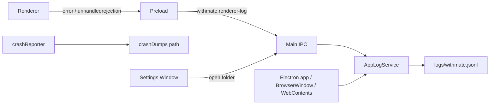

# App Log Base

- 作成日: 2026-04-25
- 対象: Electron Main / Preload / Renderer のクラッシュ調査用ログ基盤

## Goal

WithMate のクラッシュやフリーズを調査するため、アプリ起動から終了までの重要イベント、Main/Renderer の未捕捉例外、Renderer / child process の異常終了、IPC 失敗、ロード失敗を JSONL とクラッシュダンプ保存先で追跡できるようにする。

## Position

- この文書はアプリ診断ログの current design とする。
- Window / IPC の構成は `docs/design/electron-window-runtime.md` を参照する。
- セッション内のユーザー操作履歴や provider 実行履歴は `docs/design/audit-log.md` の責務であり、このログ基盤とは分離する。

## Scope

- Main Process 集約の JSONL ロガー。
- Electron runtime 情報を持つ共通ログ項目。
- Preload 経由の Renderer error / unhandled rejection 転送。
- `ipcMain.handle` の失敗記録。
- BrowserWindow / WebContents の crash / freeze / load failure 監視。
- crashReporter の起動とクラッシュダンプ保存先の導線。
- Settings からログフォルダとクラッシュダンプフォルダを開く API。

## Out Of Scope

- 外部サーバーへの crash dump upload。
- IPC request / response の通常成功ログ。
- provider API body、IPC payload、添付ファイル内容、標準出力・標準エラーの全文保存。
- dump file の起動時 scan と一覧表示。
- ドメイン service ごとの詳細な file / config / network ログ。

## Runtime Structure

## Log Format

ログは 1 行 1 イベントの JSONL とする。型定義は `src/app-log-types.ts` に置く。

共通項目:

- `timestamp`: ISO 8601 文字列。
- `level`: `trace` / `debug` / `info` / `warn` / `error` / `fatal`。
- `kind`: イベント種別。
- `process`: `main` / `renderer` / `preload` / `worker`。
- `message`: 人間が短く読める要約。
- `appVersion` / `electronVersion` / `chromeVersion` / `nodeVersion` / `platform` / `arch` / `isPackaged`: Main Process で付与する runtime 情報。
- `windowId`: Window に紐づく場合だけ付与する。
- `data`: 調査用の構造化メタデータ。payload 本文は入れない。
- `error`: `name` / `message` / `stack`。

## Storage

- 保存先は `userData` 配下の `logs/withmate.jsonl`。
- Main Process から同期 append する。
- `AppLogService` はログディレクトリを自動作成する。
- 1 ファイルの既定上限は 5 MiB。
- ローテーション時は timestamp suffix 付きのファイルへ退避し、既定で 5 ファイルまで保持する。

## Event Policy

初期実装で記録する `kind` は次の通り。

- `app.started`
- `app.ready`
- `app.before-quit`
- `app.will-quit`
- `app.window.created`
- `app.window.closed`
- `crash-reporter.started`
- `crash-reporter.start-failed`
- `main.uncaught-exception`
- `main.unhandled-rejection`
- `renderer.process-gone`
- `child-process.gone`
- `webcontents.unresponsive`
- `webcontents.responsive`
- `renderer.error`
- `renderer.unhandled-rejection`
- `renderer.did-fail-load`
- `ipc.error`

通常の `ipc.request` / `ipc.response`、画面ロード成功、API request / response は初期実装では記録しない。量と機密情報漏えいリスクが高く、クラッシュ調査の初期価値に対してノイズが多いため。

## Privacy And Redaction

- IPC payload、API request / response body、API key、添付ファイル内容は記録しない。
- `data` は JSON 化できるメタデータに限定する。
- 文字列と serialized data は上限を持ち、巨大データは preview に切り詰める。
- 循環参照など JSON 化できない値は `"[unserializable]"` として記録する。

## User Access

Settings Window は次の操作を提供する。

- `openAppLogFolder`: ログフォルダを開く。
- `openCrashDumpFolder`: Electron crash dumps フォルダを開く。

Renderer からは `window.withmate` の navigation API として呼び出す。実際のパス解決と folder open は Main Process が担当する。

## Failure Handling

- ログ書き込み失敗はアプリ動作を止めず、Main Process の `console.warn` に落とす。
- `ipc.error` は元の IPC 例外を握りつぶさず、記録後に再 throw する。
- crashReporter 起動失敗は `crash-reporter.start-failed` として記録する。

