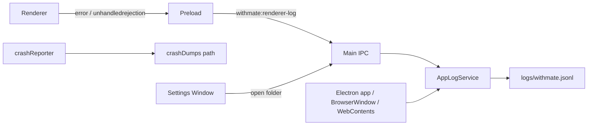

# App Log Base

## Goal

WithMate のクラッシュやフリーズを調査するため、アプリ起動から終了までの重要イベント、Main/Renderer の未捕捉例外、Renderer / child process の異常終了、IPC 失敗、ロード失敗を JSONL とクラッシュダンプ保存先で追跡できるようにする。

## Position

- この文書はアプリ診断ログの current design とする。
- Window / IPC の構成は `docs/design/electron-window-runtime.md` を参照する。
- セッション内のユーザー操作履歴や provider 実行履歴は `docs/design/audit-log.md` の責務であり、このログ基盤とは分離する。

## Scope

- Main Process 集約の JSONL ロガー。
- Electron runtime 情報を持つ共通ログ項目。
- Preload 経由の Renderer error / unhandled rejection 転送。
- `ipcMain.handle` の失敗記録。
- BrowserWindow / WebContents の crash / freeze / load failure 監視。
- crashReporter の起動とクラッシュダンプ保存先の導線。
- Settings からログフォルダとクラッシュダンプフォルダを開く API。

## Out Of Scope

- 外部サーバーへの crash dump upload。
- IPC request / response の通常成功ログ。
- provider API body、IPC payload、添付ファイル内容、標準出力・標準エラーの全文保存。
- dump file の起動時 scan と一覧表示。
- ドメイン service ごとの詳細な file / config / network ログ。

## Runtime Structure

```mermaid
flowchart LR
    Renderer[Renderer] -->|error / unhandledrejection| Preload[Preload]
    Preload -->|withmate:renderer-log| MainIpc[Main IPC]
    MainIpc --> Logger[AppLogService]
    Electron[Electron app / BrowserWindow / WebContents] --> Logger
    Logger --> Jsonl[logs/withmate.jsonl]
    CrashReporter[crashReporter] --> Dumps[crashDumps path]
    Settings[Settings Window] -->|open folder| MainIpc
```

## Log Format

ログは 1 行 1 イベントの JSONL とする。型定義は `src-shared/window/app-log-types.ts` に置く。

共通項目:

- `timestamp`: ISO 8601 文字列。
- `level`: `trace` / `debug` / `info` / `warn` / `error` / `fatal`。
- `kind`: イベント種別。
- `process`: `main` / `renderer` / `preload` / `worker`。
- `message`: 人間が短く読める要約。
- `appVersion` / `electronVersion` / `chromeVersion` / `nodeVersion` / `platform` / `arch` / `isPackaged`: Main Process で付与する runtime 情報。
- `windowId`: Window に紐づく場合だけ付与する。
- `data`: 調査用の構造化メタデータ。payload 本文は入れない。
- `error`: `name` / `message` / `stack`。

## Storage

- 保存先は `userData` 配下の `logs/withmate.jsonl`。
- Main Process から同期 append する。
- `AppLogService` はログディレクトリを自動作成する。
- 1 ファイルの既定上限は 5 MiB。
- ローテーション時は衝突しないtimestamp suffix付きのファイルへ退避する。同一millisecondでは採番を増やし、mtimeが同じ場合もsuffixで新旧を判定する。active fileを含め既定で5ファイルまで保持する。

## Event Policy

記録する主要な `kind` は次の通り。

- `app.started`
- `app.ready`
- `app.before-quit`
- `app.will-quit`
- `app.window.created`
- `app.window.closed`
- `crash-reporter.started`
- `crash-reporter.start-failed`
- `main.uncaught-exception`
- `main.unhandled-rejection`
- `renderer.process-gone`
- `child-process.gone`
- `webcontents.unresponsive`
- `webcontents.responsive`
- `renderer.error`
- `renderer.unhandled-rejection`
- `renderer.did-fail-load`
- `ipc.error`

通常の `ipc.request` / `ipc.response`、画面ロード成功、API request / response は記録しない。量と機密情報漏えいリスクが高く、クラッシュ調査の価値に対してノイズが多いため。

## Storage Diagnostic Log Policy

storage Workerと排他coordinatorの診断は、Mainの`StorageOperationLogService`で集計する。永続Auditの保存・受付・失敗通知とは独立しており、Auditの保存保証は変更しない。

- 通常のqueued／started／completed成功は個別appendせず、イベントがある60秒区間ごとに`storage.operation.summary`を1行だけ同期appendする。空区間では出力しない。
- 操作名ごとのqueued／started／成功／失敗／遅延完了件数と最大wait／hold時間を記録する。waitまたはholdが100ms以上の区間はwarnとし、最長waitとholdの相関ID・request ID・storage generationを各1件のsampleで保持する。
- 集計は操作名16種とoverflow bucketに制限する。超過する操作の件数と時間はoverflowへ加算し、容量超過を理由に追加appendしない。操作名・sampleの文字列は160文字までで、イベント本文や未完了operationの一覧、無制限queueは保持しない。
- outcomeがfailureの診断は容量に関係なく`storage.operation`をerrorとして即時同期appendする。相関ID・request ID・generation・stage・outcome・時間を保持する。原因の例外は既存のIPC／runtime失敗ログが記録する。error／fatalなどその他のapp logも従来どおり同期appendする。
- 正常終了の`will-quit`でtimerを停止し、残る集計を同期flushする。終了後の失敗診断も即時記録する。異常終了時は最後の集計区間を失う可能性があるが、記録済みの失敗／fatalを通常集計のために待たせない。
- 集計／即時診断のwrite失敗はMainの`console.warn`へ出し、storageの結果を変えない。失敗した集計は再queueせず、無制限retryやbuffer増加を行わない。

集計と即時診断は同じ`AppLogService`の5MiBローテーションを使う。非同期append bufferは設けず、重要イベントの書込み時点と正常終了の同期flushを保つ。

## Provider Diagnostic Log Policy

provider 実行ログは、通常運用では turn 単位の summary を残し、stream event 単位の詳細ログは出さない。

Codex の通常ログに残す summary:

- `codex.run.started`
- `codex.run.completed`
- `codex.run.failed`
- `codex.run.provider-error`
- `codex.run.stream-error`
- `codex.run.parse-noise.ignored`
- `codex.run.stream-close-failed`
- `codex.run.stream-close-timeout`
- `codex.run.snapshot-timeout`

`codex.run.completed` / `codex.run.failed` / `codex.run.provider-error` / `codex.run.stream-error` には、原因分析に必要な `providerErrorReason`、`turnCompleted`、`hasUsage`、`itemCount`、`liveStepCount`、`streamErrorMessage` などの構造化 summary を残す。

Codex stream の event-level 診断ログは通常運用では出さない。

- `codex.run.stream.opened`
- `codex.run.stream.event`
- `codex.run.stream.finished`

上記 3 種は、provider stream の lifecycle や SDK event payload を調べる必要がある場合だけ、`WITHMATE_CODEX_STREAM_DEBUG=1` で再有効化する。

## Privacy And Redaction

- IPC payload、API request / response body、API key、添付ファイル内容は記録しない。
- `data` は JSON 化できるメタデータに限定する。
- 文字列と serialized data は上限を持ち、巨大データは preview に切り詰める。
- 循環参照など JSON 化できない値は `"[unserializable]"` として記録する。

## User Access

Settings Window は次の操作を提供する。

- `openAppLogFolder`: ログフォルダを開く。
- `openCrashDumpFolder`: Electron crash dumps フォルダを開く。

Renderer からは `window.withmate` の navigation API として呼び出す。実際のパス解決と folder open は Main Process が担当する。

## Failure Handling

- ログ書き込み失敗はアプリ動作を止めず、Main Process の `console.warn` に落とす。
- `ipc.error` は元の IPC 例外を握りつぶさず、記録後に再 throw する。
- crashReporter 起動失敗は `crash-reporter.start-failed` として記録する。

