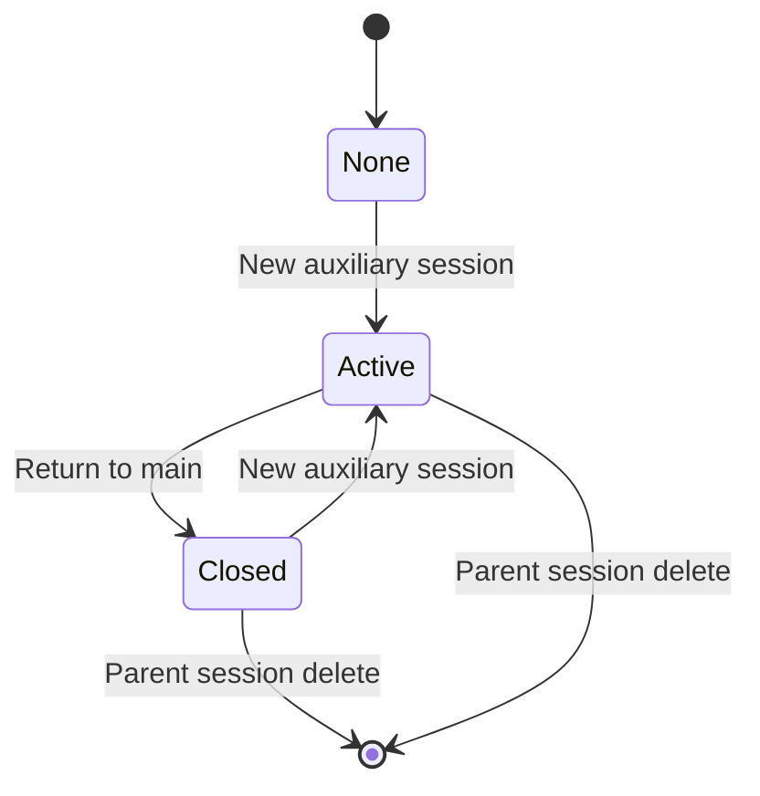

# Auxiliary Session

- 作成日: 2026-05-24
- 対象: Session Window 内で使う補助チャットと response 引用操作

## Goal

ユーザーがメイン Session の作業文脈を保ったまま、別の短い会話で調査、レビュー、検証、相談を行えるようにする。
Auxiliary Session は provider context としてはメイン Session の transcript へ混ぜない。
一方で UI 上はメイン Session のメッセージ欄に Auxiliary 枠として表示し、終了後も同じメッセージ欄から結果を見返せるようにする。
必要な結果は Copy / Quote でメイン composer に持ち込む。

## Position

- Auxiliary Session は用途固定の Review 機能ではなく、Session Window に紐づく汎用の補助セッションである。
- UI は既存の Session Window / chat layout を使い、別 window や専用 review layout は作らない。
- メイン Session の実行環境は引き継ぐが、会話履歴と live run state は分離する。
- 元 Session を削除した場合、紐づく Auxiliary Session も削除する。
- Window 構成の上位責務は `docs/design/window-architecture.md` を参照する。
- 実行中 session の close / continuation 方針は `docs/design/session-run-lifecycle.md` を参照する。
- Session local files の暗黙許可は `docs/design/session-local-files.md` を参照する。

## Scope

- Session Header から Auxiliary Session を開始する導線。
- Session Window 内でメイン Session を一時停止し、Auxiliary Session を表示する UI mode。
- Auxiliary 用 ActionDock と composer。
- Auxiliary transcript の保存とメイン Session message column 内での read-only 表示。
- assistant response の共通 Copy / Quote action。
- メイン Session と Auxiliary Session の context 継承境界。

## Out Of Scope

- Codex / Copilot の専用 review command 統合。
- Review 専用 prompt preset。
- Auxiliary Session の resume / continue 機能。
- Auxiliary 単体の独立削除 UI。
- メイン Session と Auxiliary Session の同時操作。
- raw Markdown の部分選択範囲抽出。

## Runtime Model

Auxiliary Session は parent Session に紐づく補助 conversation として保存する。
同時に active にできる Auxiliary Session は parent Session ごとに 1 つまでとする。



`Closed` はメイン Session の message column に read-only の Auxiliary 枠として表示し続ける。
Closed Auxiliary を選択する History / 再開導線は持たない。
続けたい場合は常に新しい Auxiliary Session を作る。

Window を閉じて開き直した時点で `Active` の Auxiliary Session が残っている場合は、未終了状態の復元として Auxiliary mode のまま表示する。
これは closed Auxiliary の resume 機能とは分けて扱う。

## UI Flow

### Normal Session

Session Header に `Auxiliary` action を置く。

```text
[Session title] ... [Auxiliary]
```

`Auxiliary` button は新しい Auxiliary Session を開始する。

### Button Placement

追加するボタンは既存の Session Window の control group に合わせる。

- Session Header の `Auxiliary` button は、`workspaceActions` / `sessionFilesActions` の後、`Rename` / `Audit Log` / `Delete` の前に置く。
- 実装上は `SessionHeader` の `actions` slot を使い、Workspace や Session Files の group には混ぜない。
- `Auxiliary` button は parent Session に紐づく補助会話の入口であり、workspace 操作でも session files 操作でもないためである。
- Active Auxiliary 中は同じ位置に `Return to main` を表示し、メイン送信はできない。
- Auxiliary 実行中は `Return to main` を無効にし、必要ならまず `Cancel` で実行を止める。
- `Return to main` は Session Header の通常操作群ではなく、Auxiliary 枠 header または Auxiliary ActionDock に置く。
- response の `Copy` / `Quote` は ActionDock ではなく、assistant response 内の選択範囲に対する selection action として扱う。

response action は assistant response ごとの固定機能ではなく、ユーザーが assistant response text を選択したときだけ表示する。
未選択時に message card 内へ常設しない。
`Copy` / `Quote` の対象は選択範囲のみとし、response 全体を暗黙の fallback 対象にはしない。
右クリックメニューは初期実装の主導線にしない。

### Active Auxiliary

Auxiliary 使用中はメイン Session の操作を停止し、同じ Session Window の chat area に Auxiliary 枠を表示する。
ActionDock も Auxiliary composer に置き換える。
Home の Session Monitor では、open な親 Session に active Auxiliary が紐づいて実行中の場合、親 Session の monitor state を `実行中` として扱う。

```text
──────────────── Auxiliary ────────────────
Main session paused

user ...
assistant ...

──────────────────────────────────────────

ActionDock: Auxiliary composer
```

上記の線は実体テキストではなく、CSS の border / label として描画する。
transcript には UI ornament を保存しない。

Active Auxiliary で提供する主要操作は次の通り。

- response ごとの `Copy`
- response ごとの `Quote`
- `Return to main`

`Return to main` は Auxiliary を削除しない。
Auxiliary を `Closed` にしてメイン Session 表示へ戻す。

## Visual Design

Auxiliary 枠は通常 chat と混ざらないことを優先し、過度な警告色や説明文は使わない。

- 薄い border。
- 通常 surface と少し違う背景色。
- 上端の小さな `Auxiliary` label。
- Closed Auxiliary transcript は message column 内で session ごとの色付き group 枠として表示する。
- Active Auxiliary 中は ActionDock 内に `Auxiliary` badge を表示し、work surface 上へ label を重ねない。
- Active / Closed の文字列は通常表示しない。状態差は枠と ActionDock badge で表す。
- `Return to main` は ActionDock 側に置く。

`---------- Auxiliary ----------` のような構造は視覚表現としては採用できるが、実体文字列ではなく CSS で表現する。

## Context Inheritance

Auxiliary Session は「同じ作業場にいる別会話」として扱う。
そのため実行環境の文脈は引き継ぎ、会話状態は分離する。

### Inherited

- workspace / cwd。
- parent Session で AddDirectory 済みの追加ディレクトリ。
- session files directory。
- provider / model / reasoning effort の初期値。
- approval mode / sandbox mode の初期値。
- provider instruction / `AGENTS.md` などの runtime context。
- path attachment の許可境界。
- app settings と表示設定。

### Isolated

- メイン Session の messages。
- メイン Session の composer draft。
- live run state。
- approval / elicitation の pending state。
- latest command / reasoning / tasks の表示状態。
- audit / progress UI の現在表示。

Audit Log は表示中の Auxiliary Session 自身の実行 log を開く。
Auxiliary mode の audit log は親 Session の audit log へ混ぜず、Auxiliary Session id を owner として取得する。
メイン Session へ戻った場合は、メイン Session 自身の audit log を表示する。

Auxiliary 作成時に parent の AddDirectory 状態を snapshot として引き継ぐ。
Auxiliary 使用中に AddDirectory した場合は Auxiliary にだけ追加し、parent へは自動反映しない。
必要なら将来、明示的な `Add to main session` 操作を検討する。

Session files directory は parent Session の managed directory を共有する。
これは Session local files が parent Session の作業用領域であり、Auxiliary から同じ `@path` reference を扱える方が自然なためである。

## Response Actions

`Copy` と `Quote` は Auxiliary 専用ではなく、assistant response に対する共通機能として実装する。
Agent Session、Auxiliary、Companion、MateTalk など、共通 message column を使う画面では同じ action として扱う。

### Copy

- response 全体の場合は provider から返った raw Markdown / text を clipboard に入れる。
- 選択範囲が同じ response 内にある場合は selected plain text を clipboard に入れる。

### Quote

- response 全体の場合は raw Markdown / text の各行に Markdown blockquote prefix を付け、現在の画面の writable composer に挿入する。
- 選択範囲が同じ response 内にある場合は selected plain text を blockquote 化して現在の画面の writable composer に挿入する。
- Active Auxiliary 中は Auxiliary composer の caret 位置へ挿入し、`Return to main` 後は通常 composer の caret 位置へ挿入する。
- Auxiliary 由来であることを prompt 本文に特別な label として入れない。

例:

```markdown
> 引用した内容
> 複数行なら各行に `>` を付ける
```

raw Markdown の部分選択範囲を復元する処理は初期実装では行わない。
rendered DOM と raw Markdown の位置対応が code fence、link、list、table、改行で複雑になるためである。

## Persistence

Auxiliary transcript は自動保存する。
保存済み transcript はメイン Session message column に Auxiliary 枠として投影する。
ただし、provider へ渡すメイン Session messages には自動追加しない。

保存する情報:

- parent session id。
- auxiliary session id。
- status: `active` / `closed`。
- provider / model / runtime options。
- inherited context snapshot。
- messages。
- composer draft。
- displayAfterMessageIndex。
- createdAt / updatedAt。

parent Session 削除時は紐づく Auxiliary Session も cascade cleanup する。
Auxiliary 単体の明示削除 UI は初期実装では持たない。

## Database Version Impact

Auxiliary 自体は V6 runtime DB の schema table として扱う。
Auxiliary transcript は `withmate-v6.db` の `auxiliary_sessions` に保存する。
この table は V6 foundation schema の一部として初期化し、V4 以前 / invalid DB path では legacy no-op storage を使う。

理由:

- Auxiliary は既存 parent Session に従属する補助データだが、V6 runtime では保存と audit log の参照先として schema に含める。
- parent Session transcript へ混ぜないため、既存 `sessions` / message payload の責務は変えない。
- `parent_session_id` で紐づけ、parent Session 削除時は service 側から同時削除する。
- V2 / V3 / invalid named DB では table 作成を行わず、legacy 読み取りや migration diagnostics に影響させない。
- active 復元と message column 内の closed transcript 表示に必要な情報は payload JSON で完結するため、初期実装では normalized message table までは不要である。

保存 table:

- `auxiliary_sessions`
  - `id`
  - `parent_session_id`
  - `status`: `active` / `closed`
  - `created_at`
  - `updated_at`
  - `payload_json`

`created_at` / `updated_at` は `database-schema.md` の共通 column convention に従う。
`payload_json` には provider / model / runtime options、AddDirectory snapshot、thread id、composer draft、messages、displayAfterMessageIndex、createdAt / updatedAt / closedAt を保存する。

Auxiliary Session の audit log は `audit_events_v6` に保存する。
`sessions_v6` の行ではないため、`audit_events_v6.session_id` には入れず、`audit_events_v6.auxiliary_session_id` で `auxiliary_sessions.id` を参照する。
通常 Session の audit log は従来通り `session_id` で `sessions_v6.id` を参照する。
AuditLog 読み取り API は渡された id に対して `session_id` または `auxiliary_session_id` の一致を見て、メイン Session と Auxiliary Session の log を分離する。

`displayAfterMessageIndex` は Auxiliary 作成時点の parent Session message index を保存する。
message column へ投影するときは、Auxiliary transcript をこの index の直後へ差し込む。
同じ index に複数の Auxiliary がある場合は `created_at` 昇順で並べる。
既存 payload などで `displayAfterMessageIndex` がない場合は、`created_at` 昇順で末尾に fallback 表示する。

将来、Auxiliary transcript の検索、message 単位の pagination、artifact の遅延読み込みが必要になった場合は、次期 schema version で `auxiliary_messages` などへ正規化する。
その段階では user_version 変更、diagnostics、migration を含めて扱う。

## Provider Integration

Provider SDK の review 専用 API は前提にしない。
Auxiliary Session は通常の provider chat / coding session と同じ入力経路で prompt を送る。

Codex / Copilot の review 的な用途も、自然言語 prompt と必要な context を送るだけに留める。
結果の採用、修正、メイン Session への持ち込みは Copy / Quote でユーザーが明示する。

## Validation

- Auxiliary を開始すると Session Window 内で Auxiliary 枠と Auxiliary ActionDock に切り替わる。
- Auxiliary 使用中はメイン Session に送信できない。
- `Return to main` で Auxiliary が Closed になり、メイン Session 表示へ戻る。
- Closed Auxiliary はメイン Session の message column 内に read-only 枠として残る。
- Window を閉じて開き直しても Active Auxiliary は復元される。
- parent Session 削除で Auxiliary も削除される。
- parent の AddDirectory と session files directory が Auxiliary の attachment / provider runtime に渡る。
- Auxiliary 内の AddDirectory は parent に自動反映されない。
- response 全体の Copy は raw Markdown / text を clipboard に入れる。
- selected text が response 内にある場合、Copy / Quote は selected plain text を対象にする。
- Quote は Markdown blockquote として対象画面の composer に挿入される。
