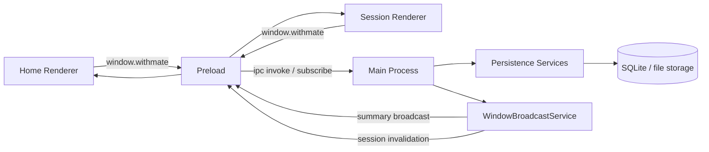

# Electron Session Store

- 作成日: 2026-03-12
- 対象: Electron Main Process が持つ session / audit / memory persistence の責務分離

## Goal

Electron Main Process が `session metadata` と session payload の source of truth を持ち、  
SQLite-backed store により window 間整合と再起動後の復元を両立する current 実装を説明する。

## Position

- この文書は persistence orchestration の supporting doc として扱う
- table / JSON カラムの正本は `docs/design/database-schema.md` を参照する
- running session の lifecycle と background hook は `docs/design/session-run-lifecycle.md` を参照する
- BrowserWindow / preload / bootstrap detail は `docs/design/electron-window-runtime.md` を参照する

## Scope

- Main Process 内の SQLite-backed session / audit / memory persistence
- preload 経由の session query / command API
- persistence service の責務境界
- Home / Session Renderer の store 参照切り替え

## Out Of Scope

- BrowserWindow の生成や再利用 policy
- provider adapter の詳細
- table 定義の全文
- renderer UI の詳細

## Decision

- Main Process は SQLite を正本にし、必要時だけ `Session[]` をメモリへ投影する
- Renderer は `window.withmate` 経由でのみ session / audit / settings に触る
- session summary の変更通知は `WindowBroadcastService` から Home / Session Monitor / Settings / Memory Management window へ配信する
- Session window には full summary を流さず、`sessionId` 配列ベースの軽量 invalidation 通知を配信し、必要時だけ `getSession()` で再 hydrate する
- session CRUD と bulk write path は `SessionPersistenceService` に集約する
- turn 実行は `SessionRuntimeService`、window lifecycle hook は `SessionWindowBridge` が担う
- Session / Project / Character Memory の session 起点補助は `SessionMemorySupportService` が担う
- Session Memory / Character Reflection の background orchestration は `MemoryOrchestrationService` が担う
- persistent store の初期化 / close / recreate は `PersistentStoreLifecycleService` が担う

## Runtime Model

## Persistence Services

### SessionPersistenceService

- `createSession`
- `updateSession`
- `deleteSession`
- `upsertSession`
- `replaceAllSessions`
- `listSessions`
- `getSession`

`sessions` table を正本にしつつ、Main Process 内の in-memory projection と同期する。

### AuditLogService

- `listSessionAuditLogs`
- `createAuditLog`
- `updateAuditLog`
- `clearSessionAuditLogs`

`audit_logs` の read / write を一箇所に集約する。

### SessionMemorySupportService

- `session_memories` の同期
- project scope / character scope の同期
- project promotion / retrieval
- character memory 保存補助
- monologue append

session 実行後の memory 補助処理を persistence 側へつなぐ。

### SettingsCatalogService

- `app_settings`
- `model_catalog_*`
- reset / import / export と関連 invalidation

session 以外の app-wide persistence をまとめて扱う。

### PersistentStoreLifecycleService

- store 初期化
- 5 分間隔の WAL size-based maintenance
- close
- close 時の WAL truncate checkpoint
- DB 再生成前の WAL truncate checkpoint

Main Process の bootstrap / reset から persistent store を束ねる。

## Query / Command Boundary

Renderer は `window.withmate` から session 系 API を呼ぶ。  
Main Process 側では `MainQueryService`、`SessionRuntimeService`、`SessionPersistenceService`、`AuditLogService` などへ振り分ける。

### 主な query

- `listSessions`
- `getSession`
- `listSessionAuditLogs`
- `listSessionSkills`
- `listSessionCustomAgents`

### 主な command

- `createSession`
- `updateSession`
- `deleteSession`
- `runSessionTurn`
- `cancelSessionTurn`

## Persistence Boundary

- `sessions`
  - session metadata
  - `messages_json`
  - `stream_json`
  - `session_kind` による用途分離
- `session_memories`
  - `Session Memory v1`
- `audit_logs`
  - turn 実行と background task の監査ログ
- `project_scopes` / `project_memory_entries`
  - project 単位の durable knowledge
- `character_scopes` / `character_memory_entries`
  - character 単位の関係性記憶

table 詳細と JSON カラム一覧は `docs/design/database-schema.md` を参照する。

## Renderer Responsibilities

### Home Renderer

- session 一覧の取得と購読
- Settings / Model Catalog 操作
- `createSession()` 後の Session Window 起動

### Session Renderer

- 初回 `getSession()` と軽量 invalidation 通知受信時の再 hydrate
- title / approval / model / reasoning depth の更新
- turn 実行と cancel
- audit log / observability 表示

## Relation To Current Docs

- `database-schema.md`
  - table / JSON カラムの正本
- `session-run-lifecycle.md`
  - turn 実行と background task の lifecycle
- `electron-window-runtime.md`
  - BrowserWindow / preload / bootstrap detail

## Open Questions

- `messages_json` / `stream_json` を今後どの粒度で正規化するか
- audit log export を後で追加するか
- `Session Memory` / `Project Memory` / `Character Memory` の renderer expose をどこまで広げるか
