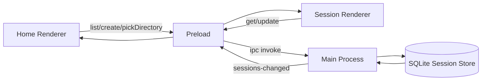

# Electron Session Store

- 作成日: 2026-03-12
- 対象: Electron Main Process が保持する session store と IPC 境界

## Goal

Electron Main Process が `session metadata` と session payload の source of truth を持ち、
SQLite-backed store により window 間整合と再起動後の復元を両立する。

## Scope

- Main Process 内の SQLite-backed session store
- preload 経由の session API
- directory picker API
- Home / Session Renderer の store 参照切り替え

## Out Of Scope

- LangGraph memory 保存
- Codex Adapter 連携
- message / stream の差分同期最適化

## Decision

- Main Process は SQLite を正本にし、必要時だけ `Session[]` をメモリへ投影する
- Renderer は `window.withmate` 経由でのみ session に触る
- 変更通知は `sessions-changed` event で全 window に配信する
- Session Window は `sessionId` 指定で `getSession(sessionId)` を引き、必要に応じて `updateSession(session)` で保存する
- Session Window は `deleteSession(sessionId)` で自身の session を削除できる
- SQLite driver には Node 標準の `node:sqlite` を採用する
- session metadata には `model` / `reasoningEffort` も保持する

## API Surface

```ts
type WithMateWindowApi = {
  openSession(sessionId: string): Promise<void>;
  listSessions(): Promise<Session[]>;
  getSession(sessionId: string): Promise<Session | null>;
  createSession(input: CreateSessionInput): Promise<Session>;
  updateSession(session: Session): Promise<Session>;
  deleteSession(sessionId: string): Promise<void>;
  pickDirectory(): Promise<string | null>;
  subscribeSessions(listener: (sessions: Session[]) => void): () => void;
};
```

## Runtime Model



## Store Responsibilities

- 初回起動時に SQLite schema を作成する
- 起動時に SQLite から session list を読み込む
- `createSession` で新しい session を先頭へ追加する
- `updateSession` で `id` 一致の session を置き換える
- `deleteSession` で `id` 一致の session を削除する
- `runSessionTurn` の結果も同じ store を通して保存する
- 変更後は全 window に最新 session list を通知する
- `getSession` は単一 session を返す

## SQLite Layout

MVP では `sessions` テーブル 1 枚で管理する。

- metadata 列
  - `id`
  - `task_title`
  - `task_summary`
  - `status`
  - `updated_at`
  - `provider`
  - `workspace_label`
  - `workspace_path`
  - `branch`
  - `character_id`
  - `character_name`
  - `character_icon_path`
  - `run_state`
  - `approval_mode`
  - `model`
  - `reasoning_effort`
  - `thread_id`
- payload 列
  - `messages_json`
  - `stream_json`
- sort 列
  - `last_active_at`

正規化は後回しにし、まずは再起動後の復元と実装単純性を優先する。

## Renderer Responsibilities

### Home Renderer

- `listSessions()` で一覧を取得する
- `subscribeSessions()` で一覧更新を反映する
- `createSession()` 実行後に返却された `session.id` を使って Session Window を開く
- `pickDirectory()` で browse 結果を受け取る
- model / depth の変更も `updateSession(session)` で保存する

### Session Renderer

- query string の `sessionId` を読む
- `getSession(sessionId)` で対象 session を取得する
- title / approval 変更時は `updateSession(session)` で保存する
- model / reasoning depth 変更時も `updateSession(session)` で保存する
- 削除時は `deleteSession(sessionId)` を呼び、自分の window を閉じる
- `subscribeSessions()` で同じ session の最新状態を追従する

## Relation To Session Persistence

- [session-persistence.md](./session-persistence.md) で定義した `Session Metadata` の source of truth に相当する
- Main Process 側 SQLite 実装が current source of truth
- preload API は将来 SQLite 実装へ差し替えても Renderer を変えないための境界として使う

## Directory Picker Policy

- `pickDirectory()` は Main Process で `dialog.showOpenDialog` を呼ぶ
- 戻り値は選択された絶対パス、または `null`
- Renderer 側では path から一時的な workspace label を組み立てて launch summary に表示する

## Open Questions

- `sessions-changed` を差分通知にするか全量通知にするか
- 実行中 session の削除禁止を今後どこまで厳密にするか
- `messages_json` / `stream_json` を今後どの粒度で正規化するか
