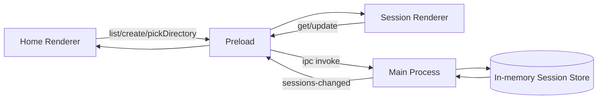

# Electron Session Store

- 作成日: 2026-03-12
- 対象: Electron Main Process が保持する session store と IPC 境界

## Goal

Renderer が `localStorage` を正本として扱う状態をやめて、
Electron Main Process が `session metadata` と mock session 内容の source of truth を持つ形へ移行する。
この段階では本格的な SQLite 永続化はまだ導入せず、in-memory store + IPC で window 間整合を取る。

## Scope

- Main Process 内の mock session store
- preload 経由の session API
- directory picker API
- Home / Session Renderer の store 参照切り替え

## Out Of Scope

- SQLite 永続化
- LangGraph memory 保存
- Codex Adapter 連携
- message / stream の差分同期最適化

## Decision

- Main Process は mock 段階でも `Session[]` をメモリで保持する
- Renderer は `window.withmate` があるとき、直接 `localStorage` を触らない
- 変更通知は `sessions-changed` event で全 window に配信する
- Session Window は `sessionId` 指定で `getSession(sessionId)` を引き、必要に応じて `updateSession(session)` で保存する
- browser-only preview は fallback として残すが、Electron 実行時が優先

## API Surface

```ts
type WithMateWindowApi = {
  openSession(sessionId: string): Promise<void>;
  listSessions(): Promise<Session[]>;
  getSession(sessionId: string): Promise<Session | null>;
  createSession(input: CreateSessionInput): Promise<Session>;
  updateSession(session: Session): Promise<Session>;
  pickDirectory(): Promise<string | null>;
  subscribeSessions(listener: (sessions: Session[]) => void): () => void;
};
```

## Runtime Model



## Store Responsibilities

- 初回起動時に `initialSessions` を clone して store を初期化する
- `createSession` で新しい session を先頭へ追加する
- `updateSession` で `id` 一致の session を置き換える
- 変更後は全 window に最新 session list を通知する
- `getSession` は単一 session を返す

## Renderer Responsibilities

### Home Renderer

- `listSessions()` で一覧を取得する
- `subscribeSessions()` で一覧更新を反映する
- `createSession()` 実行後に返却された `session.id` を使って Session Window を開く
- `pickDirectory()` で browse 結果を受け取る

### Session Renderer

- query string の `sessionId` を読む
- `getSession(sessionId)` で対象 session を取得する
- mock 送信時は `updateSession(session)` で保存する
- `subscribeSessions()` で同じ session の最新状態を追従する

## Relation To Session Persistence

- [session-persistence.md](./session-persistence.md) で定義した `Session Metadata` の source of truth に相当する
- いまは in-memory だが、将来は Main Process 側 storage 実装へ置き換える
- preload API は将来 SQLite 実装へ差し替えても Renderer を変えないための境界として使う

## Directory Picker Policy

- `pickDirectory()` は Main Process で `dialog.showOpenDialog` を呼ぶ
- 戻り値は選択された絶対パス、または `null`
- Renderer 側では path から一時的な workspace label を組み立てて launch summary に表示する

## Open Questions

- browser-only preview の fallback をいつまで維持するか
- `sessions-changed` を差分通知にするか全量通知にするか
- Session Window から `closeSession` 的な操作を Main 側へ持たせるか
