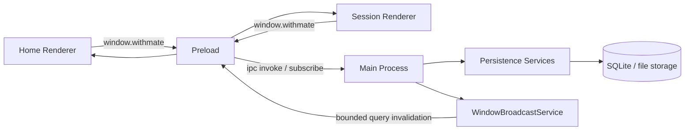

# Electron Session Store

- 作成日: 2026-03-12
- 対象: Electron Main Process が持つ session / audit / memory persistence の責務分離

## Goal

Electron Main Process が `session metadata` と session payload の source of truth を持ち、  
SQLite-backed store により window 間整合と再起動後の復元を両立する current 実装を説明する。

## Position

- この文書は persistence orchestration の supporting doc として扱う
- table / JSON カラムの正本は `docs/design/database-schema.md` を参照する
- running session の lifecycle と background hook は `docs/design/session-run-lifecycle.md` を参照する
- BrowserWindow / preload / bootstrap detail は `docs/design/electron-window-runtime.md` を参照する

## Scope

- Main Process 内の SQLite-backed session / audit / memory persistence
- preload 経由の session query / command API
- persistence service の責務境界
- Home / Session Renderer の store 参照切り替え

## Out Of Scope

- BrowserWindow の生成や再利用 policy
- provider adapter の詳細
- table 定義の全文
- renderer UI の詳細

## Decision

- Main Process は SQLite を正本にし、必要時だけ `Session[]` をメモリへ投影する
- Renderer は `window.withmate` 経由でのみ session / audit / settings に触る
- Homeのsession一覧は `listSessionSummaryPage()` をstorage query ownerへ送り、recent / pinned / openをboundedに取得する。検索もstorage側で行い、Homeへ全summary配列を返さない
- session summary の変更通知は `scope: "ids"` または `scope: "all"` のinvalidationを `WindowBroadcastService` からHome / Session windowへ配信する。IDは最大256件で、超過時に切り捨てず `all` へ切り替える
- Session windowはinvalidationを受けた対象だけ `getSession()` で再 hydrateする。Homeは現在のquery generationで古いresponseを失効させ、検索条件変更時だけcursor chainを初期化する。focus、open Session ID変更、invalidationでは読み込み済みrecent / pinned pageとopen special entryを保持したままboundedに再同期する
- Session windowが関連Sessionの遷移可否を解決するときは、IDとtitleだけを返すbatch summary queryを使い、関連Sessionのmessageをhydrateしない。初回、missing、query errorを区別し、refresh中は直前のtitleを維持する
- session CRUD と bulk write path は `SessionPersistenceService` に集約する
- turn 実行は `SessionRuntimeService`、window lifecycle hook は `SessionWindowBridge` が担う
- Agent起点のcross-Session Turnはtarget側executionを正本とし、送信元projection用のorigin snapshotだけを同じtransactionへ保存する
- Session / Project / Character Memory の session 起点補助は `SessionMemorySupportService` が担う
- Session Memory / Character Reflection の background orchestration は `MemoryOrchestrationService` が担う
- persistent store の初期化 / close / recreate は `PersistentStoreLifecycleService` が担う

## Runtime Model

```mermaid
flowchart LR
    HR[Home Renderer] -->|window.withmate| PL[Preload]
    SR[Session Renderer] -->|window.withmate| PL
    PL -->|ipc invoke / subscribe| MP[Main Process]
    MP --> PERSIST[Persistence Services]
    PERSIST --> STORE[(SQLite / file storage)]
    MP --> BROADCAST[WindowBroadcastService]
    BROADCAST -->|bounded query invalidation| PL
    PL --> HR
    PL --> SR
```

## Persistence Services

### SessionPersistenceService

- `createSession`
- `updateSession`
- `deleteSession`
- `deleteSessionsLastActiveBefore`
- `upsertSession`
- `replaceAllSessions`
- `listSessions`
- `getSession`

`sessions` table を正本にしつつ、Main Process 内の in-memory projection と同期する。
session 削除の副作用は単一削除と cutoff bulk 削除で同じ内部経路を通す。
cutoff bulk 削除では storage が `last_active_at` から対象 id を列挙し、実行中の session は削除対象から skip する。

### AuditLogService

- `listSessionAuditLogs`
- `createAuditLog`
- `updateAuditLog`
- `clearSessionAuditLogs`

`audit_logs` の read / write を一箇所に集約する。

### SessionMemorySupportService

- `session_memories` の同期
- project scope / character scope の同期
- project promotion / retrieval
- character memory 保存補助
- monologue append

session 実行後の memory 補助処理を persistence 側へつなぐ。

### SettingsCatalogService

- `app_settings`
- `model_catalog_*`
- reset / import / export と関連 invalidation

session 以外の app-wide persistence をまとめて扱う。

### PersistentStoreLifecycleService

- store 初期化
- close
- close 時の WAL truncate checkpoint
- DB 再生成前の WAL truncate checkpoint

Main Process の bootstrap / reset から persistent store を束ねる。
WAL truncate checkpoint は best-effort とし、失敗しても close / recreate を中断しない。

### WAL Maintenance Timer

- Main Process が `startWalMaintenance()` / `stopWalMaintenance()` で interval を管理する
- interval は 5 分ごとに WAL size を確認し、64 MiB を超えている場合だけ truncate checkpoint を実行する
- interval 側の checkpoint は短い busy timeout を使い、Main Process の event loop block を抑える

## Query / Command Boundary

Renderer は `window.withmate` から session 系 API を呼ぶ。  
Main Process 側では `MainQueryService`、`SessionRuntimeService`、`SessionPersistenceService`、`AuditLogService` などへ振り分ける。

### 主な query

- `listSessions`
- `getSession`
- `listSessionAuditLogs`
- `listSessionSkills`
- `listSessionCustomAgents`

### 主な command

- `createSession`
- `updateSession`
- `deleteSession`
- `deleteSessionsLastActiveBefore`
- `runSessionTurn`
- `cancelSessionTurn`

## Persistence Boundary

- `sessions`
  - session metadata
  - `messages_json`
  - `stream_json`
  - `session_kind` による用途分離
- `session_memories`
  - `Session Memory v1`
- `audit_logs`
  - turn 実行と background task の監査ログ
- `session_execution_origins_v6`
  - cross-Session executionのsource Session ID、canonical target Session ID、target titleとRoleのacceptance snapshot、source message sequence anchor、canonical execution sequence
  - source Sessionからは`(source_session_id, execution_sequence)` indexで取得し、`request_json`をquery ownerにしない
  - target Sessionの外部キーを持たず、target削除後も履歴を維持する。source Session削除時はcascadeする
  - legacy executionからのorigin補完はschema遷移後の一回だけ実行し、Session initiatorを持つAgent-origin executionへ限定する。terminal failure notification executionは補完対象にしない
- `work_items_v6` / `work_item_idempotency_v6`
  - Session間委譲のstable identity、immutable binding、state revision、strict terminal result、mutation replayを正規化して保存する
  - mutation replay recordは`expires_at`を持ち、24時間後に起動時・定期maintenanceまたは次のmutationで削除する
  - active Work Itemまたはresultを持つWork Itemが参照するSessionの削除はstorage triggerで拒否する
- `work_item_execution_associations_v6`
  - 一つのWork Itemと複数の`turn.run | turn.enqueue` executionを別identityのまま関連付ける
  - associationはexecution作成transaction内でWork Itemのtarget一致とactive stateを再検証して保存し、executionのterminal stateからWork Item stateを更新しない
- `work_item_aggregations_v6` / `work_item_aggregation_decisions_v6` / `work_item_aggregation_idempotency_v6`
  - 親Work Itemごとのaggregate revision、直属子resultへのimmutable decision、retry replacement linkageをresult本文やCoordination Eventとは別の正本として保存する
  - 直属子作成とaggregate revision、retry decisionとreplacement、親resultと集約preconditionはそれぞれ同一transactionで確定する
- `project_scopes` / `project_memory_entries`
  - project 単位の durable knowledge
- `character_scopes` / `character_memory_entries`
  - character 単位の関係性記憶

table 詳細と JSON カラム一覧は `docs/design/database-schema.md` を参照する。

## Renderer Responsibilities

### Home Renderer

- boundedなsession summary pageの取得、cursor chain、検索generationの管理
- session invalidation受信時のloaded recent / pinned page、open special entryのbounded refresh
- random Character用のCharacter usage projectionとopen Session ID chunkの利用
- Settings / Model Catalog 操作
- `createSession()` 後の Session Window 起動

### Session Renderer

- 初回 `getSession()` と軽量 invalidation 通知受信時の再 hydrate
- 関連Session IDのbatch summary取得と、ID単位のloading / found / missing / error状態の維持
- title / approval / model / reasoning depth の更新
- turn 実行と cancel
- audit log / observability 表示

## Relation To Current Docs

- `database-schema.md`
  - table / JSON カラムの正本
- `session-run-lifecycle.md`
  - turn 実行と background task の lifecycle
- `electron-window-runtime.md`
  - BrowserWindow / preload / bootstrap detail

## Open Questions

- `messages_json` / `stream_json` を今後どの粒度で正規化するか
- audit log export を後で追加するか
- `Session Memory` / `Project Memory` / `Character Memory` の renderer expose をどこまで広げるか
