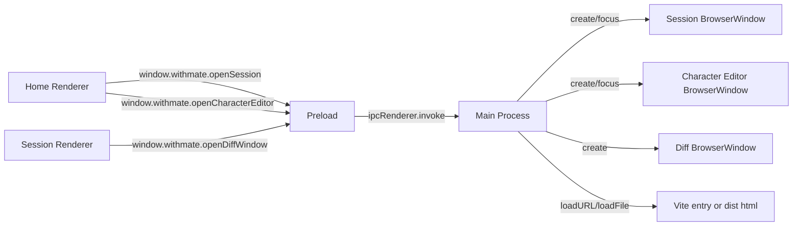

# Electron Window Runtime

- 作成日: 2026-03-12
- 対象: `Home Window` / `Session Window` / `Character Editor Window` / `Diff Window` を Electron で起動する最小ランタイム

## Goal

React/Vite の separate entry mock を Electron の実 `BrowserWindow` へ接続し、
`Home Window` / `Session Window` / `Character Editor Window` / `Diff Window` を Main Process で管理できる状態にする。
この段階では Codex Adapter や永続化の本実装までは行わず、window lifecycle と preload 境界を確定する。

## Scope

- Electron の導入
- Main Process の entry
- preload による最小限の window API 露出
- `Home Window` の生成
- `Session Window` の生成、再利用、フォーカス
- `Character Editor Window` の生成、再利用、フォーカス
- `Diff Window` の生成
- dev / build の URL 解決

## Out Of Scope

- Codex SDK 接続
- SQLite 永続化
- IPC による session store 本実装
- menu / tray / updater
- packaging

## Runtime Structure



## Decision

- Main Process は `Home Window` を 1 つだけ生成する
- `Session Window` は `sessionId` ごとに 1 つまで生成する
- `Character Editor Window` は create mode 1 つ、edit mode は `characterId` ごとに 1 つまで生成する
- 同じ `sessionId` / `characterId` を再度開く要求が来たら新規生成せず、既存 window を再表示・フォーカスする
- 実行中 session は Main Process の registry で追跡し、window close では止めない
- 全 window が閉じても実行中 session がある場合は `Home Window` を再生成する
- preload では `openSession(sessionId)` と `openCharacterEditor(characterId?)` を最小 window API として公開する
- diff の popout は `openDiffWindow(diffPreview)` と `getDiffPreview(token)` で扱う
- browser-only mock 互換のため、Renderer 側は `window.withmate` が無い場合 `window.open` へフォールバックする
- character metadata の正本は Main Process が読む file-based storage とする

## Main Process Responsibilities

- app ready 後に `Home Window` を生成する
- `sessionId -> BrowserWindow` 対応表を保持する
- `open-session` / `open-character-editor` IPC を受けて各 window を生成または再利用する
- `open-diff-window` IPC を受けて一時 token を発行し、対応する `Diff Window` を生成する
- window close 時に対応表を掃除する
- 実行中 session の close / quit 保護を行う
- dev では Vite URL、build では `dist/` の html を読む
- character list / detail / save / delete を file system と接続する

## Renderer / Preload Boundary

### Preload API

```ts
type WithMateWindowApi = {
  openSession(sessionId: string): Promise<void>;
  openCharacterEditor(characterId?: string | null): Promise<void>;
  openDiffWindow(diffPreview: DiffPreviewPayload): Promise<void>;
  listSessions(): Promise<Session[]>;
  getSession(sessionId: string): Promise<Session | null>;
  getDiffPreview(token: string): Promise<DiffPreviewPayload | null>;
  createSession(input: CreateSessionInput): Promise<Session>;
  updateSession(session: Session): Promise<Session>;
  pickDirectory(): Promise<string | null>;
  subscribeSessions(listener: (sessions: Session[]) => void): () => void;
};
```

### 方針

- Renderer は Electron 固有 API を直接触らない
- `window.withmate` の有無で実行環境を判定する
- `launchSession` `pickDirectory` `listCharacters` `createCharacter` などの機能追加も、この preload 境界を拡張していく

## URL Resolution

### Development

- `Home Window`: `http://localhost:4173/`
- `Session Window`: `http://localhost:4173/session.html?sessionId=...`
- `Character Editor Window`: `http://localhost:4173/character.html?characterId=...` または `?mode=create`
- `Diff Window`: `http://localhost:4173/diff.html?token=...`

### Build

- `Home Window`: `dist/index.html`
- `Session Window`: `dist/session.html?sessionId=...`
- `Character Editor Window`: `dist/character.html?characterId=...` または `?mode=create`
- `Diff Window`: `dist/diff.html?token=...`

query string は `loadURL()` では `?` 付き、`loadFile(..., { search })` では `?` なしの `key=value` 形式で渡す。
browser fallback URL も `file://` 実行で壊れないよう、root-relative ではなく html 相対パスで組み立てる。

## Security Baseline

- `contextIsolation: true`
- `nodeIntegration: false`
- `sandbox: false`
- preload 経由で必要最小限の API だけ渡す

現段階では `window.withmate` の安定露出を優先し、sandbox は無効にしている。
将来 hardened runtime を詰める段階で再評価する。

## Relation To Existing Docs

- [window-architecture.md](./window-architecture.md)
  - window の責務分離と lifecycle の上位設計
- [ui-react-mock.md](./ui-react-mock.md)
  - 現状の mock entry 構成
- [electron-session-store.md](./electron-session-store.md)
  - session metadata を Main Process が持つ設計

## Open Questions

- Home Window を閉じたあと Session / Character Editor だけを残す運用をどう扱うか
- app メニューやショートカットをどの window に割り当てるか
- session / character metadata の source of truth を localStorage から Main Process store へいつ移すか
