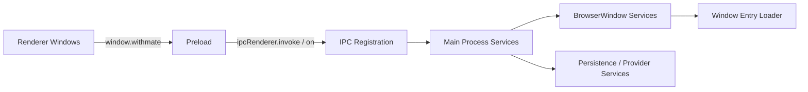

# Electron Window Runtime

- 作成日: 2026-03-12
- 対象: BrowserWindow / preload / bootstrap の current runtime

## Goal

WithMate の `Home Window`、`Session Window`、`Session Monitor Window`、`Settings Window`、`Character Editor Window`、`Diff Window` を Electron の current runtime でどう起動・再利用・接続しているかを説明する。

## Position

- この文書は `window-architecture.md` の supporting doc として扱う
- window の上位責務と mode 切り替え判断は `docs/design/window-architecture.md` を正本とする
- session 実行 lifecycle は `docs/design/session-run-lifecycle.md` を参照する
- session / audit / memory persistence は `docs/design/electron-session-store.md` を参照する

## Scope

- BrowserWindow の生成と再利用
- preload 境界
- IPC 登録の grouping
- app bootstrap / lifecycle
- dev / build の entry 解決

## Out Of Scope

- provider adapter の詳細
- SQLite schema の詳細
- renderer UI の詳細
- packaging / updater

## Runtime Structure

## Window Set

- `Home Window`
- `Session Window`
- `Session Monitor Window`
- `Settings Window`
- `Character Editor Window`
- `Diff Window`

## Decision

- `Home Window` は単一 window とする
- `Session Window` は `sessionId` ごとに 1 つまで生成する
- `Character Editor Window` は create mode 1 つ、edit mode は `characterId` ごとに 1 つまで生成する
- `Session Monitor Window` と `Settings Window` は単一 window として再利用する
- `Diff Window` は一時 token で preview payload を引く popout とする
- 同じ対象を再度開く要求が来たら新規生成せず、既存 window を再表示・フォーカスする
- renderer は `window.withmate` を前提に動作し、browser 単体起動はサポートしない

## Main Process Responsibilities

### MainBootstrapService

- app ready 後の bootstrap
- store 初期化
- IPC / lifecycle / window wiring

### AppLifecycleService

- `activate`
- `window-all-closed`
- `before-quit`

### SessionWindowBridge

- `Session Window` の生成後 wiring
- running close policy
- `session-start`
- `session-window-close`

### AuxWindowService

- `Home`
- `Session Monitor`
- `Settings`
- `Character Editor`
- `Diff`
  の生成 / 再利用 / registry

### WindowEntryLoader

- dev では Vite URL
- build では `dist/*.html`
- query / search の付与

### MainIpcRegistration

- `window.withmate` に対応する IPC を domain ごとに登録する

## Preload Boundary

preload は `contextBridge.exposeInMainWorld("withmate", api)` の 1 箇所だけを担当する。  
current 実装の API surface は次の domain に分かれる。

- `navigation`
- `catalog`
- `session`
- `observability`
- `settings`
- `character`
- `picker`
- `subscription`

型定義の正本は `src/withmate-window-api.ts` と `src/withmate-window-types.ts` に置く。

## URL Resolution

### Development

- `Home Window`: `http://localhost:4173/`
- `Session Window`: `http://localhost:4173/session.html?...`
- `Session Monitor Window`: `http://localhost:4173/?mode=monitor`
- `Settings Window`: `http://localhost:4173/?mode=settings`
- `Character Editor Window`: `http://localhost:4173/character.html?...`
- `Diff Window`: `http://localhost:4173/diff.html?...`

### Build

- `Home Window`: `dist/index.html`
- `Session Window`: `dist/session.html?...`
- `Session Monitor Window`: `dist/index.html?mode=monitor`
- `Settings Window`: `dist/index.html?mode=settings`
- `Character Editor Window`: `dist/character.html?...`
- `Diff Window`: `dist/diff.html?...`

## Security Baseline

- `contextIsolation: true`
- `nodeIntegration: false`
- `sandbox: false`
- preload 経由で必要最小限の API だけ渡す

current 実装では `window.withmate` の安定露出を優先し、sandbox は無効にしている。  
将来 hardened runtime を詰める段階で再評価する。

## Relation To Existing Docs

- `window-architecture.md`
  - window の責務分離と mode 判断
- `desktop-ui.md`
  - 現行 desktop UI の構成
- `electron-session-store.md`
  - session / audit / memory persistence orchestration
- `session-run-lifecycle.md`
  - running session の保護制御

## Open Questions

- Home Window を閉じたあと Session / Character Editor だけを残す運用をどこまで許容するか
- app メニューやショートカットをどの window に割り当てるか
- sandbox / hardened runtime をどの段階で再評価するか
