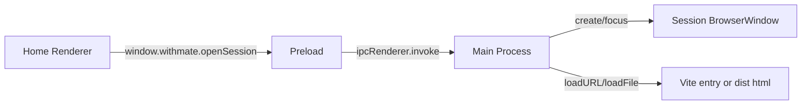

# Electron Window Runtime

- 作成日: 2026-03-12
- 対象: `Home Window` / `Session Window` を Electron で起動する最小ランタイム

## Goal

React/Vite の separate entry mock を Electron の実 `BrowserWindow` へ接続し、
`Home Window` と `Session Window` を Main Process で管理できる状態にする。
この段階では Codex Adapter や永続化の本実装までは行わず、window lifecycle と preload 境界を確定する。

## Scope

- Electron の導入
- Main Process の entry
- preload による最小限の window API 露出
- `Home Window` の生成
- `Session Window` の生成、再利用、フォーカス
- dev / build の URL 解決

## Out Of Scope

- Codex SDK 接続
- SQLite 永続化
- IPC による session store 本実装
- menu / tray / updater
- packaging

## Runtime Structure



## Decision

- Main Process は `Home Window` を 1 つだけ生成する
- `Session Window` は `sessionId` ごとに 1 つまで生成する
- 同じ `sessionId` を再度開く要求が来たら新規生成せず、既存 window を再表示・フォーカスする
- preload では `openSession(sessionId)` だけを最小 API として公開する
- browser-only mock 互換のため、Renderer 側は `window.withmate` が無い場合 `window.open` へフォールバックする

## Main Process Responsibilities

- app ready 後に `Home Window` を生成する
- `sessionId -> BrowserWindow` 対応表を保持する
- `open-session` IPC を受けて Session Window を生成または再利用する
- window close 時に対応表を掃除する
- dev では Vite URL、build では `dist/` の html を読む

## Renderer / Preload Boundary

### Preload API

```ts
type WithMateWindowApi = {
  openSession(sessionId: string): Promise<void>;
};
```

### 方針

- Renderer は Electron 固有 API を直接触らない
- `window.withmate` の有無で実行環境を判定する
- 将来 `launchSession` `pickDirectory` `listCharacters` を足しても、この preload 境界を拡張していく

## URL Resolution

### Development

- `Home Window`: `http://localhost:4173/`
- `Session Window`: `http://localhost:4173/session.html?sessionId=...`

### Build

- `Home Window`: `dist/index.html`
- `Session Window`: `dist/session.html?sessionId=...`

query string を保ったまま `loadFile(..., { search })` で sessionId を渡す。

## Security Baseline

- `contextIsolation: true`
- `nodeIntegration: false`
- `sandbox: true`
- preload 経由で必要最小限の API だけ渡す

## Relation To Existing Docs

- [window-architecture.md](./window-architecture.md)
  - window の責務分離と lifecycle の上位設計
- [ui-react-mock.md](./ui-react-mock.md)
  - 現状の mock entry 構成

## Open Questions

- Home Window を閉じたあと Session Window だけを残す運用をどう扱うか
- app メニューやショートカットをどの window に割り当てるか
- session metadata の source of truth を localStorage から Main Process store へいつ移すか
