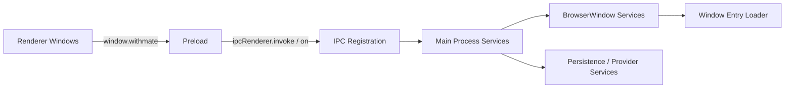

# Electron Window Runtime

## Goal

WithMate の `Home Window`、`Session Window`、`Session Monitor Window`、`Settings Window`、`Diff Window` を Electron の current runtime でどう起動・再利用・接続しているかを説明する。

## Position

- この文書は `window-architecture.md` の supporting doc として扱う
- window の上位責務と mode 切り替え判断は `docs/design/window-architecture.md` を正本とする
- session 実行 lifecycle は `docs/design/session-run-lifecycle.md` を参照する
- session / audit / memory persistence は `docs/design/electron-session-store.md` を参照する

## Scope

- BrowserWindow の生成と再利用
- preload 境界
- IPC 登録の grouping
- app bootstrap / lifecycle
- dev / build の entry 解決

## Out Of Scope

- provider adapter の詳細
- SQLite schema の詳細
- renderer UI の詳細
- packaging / updater

## Runtime Structure

```mermaid
flowchart LR
    WR[Renderer Windows] -->|window.withmate| PL[Preload]
    PL -->|ipcRenderer.invoke / on| IPC[IPC Registration]
    IPC --> MP[Main Process Services]
    MP --> BW[BrowserWindow Services]
    MP --> STORE[Persistence / Provider Services]
    BW --> ENTRY[Window Entry Loader]
```

## Window Set

- `Home Window`
- `Session Window`
- `Session Monitor Window`
- `Settings Window`
- `Diff Window`

## Decision

- `Home Window` は単一 window とする
- `Session Window` は `sessionId` ごとに 1 つまで生成する
- `Session Monitor Window` と `Settings Window` は単一 window として再利用する
- `Diff Window` は一時 token で preview payload を引く popout とする
- 同じ対象を再度開く要求が来たら新規生成せず、既存 window を再表示・フォーカスする
- renderer は `window.withmate` を前提に動作し、browser 単体起動はサポートしない

## Main Process Responsibilities

### MainBootstrapService

- app ready 後の bootstrap
- store 初期化
- IPC / lifecycle / window wiring
- `--background` 起動では Boot / Home window を表示せず、runtime API と discovery publish だけを初期化する

### AppLifecycleService

- `activate`
- `second-instance`
- `window-all-closed`
- `before-quit`

Main Process は `app.requestSingleInstanceLock()` を取得し、2 つ目以降の起動は既存 process の `second-instance` handler へ集約する。`second-instance` では `Home Window` を再生成または再表示・focus し、Windows で全 window close 後に Start Menu から戻れる導線を維持する。

### SessionWindowBridge

- `Session Window` の生成後 wiring
- running close policy
- `session-start`

Window復元候補のsnapshotは任意保存とし、open完了・quit準備は保存完了を待たない。quit準備時は候補の保存を要求したうえでcloseによる候補更新を止める。Auxiliary draft等の必須flushは独立した終了条件として維持する。

`SessionWindowRestoreService`は起動時に読み込んだ復元候補と現在開いているWindowの保存集合を分離する。復元操作は起動時候補の読込みだけを待ち、その後の現在集合の保存には待機しない。

### MainWindowComposition / MainWindowRuntime

- `MainWindowComposition` は BrowserWindow の共通生成設定、cursor placement、Homeと同じWindowでの起動状態表示を所有する。bootstrap完了時にAuxWindowServiceがそのWindowをHomeとして引き継ぐ
- `MainWindowRuntime` は WindowEntryLoader、WindowBroadcastService、WindowDialogService、AuxWindowService、SessionWindowBridge、SessionWindowRestoreService を一つの window runtime として所有する
- runtime は session lookup、run-in-flight、draft flush、restore persistence などの narrow port だけを受け取り、Memory、Character、Provider、Storage の service bag を保持しない
- window service の生成・状態は MainInfrastructureRegistry から分離し、Main Process の app/service registry と二重管理しない

### AuxWindowService

- `Home`
- `Session Monitor`
- `Settings`
- `Diff`
  の生成 / 再利用 / registry

### WindowEntryLoader

- dev では Vite URL
- build では `dist/*.html`
- query / search の付与

### MainIpcRegistration

- `window.withmate` に対応する IPC を domain ごとに登録する
- `src-electron/ipc/register-main-ipc.ts` は共通の error logging、renderer log、draft flush ACK と feature assembly の登録接続だけを担当する。各 IPC feature (`window`、`catalog`、`settings`、`session-query`、`session-runtime`、`auxiliary`、`mate`、`character`、`prompt-template`) が必要な sender identity、認可 resolver、サービス port を組み合わせた handler dependency を所有し、`src-electron/app/main-ipc-deps.ts` は Main service をその assembly へ接続する

## Preload Boundary

preload は `contextBridge.exposeInMainWorld("withmate", api)` の 1 箇所だけを担当する。  
current 実装の API surface は次の domain に分かれる。

- `navigation`
- `session`
- `observability`
- `settings`
- `picker`
- `subscription`
- `terminal`

型定義の正本は `src-shared/ipc/withmate-window-api.ts` と `src-shared/window/withmate-window-types.ts` に置く。Bridgeの実装は`src-electron/preload/preload-api.ts`が担当し、rendererのURL queryからsession・auxiliary・diff tokenを読む処理は`src/app/session-location.ts`が担当する。

## Embedded Terminal

`src-electron/terminal/`がWindowと親Sessionに属するPTYの作成・入出力・終了を管理し、`src/terminal/`がタブとxtermを所有する。専用のtyped preload APIを使い、Mainは送信元が登録済みSession Windowのmain frameであることを確認する。rendererの指定したSession IDやcwdで起動せず、保存済み親Sessionのworkspaceを使う。他Windowの端末へ入力・resize・終了・出力購読を許可しない。

node-ptyはタブごとのElectron utility process内で起動要求時にloadし、WindowsはSystemRoot内のWindows PowerShell、macOSは`/bin/zsh`を実行する。native moduleや非同期socketの異常をMain・他の端末から隔離し、hostの予期しない終了は当該タブの`Failed`として通知する。Mainとhostの接続にはElectronのメッセージAPIを使う。workspace内や相対PATHの同名プログラムをshellに選ばず、cwdの文字列をtrimしない。load・shell・cwd・spawnの失敗は端末単位の失敗として返し、外部Terminalへのfallbackや自動respawnは行わない。

出力は専用eventからxtermの`write`へ渡し、その完了callbackで処理済み文字数を返す。PTYは未処理量のhigh/low watermarkでpause/resumeする。非選択・折りたたみ中も受信と処理を継続し、本文をReact state、Session保存、Audit Log、Memory、診断ログへ複製しない。端末の履歴はxtermのscrollback上限に従う。

タブ終了、Window破棄、renderer終了・document navigation、Session削除、アプリ終了でownerのPTYと購読を解放する。起動待機中に解放された要求は、後からspawnが完了してもPTYを残さない。Window close時も個別タブと同じ判定で、実行中・起動中・判別不能な端末があれば終了を非同期で一括確認する。入力待ち・終了済み端末だけなら端末理由の確認は省略し、AI実行中ならWindowを閉じても実行を継続する確認へまとめる。確認待ちの重複closeを抑止し、承認後も既存のdraft flushを待つ。確認結果は元のWindow identityへ限定する。

## URL Resolution

### Development

- `Home Window`: `http://localhost:4173/`
- `Session Window`: `http://localhost:4173/session.html?...`
- `Session Monitor Window`: `http://localhost:4173/?mode=monitor`
- `Settings Window`: `http://localhost:4173/?mode=settings`
- `Diff Window`: `http://localhost:4173/diff.html?...`

### Build

- `Home Window`: `dist/index.html`
- `Session Window`: `dist/session.html?...`
- `Session Monitor Window`: `dist/index.html?mode=monitor`
- `Settings Window`: `dist/index.html?mode=settings`
- `Diff Window`: `dist/diff.html?...`

## Security Baseline

- `contextIsolation: true`
- `nodeIntegration: false`
- `sandbox: false`
- entry HTML には meta CSP を入れ、renderer script / style / connect を `self` と Vite dev server (`http://localhost:4173`, `ws://localhost:4173`) に限定する
- preload 経由で必要最小限の API だけ渡す

current 実装では preload が `contextBridge` と `ipcRenderer.invoke/on` の薄い橋渡しだけを担当し、Codex SDK / GitHub Copilot SDK は main process 側で動かしている。  
ただし `npm run electron:start` の Home Window では `sandbox: true` が入ると `window.withmate` 注入が回帰し、renderer が `Home は Electron から起動してね。` の fallback へ落ちる事象を確認した。  
preload API / IPC の成立を優先し、現行実装は `sandbox: false` を維持する。

## Local Path Operation Boundary

- `openPath` は current UX を優先し、任意 target を受け取れる仕様を維持する
- main process 側では target を external URL / local path へ正規化するが、path allowlist の強制ガードは入れない
- `AddDirectory` は prompt / workspace 操作で許可対象ディレクトリを広げる既存機能であり、`openPath` 自体の強制ガードではない
- `openSessionTerminal` はsessionの`workspacePath`を外部Terminalで開く用途に限定し、組み込みTerminalのAPIとは分離する
- detached file preview は `openPath` へ local file link を直接渡さず、Main process が root-scoped resource または user-activated absolute-file resourceへ解決する。absolute-file preview は Additional Directory や provider 権限を変更しない。詳細は ADR 020 を参照する
- `src-electron/files/session-file-explorer-runtime.ts` は Explorer と Git の認可境界を共有し、`SessionFilePreviewService` が resource / link / history-diff の操作、owner解決、title・payload・公開結果を所有する。IPCはsender認可を、Explorer / Git serviceはroot・resource検証を、既存Window serviceはidentity・再利用を所有する。`main.ts` はFiles操作への接続とfilesystem / Electron / Windowの公開操作を渡す
- したがって local path operation の制約は一律 block ではなく、renderer 導線と main process 正規化の責務分離で扱う

## Relation To Existing Docs

- `window-architecture.md`
  - window の責務分離と mode 判断
- `desktop-ui.md`
  - 現行 desktop UI の構成
- `electron-session-store.md`
  - session / audit / memory persistence orchestration
- `session-run-lifecycle.md`
  - running session の保護制御
