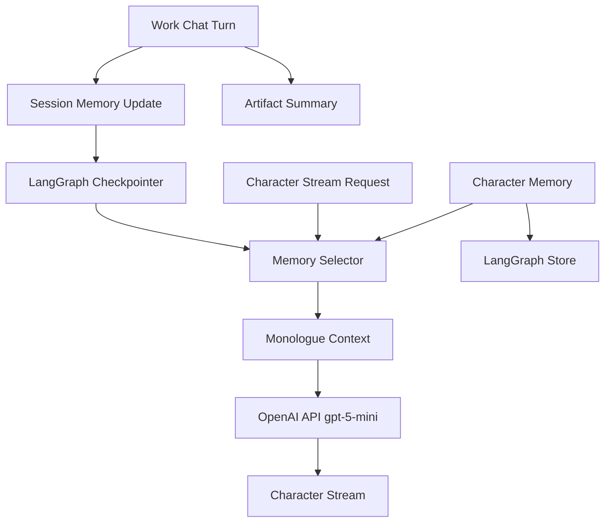

# Memory Architecture

- 作成日: 2026-03-12
- 対象: Character Memory / Session Memory / Monologue Context の責務設計
- 関連 Issue:
  - `#3 LangGraphを使ってMemoryの永続化と共有`
  - `#1 定期実行はサブスクリプションだと規約違反の可能性がある`

## Goal

WithMate における Memory を、coding agent 本体と `Character Stream` の両方で使える形に分離し、
独り言生成に必要な最小入力を安定して抽出できる構造として定義する。

## Design Summary

WithMate の Memory は 3 層に分ける。

1. `Character Memory`
- キャラ単位で共有される長期記憶
- セッションをまたいで持続する

2. `Session Memory`
- 作業セッション単位の中期記憶
- そのタスクの目的、決定事項、未解決論点を保持する

3. `Monologue Context`
- 独り言生成専用に圧縮した短期入力
- 永続化の主対象ではなく、Memory から派生させる

## Why This Split

### Character Memory

キャラの一貫性は、1 セッションに閉じない。
ユーザーとの距離感、反応傾向、話題の継続性は、キャラ単位で蓄積する必要がある。

### Session Memory

作業継続性は、キャラとは別にセッション単位で管理する必要がある。
同じキャラでも、作業内容や決定事項はセッションごとに違うため、混ぜると破綻しやすい。

### Monologue Context

独り言生成は毎回フル履歴を読むべきではない。
`Character Memory` と `Session Memory` から必要最小限だけ抜いた派生入力にすることで、
コストと応答品質を両立する。

## Data Domains

### 1. Character Memory

保持対象の例:

- キャラとして保持したい話し方のクセ
- ユーザーとの呼び方や距離感
- よく反応する話題
- 過去セッションから継続して効く印象

保存キーの考え方:

- character id
- memory category
- updated at

### 2. Session Memory

保持対象の例:

- セッションの目的
- 現在の task summary
- 決定済み仕様
- unresolved な論点
- 最近の変更や実行結果の要約

保存キーの考え方:

- session id
- workspace id / path
- thread id
- updated at

### 3. Monologue Context

入力対象の例:

- キャラ定義の短い固定要約
- Character Memory の上位数件
- Session Memory の現在要約
- 直近ターンの要約
- 現在の mood / run state

MVP では、独り言生成に raw transcript 全件を渡さない。

## LangGraph Mapping

LangGraph の公式 docs では、次の 2 つが主要な基盤として分かれている。

- `checkpointer`
  - thread 単位の short-term state
- `Store`
  - cross-thread で共有できる long-term memory

WithMate では、これを次のように対応づける。

- `checkpointer`
  - `Session Memory` の短期状態
  - turn をまたぐ state
  - thread_id ベースの継続
- `Store`
  - `Character Memory` の長期保存
  - 必要に応じて cross-session 共有

`Monologue Context` は LangGraph 上の保存主体ではなく、
checkpointer / Store から都度組み立てる派生入力とする。

## Architecture

## Read / Write Policy

### Character Memory Write

更新契機の候補:

- セッション終了時に重要な関係性や印象を抽出
- 明示的に保持したい情報が確定したとき
- 独り言生成後に継続価値の高い要素を昇格させるとき

Character Memory は毎ターン無差別に肥大化させない。
昇格条件を設ける。

### Session Memory Write

更新契機:

- ユーザーの prompt 送信後
- assistant turn 完了後
- file change / run summary 確定後
- 明示的な仕様決定後

### Monologue Context Build

生成契機:

- Character Stream が発火するとき
- UI 表示直前

毎回再構成してよく、派生結果の完全保存は MVP では不要。

## Selection Rules

Monologue Context へ入れる情報は、次の優先順で絞る。

1. 直近ターンに強く関連するもの
2. キャラとして継続性が高いもの
3. 現在の task と関係が深いもの
4. Mood や run state に影響するもの

低優先の過去情報は切り落とす。

## Non Goals

- 全会話履歴の完全複製を Memory として持つこと
- Character Memory と Session Memory を同じテーブルや同じ state に混在させること
- LangGraph を UI 状態管理まで広げること
- Monologue Context を長期保存の正本にすること

## Open Questions

- Character Memory をどの粒度で昇格するか
- Session Memory の要約を turn ごとに作るか、節目だけにするか
- Monologue Context の token budget を何 tokens に固定するか
- Store backend を何にするか

## References

- LangGraph JavaScript Persistence: https://docs.langchain.com/oss/javascript/langgraph/persistence
- LangGraph JavaScript Memory: https://docs.langchain.com/oss/javascript/langgraph/add-memory
- LangGraph TTL configuration: https://docs.langchain.com/langsmith/configure-ttl
- `docs/design/monologue-provider-policy.md`
