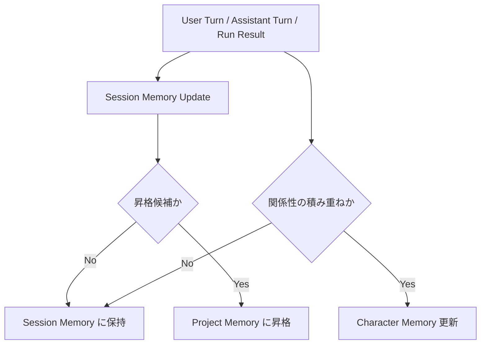

# Memory Architecture

- 作成日: 2026-03-12
- 更新日: 2026-03-27
- 対象: Project Memory / Session Memory / Character Memory の責務設計
- 関連 Issue:
  - `#3 LangGraphを使ってMemoryの永続化と共有`
  - `#1 定期実行はサブスクリプションだと規約違反の可能性がある`
  - `#14 memoryに時間経過の評価値追加`
  - `#15 キャラストリームをメモリー生成の一部にする`

## Goal

WithMate における Memory を、`coding agent の継続性` と `character との積み重ね` を支える基盤として定義する。  
current milestone では、Memory をまず `Project`、`Session`、`Character` の 3 層に分け、何をどこへ残すかの判断基準を固定する。

## Issue Mapping

- `#3`
  - Memory 永続化と共有の基盤
  - `Project / Session / Character` の保存先、抽出、検索の設計対象
- `#14`
  - Memory retrieval の ranking 改善
  - 保存 schema ではなく、検索時の時間減衰や評価値の設計として扱う
- `#15`
  - memory extraction plane と Character Stream の接続案
  - Memory 基盤の上に載る応用案として扱う
- `#1`
  - monologue plane の provider / auth / trigger policy
  - `#15` が成立する前提条件


## Design Summary

WithMate の Memory は 3 層に分ける。

1. `Project Memory`
- 作業対象単位で共有したい永続記憶
- session をまたいでも持ち越したい durable knowledge

2. `Session Memory`
- その session を継続するための working memory
- compact 後や再開後でも、作業の目的や決定事項が欠落しないための記憶

3. `Character Memory`
- ユーザーと character の関係性や積み重ね
- project や task と分離して character 単位で持つ記憶
- main の coding session prompt には注入せず、monologue や将来の character update で使う

## Core Distinction

一番重要なのは `Project Memory` と `Session Memory` の違いである。

- `Project Memory`
  - この作業対象で次回以降も通用する記憶
  - session をまたいで共有される
- `Session Memory`
  - 今この作業を続けるためだけに必要な記憶
  - その session の再開や compact 復元に必要

つまり、

- `Project Memory` は「昇格済み知識」
- `Session Memory` は「作業継続用の scratchpad」

として扱う。

## Why This Split

### Project Memory

同じ作業対象で何度も効く知識は、session に閉じずに残したい。

例:

- プロダクト方針
- project 固有の設計ルール
- 継続採用が決まった naming / layout / dependency 方針
- 「これは今は見送る」といった中長期判断

### Session Memory

作業継続に必要な情報は、project 全体の知識とは別に持つ必要がある。

例:

- 今回の目的
- 今回の決定事項
- 未解決論点
- 次にやること
- compact 前のやり取りから失いたくない前提

この層を分けることで、「一時メモ」と「昇格済み知識」が混ざりにくくなる。

### Character Memory

character との積み重ねは、project や session に閉じない。  
ただし current 設計では、これを main の coding session prompt に戻さない。

例:

- 呼び方
- 距離感
- ユーザーへの反応傾向
- 一緒に過ごした結果として残したい印象

このため、`Project Memory` とも `Session Memory` とも別に持つ。  
利用先は主に `Character Stream`、将来の character definition update、関係性 summary の生成補助である。

## Internal Processing Policy

Memory の分類や昇格判断は、基本的にユーザーへ都度聞かない。  
WithMate 内部の処理で行う。

### Principle

1. まず `Session Memory` に入れる
2. その中で再利用価値が高いものだけ `Project Memory` に昇格させる
3. 関係性や character 固有の積み重ねだけ `Character Memory` に寄せる

つまり、`Project Memory` は直接書き込む先というより、`Session Memory` からの昇格先として扱う。

## Project Promotion Policy v1

current 実装の `Session -> Project` 昇格は rule-based で行う。

- `decisions`
  - 常に `Project Memory` へ昇格する
- `notes`
  - `constraint:` / `convention:` / `context:` / `deferred:` prefix を持つものだけ昇格する
- `goal`
  - 昇格しない
- `openQuestions`
  - 昇格しない
- `nextActions`
  - 昇格しない

この設計では、`Project Memory` のノイズを抑え、session 固有の scratchpad を長期記憶へ混ぜすぎないことを優先する。

## Retrieval Evaluation

`Project Memory` と `Character Memory` の retrieval では、保存有無だけでなく「今どれを拾うべきか」の評価が必要になる。  
ただし retrieval の利用面は同じではない。

current design では、次の 3 要素を retrieval score の候補として扱う。

1. semantic relevance
- 現在の query や session 文脈との意味的近さ

2. lexical match
- 明示的なキーワード一致

3. recency / decay
- 古い記憶ほど価値を下げる補正
- Issue `#14` はこの層の follow-up として扱う

current 実装の `Project Memory` retrieval は semantic ではなく lexical までで止めるが、日本語 query を拾いやすくするために word token と 2-gram / 3-gram を併用する。

このため `#14` は新しい memory type の追加ではなく、検索・再注入ロジックの改善タスクとして位置づける。  
`Project Memory` では coding session への再注入の ranking、`Character Memory` では monologue / character update 用 retrieval ranking に効く。

## Data Domains

### 1. Project Memory

保持対象の例:

- project 全体の方針
- 設計上の前提
- 継続的に使うディレクトリ構成の意味
- 次回の session でも有効な判断

保持しないほうがよいもの:

- その場限りの調査メモ
- 一時的な仮説
- 1 session だけの TODO

保存キーの考え方:

- project type (`git` | `directory`)
- project id
- category
- source session id
- updated at

### Project Identity

`Project Memory` の identity は Git 前提にしない。

- `Git`
  - `git root` を第一の anchor にする
  - 必要なら remote 情報を補助キーに使う
- `NotGit`
  - 正規化した `workspace path` を anchor にする

つまり `Project Memory` は、

- Git 管理された repository
- Git ではない単なる作業ディレクトリ

のどちらにも対応する。

### 2. Session Memory

保持対象の例:

- session の目的
- 現在の task summary
- 直近で決めたこと
- unresolved な論点
- 次にやること
- compact 後でも必要な経緯

保存キーの考え方:

- session id
- workspace path
- thread id
- updated at

### Session Memory v1 Schema

`Session Memory` は最初から大きくしすぎず、まずは compact 後や再開後の継続に必要な最小情報だけを持つ。

```ts
type SessionMemoryV1 = {
  schemaVersion: 1;
  goal: string;
  decisions: string[];
  openQuestions: string[];
  nextActions: string[];
  notes: string[];
  updatedAt: string;
};
```

### Field Roles

#### `schemaVersion`

- schema の版
- 将来 field を追加しても読み分けられるようにするためのもの
- 最初から持たせておく

#### `goal`

- この session が何を達成しようとしているか
- 一文または短い段落で表す
- compact 後に「今何をやっていたか」を復元する基点になる

例:

- `Copilot parity の残タスクを整理して rate limit 可視化まで仕上げる`

#### `decisions`

- この session 中に確定した判断
- 後で再度迷わないために残す
- `done` ではなく「何をどう決めたか」を書く

例:

- `Copilot の image は専用扱いせず file attachment として送る`
- `Codex の approval callback は SDK 待ちのため実装しない`

#### `openQuestions`

- まだ答えが出ていない論点
- これを持つことで、再開時に「次に何を考えるべきか」がすぐ分かる
- `決定事項` と混ぜない

例:

- `Session Memory を turn ごとに更新するか、節目でだけ更新するか`

#### `nextActions`

- 次に着手すべき具体的な行動
- TODO に近いが、あくまでこの session の継続用
- 1 アクション 1 行で短く保つ

例:

- `Session Memory v1 を docs に追記する`
- `Project Memory の昇格ルールを決める`

#### `notes`

- 上のどれにも綺麗に入らないが、compact 後に落ちると困る補助情報
- 乱用は避ける
- 一時メモの捨て先ではなく、復元に必要な補助欄として使う

例:

- `ユーザーは provider prompt 側の character override は不要と言っている`

#### `updatedAt`

- 最終更新時刻
- freshness と衝突解決の基準

### Why These Fields

この 6 項目に絞る理由は単純で、`Session Memory` の責務が次の 3 つに集約されるからである。

1. 何をしていたかを思い出せる
2. 何を決めたかを失わない
3. 次に何をやるかが分かる

対応関係は次のとおり。

- `goal`
  - 何をしていたか
- `decisions` / `openQuestions`
  - 何を決めたか / まだ決めていないか
- `nextActions`
  - 次に何をやるか
- `notes`
  - 上記を補助する文脈

### Update Guidance

`Session Memory` 更新時は、まず次の順で field を見直す。

1. `goal` は変わったか
2. 新しい `decision` は確定したか
3. `openQuestion` は解消または追加されたか
4. `nextAction` は更新されたか
5. 補助的に残すべき `note` はあるか

### Extension Policy

後から拡張は普通にありうる。  
ただし v1 では入れない。

将来追加候補:

- `constraints`
- `risks`
- `references`
- `artifacts`
- `summary`

最初は top-level を増やしすぎず、`schemaVersion` つきの最小形で始める。

### 3. Character Memory

保持対象の例:

- ユーザーとの呼び方
- 距離感
- 継続した反応傾向
- 一緒に過ごした時間として残したい印象

保存キーの考え方:

- character id
- category
- updated at

主用途:

- `Character Stream` の入力
- 将来の character definition update 補助
- 関係性 summary の生成

非用途:

- main の coding session prompt への常設注入
- main の coding session prompt での on-demand retrieval

## Promotion Rules

`Session Memory` から `Project Memory` へ昇格させる条件は、最低限次の 3 つで判断する。

1. project 全体で再利用価値がある
2. 一時的な作業メモではない
3. 別 session にも持ち越したい

この条件を満たさないものは `Session Memory` に留める。

## Update Flow



## Read / Write Policy

### Session Memory Write

更新契機:

- ユーザーの prompt 送信後
- assistant turn 完了後
- file change / run summary 確定後
- compact 実行前後
- 明示的な仕様決定後

この層は最も頻繁に更新される。

### Project Memory Write

更新契機:

- `Session Memory` から昇格条件を満たしたとき
- session の節目で durable knowledge が確定したとき

毎 turn 無差別に増やさない。

### Character Memory Write

更新契機の候補:

- 関係性や呼び方が明確に変化したとき
- 継続して残したい反応傾向が見えたとき
- character 体験として再利用価値があると判断したとき

project の知識や task の知識はここへ混ぜない。

## Current Implementation Slice

current 実装では、`Session Memory` の永続化と extraction trigger、`Project Memory` の persistence foundation まで入れる。

- SQLite の `session_memories` table を使う
- key は `session_id`
- `Session` 作成時に default memory を作る
- `workspacePath` と `threadId` は session metadata と同期する
- provider ごとの `Memory Extraction` 設定から `model / reasoning depth / outputTokens threshold` を読む
- turn 完了時に `outputTokensThreshold` を超えた場合だけ extraction plane を走らせる
- `Session Window` を閉じた時は threshold に関係なく extraction を 1 回走らせる
- extraction 結果は `SessionMemoryDelta` を validate / normalize した時だけ merge する
- `Session Memory` の `decisions` と tag 付き `notes` を `Project Memory` へ昇格する
- coding plane prompt では `Session Memory` を常設し、`Project Memory` は lexical retrieval hit を最大 3 件だけ注入する

つまり現段階では、

- `Session Memory`
  - 保存基盤あり
  - trigger あり
- `Project Memory`
  - `project_scopes` / `project_memory_entries` の保存基盤あり
  - scope 解決あり
  - rule-based 昇格あり
  - lexical retrieval あり
  - retrieval 時に `lastUsedAt` 更新あり
- `Character Memory`
  - design only

という進み方を取る。

## Decision Engine

current milestone の設計では、分類と昇格は内部処理で扱う。

### Phase 1

- rule-based を基本にする
- `Session Memory` は固定 schema で更新する
- `Project Memory` は昇格ルールで更新する
- `Character Memory` は category を限定して扱う

### Phase 2

- 必要なら local model を補助的に使う
- 役割は次に限定する
  - 昇格候補の判定補助
  - 重複統合
  - 要約の正規化
  - Character / Project / Session の分類補助

この local model は「Memory 全体を自由生成する主体」ではなく、内部判定の補助として使う。

## Memory Extraction Plane

Memory 更新は、coding session 本体とは別の `memory extraction plane` として扱う。

- coding plane
  - `Codex` / `Copilot` の通常会話と作業実行
- memory extraction plane
  - Session / Project / Character memory を更新するための裏処理

この分離により、

- 通常会話の出力形式を JSON に縛らない
- provider ごとの差で Memory 更新ロジックを壊しにくくする
- Memory 更新失敗が本体の turn を壊さない

## Extraction Model Policy

Memory 抽出は、通常会話と同じ provider session に混ぜず、専用モデルへ固定 prompt を投げる形を基本とする。

### Default Stance

- `Session Memory` 抽出は専用モデルで行う
- 初期値は軽量モデルを想定する
- `goal / openQuestions / nextActions / notes` の抽出を優先し、`decisions` は保守的に扱う

### Model Choice

- current の想定では `gpt-5.4-mini` 級で十分有力
- 理由:
  - 目的は創作ではなく抽出・分類・整形
  - 出力は小さい JSON
  - 多少取りこぼしても次回更新で回復できる

### Settings

- current 実装では provider ごとに次を Settings で保持する
  - `model`
  - `reasoning depth`
  - `outputTokens threshold`
- trigger engine はその provider の設定値をそのまま使う

## Extraction Prompt Policy

Memory 抽出には固定 prompt を使う。

- role:
  - 会話生成ではなく、構造化抽出
- input:
  - 直近の turn 群
  - 既存の `Session Memory`
  - 必要なら補助的な project / character context
- output:
  - `SessionMemoryDelta` JSON

固定 prompt に含めるべき制約:

- JSON 以外を返さない
- 不明な field は無理に埋めない
- 既存 memory を全再生成せず、差分更新を意識する
- 推測で `decisions` を増やしすぎない
- `goal / decisions / openQuestions / nextActions / notes` の役割を field guide として明示する
- `goal` は session 全体の目的が変わった時だけ更新する
- `notes` は fallback として扱い、durable knowledge 候補だけ tag を付ける

## Session Memory Delta

Memory 抽出の返答は、完全な `SessionMemoryV1` ではなく差分形式を基本とする。

```ts
type SessionMemoryDelta = {
  goal?: string | null;
  decisions?: string[];
  openQuestions?: string[];
  nextActions?: string[];
  notes?: string[];
};
```

理由:

- 毎回全量を再生成すると揺れやすい
- 既存 memory と merge しやすい
- validate と失敗時の discard が簡単

## Validation And Save Policy

抽出結果は、そのまま保存しない。

1. response が JSON として parse できる
2. schema validate に通る
3. field ごとの正規化を通す
4. その時だけ Memory に merge する

この条件を満たさない時は保存しない。

### Strictness

- 形式が壊れている時は捨てる
- 1 回だけ repair retry を将来許容してよい
- ただし current milestone では `valid な時だけ保存` のほうが単純で安全

## Trigger Policy

Memory extraction は定期常駐ではなく、session の流れに従属した裏処理として発火させる。

### Initial Trigger Rule

初期仕様では、Memory extraction の通常発火条件を `outputTokens threshold` のみで扱う。

- `Codex`
  - 直近 turn の `outputTokens` が threshold 以上なら発火
- `Copilot`
  - 直近 turn の `outputTokens` が threshold 以上なら発火

ここでは provider ごとの差があっても、trigger の概念は揃える。

### Forced Triggers

次は threshold に関係なく必ず発火させる。

- compact 前
- session close 前

current 実装では、先に `Session Window` close 時の強制実行を入れている。  
compact 前の hook は follow-up で接続する。

## Audit Logging Policy

memory extraction plane の実行も、最終的には `audit_logs` に残す。  
ただし通常の user turn と同列には扱わず、background task として区別する。

### Recording Rule

- 通常 turn
  - `running / completed / canceled / failed`
- memory extraction
  - `background-running / background-completed / background-failed / background-canceled`

### Stored Data

background memory extraction では次を監査対象にする。

- extraction prompt の logical prompt
- extraction model / reasoning depth
- trigger reason
  - `outputTokensThreshold`
  - `session-window-close`
  - 将来は `compact-before` も追加
- provider raw response text
- extraction usage
- parse / validate failure

### Why

- どの会話 turn の後で memory が更新されたか追える
- threshold や固定 prompt の挙動を後から検証できる
- Character Stream のような別の background task が増えても、同じ audit policy で扱える

### Why

- `N turn` 固定より、情報量ベースで説明しやすい
- context growth や複合統計まで持ち込まずに済む
- Settings を provider ごとの 1 数値だけで済ませられる

### Threshold Ownership

- threshold は provider ごとに持つ
- 初期値は app 側の固定値とする
- 将来の自動調整は必須にしない
- ユーザーが必要なら Settings から手動で上書きできる形を想定する

## Provider Boundary

Copilot SDK では response schema を厳密固定する surface が現時点で見当たらない。  
そのため Memory 抽出は、Copilot 本体 session の出力形式に依存しない設計を優先する。

方針:

- coding plane は provider native の会話を維持する
- memory extraction plane は別 request / 別モデルで扱う
- 形式が合った時だけ保存する

## Relationship To Character Stream

Memory extraction plane は `Character Stream` と違い、セッション継続性のための内部処理である。

- 主目的は体験演出ではない
- 本体 turn に従属して発火する
- 裏処理として説明しやすい

このため、Character Stream で懸念していた `機械的な自動実行` とは切り分けて扱う。

## Prompt Injection Policy

Memory は 3 層すべてを同じように prompt へ入れない。

### 1. Character

- `character.md` や UI copy と同じく、character は session の基本前提として扱う
- `Character Memory` はここには含めない
- 関係性の記憶は main の coding session prompt ではなく、monologue / character update 側で使う

### 2. Session Memory

- `Session Memory` は prompt の骨格に近い
- 毎 turn の継続性に必要なので、常設注入を基本とする
- まずは次の最小 summary を常設候補とする
  - 目的
  - 決定事項
  - 未解決論点
  - 次にやること

### 3. Project Memory

- `Project Memory` は常設しない
- 毎 turn 全量を入れるのではなく、必要な時だけ検索して数件を注入する
- つまり RAG 的な検索注入を基本とする

### 4. Character Memory

- `Character Memory` は main の coding session prompt には入れない
- 主な用途は `Character Stream`、関係性 summary、将来の character update 補助である
- current milestone では coding plane の prompt 設計対象から外す

## Injection Order

current の設計では、実際の coding session prompt 組み込み順は次の考え方を基本にする。

1. app / provider の system 指示
2. `character.md`
3. `Session Memory` summary
4. 必要時に検索した `Project Memory`
5. ユーザー入力

つまり:

- `Session Memory` は骨格
- `Project Memory` は必要時の補助知識
- `Character Memory` は coding plane の prompt 注入対象ではない

として扱う。

## Retrieval Policy

### Always Included

- `character.md`
- `Session Memory` summary

### Retrieved On Demand

- `Project Memory`

検索注入の契機は今後の実装で詰めるが、少なくとも次のような場面を想定する。

- project 固有の方針や過去判断が関係しそうなとき
- session 内で「前に決めた project 全体の方針」を参照したいとき

## Non Goals For Prompt Injection

- `Project Memory` を毎 turn 全量投入すること
- `Session Memory` と `Project Memory` を同一形式で扱うこと
- `Character Memory` を main の coding session prompt へ注入すること
- 初期段階から local model に注入判定すべてを任せること

## Connection To Prompt Composition

`docs/design/prompt-composition.md` は prompt の合成レイヤーを扱う。  
本書は、そのうち `Memory をどの層でどう差し込むか` の判断基準を扱う。

実装時は次の責務分離を前提にする。

- `prompt-composition.md`
  - character、system prefix、user input の合成
- `memory-architecture.md`
  - Session / Project / Character memory の選択と注入条件

具体的な section 書式、件数上限、provider transport への分配方法は `docs/design/prompt-composition.md` を正本にする。

## LangGraph Mapping

LangGraph の公式 docs では、次の 2 つが主要な基盤として分かれている。

- `checkpointer`
  - thread 単位の short-term state
- `Store`
  - cross-thread で共有できる long-term memory

WithMate では、現時点では次の対応が自然である。

- `checkpointer`
  - `Session Memory`
- `Store`
  - `Project Memory`
  - `Character Memory`

ただし current milestone では LangGraph 実装そのものより、責務定義を先に固定する。

## Compact Interaction

`Session Memory` の主要な責務の 1 つは、compact 後でも作業継続に必要な記憶を失わないことにある。

そのため compact 前後では次を保証したい。

- 目的
- 決定事項
- 未解決論点
- 次にやること

これらは transcript から失われても、`Session Memory` に残っている前提で復元可能にする。

## Non Goals

- 全会話履歴の完全複製を Memory として持つこと
- Project / Session / Character を同じ箱に混ぜること
- 毎回ユーザーへ昇格判断を求めること
- local model に Memory 全体の正本管理を任せること
- current milestone で Monologue 用の派生入力まで細かく確定すること

## Open Questions

- `Session Memory` の最小 schema をどこまで固定するか
- `Project Memory` への昇格を turn ごとに見るか、節目だけにするか
- `Character Memory` をどの category に分けるか
- local model を採用する場合の runtime と distribution をどうするか
- Memory backend を何にするか

## Related

- `docs/design/product-direction.md`
- `docs/design/monologue-provider-policy.md`
- `docs/design/project-memory-storage.md`
