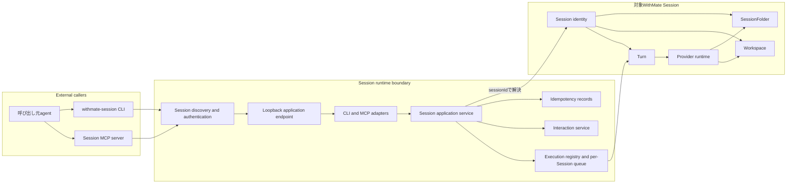
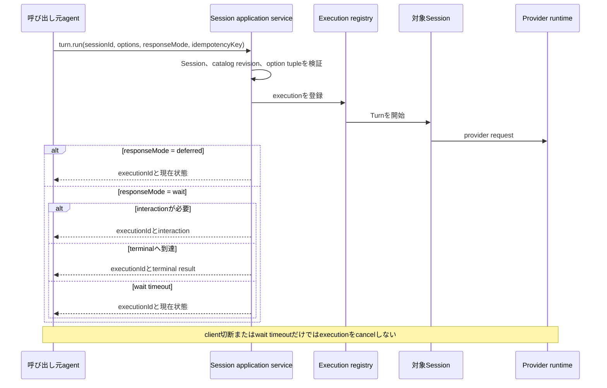
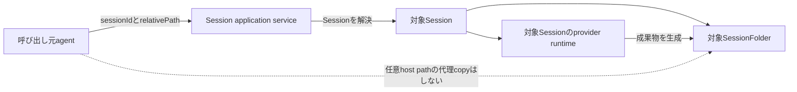
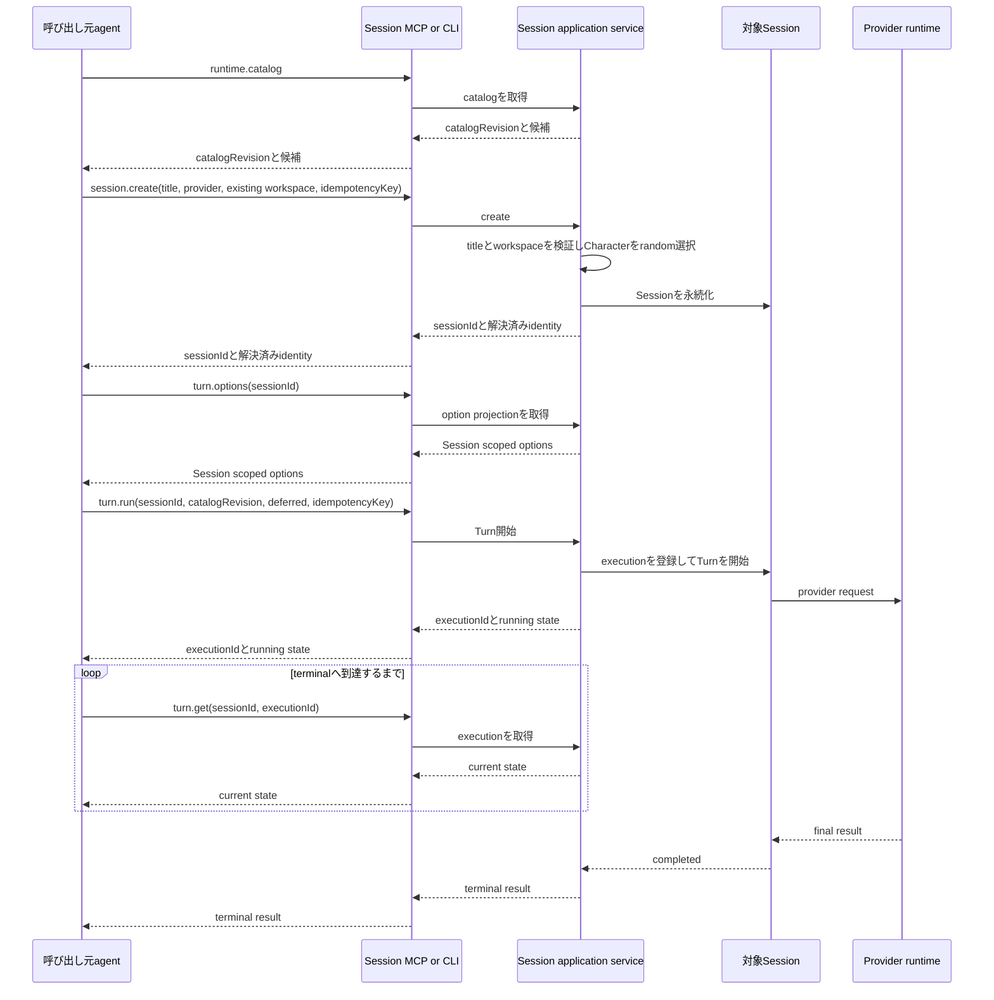
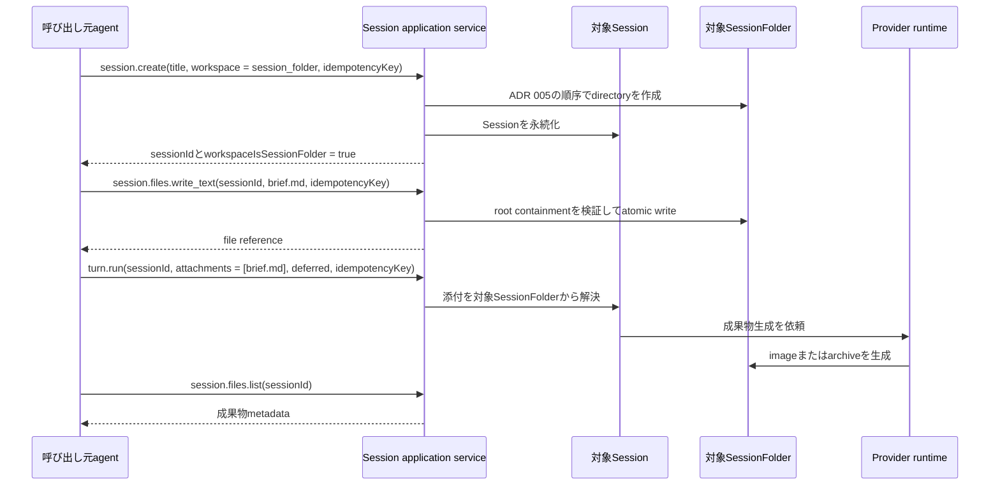
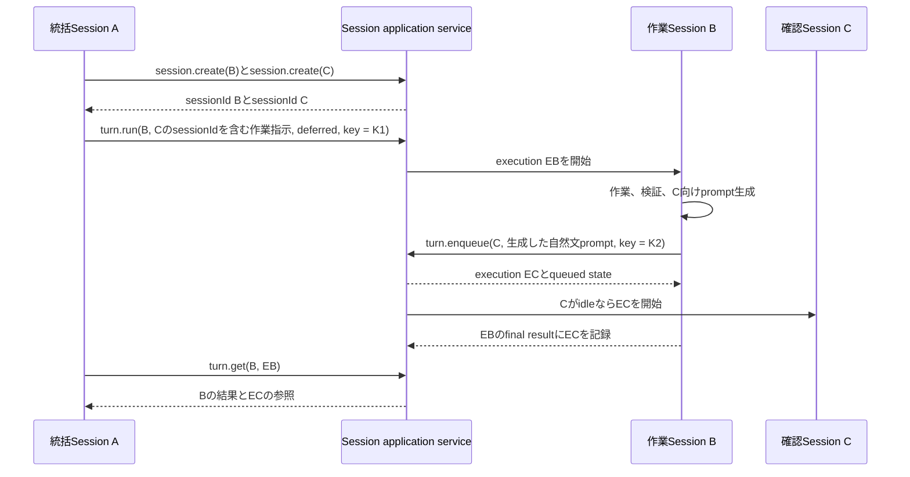
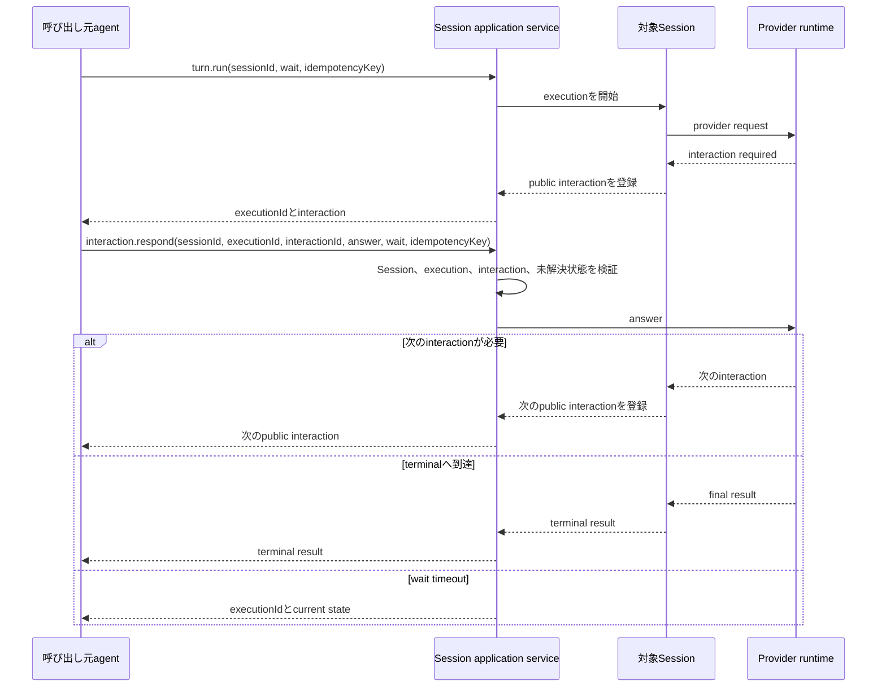
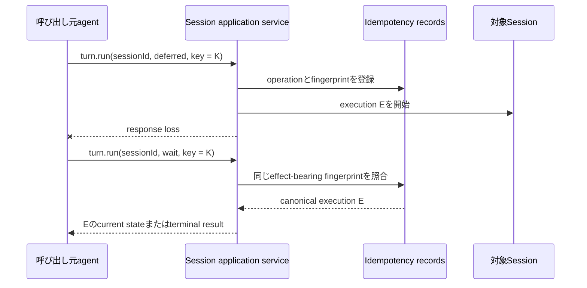
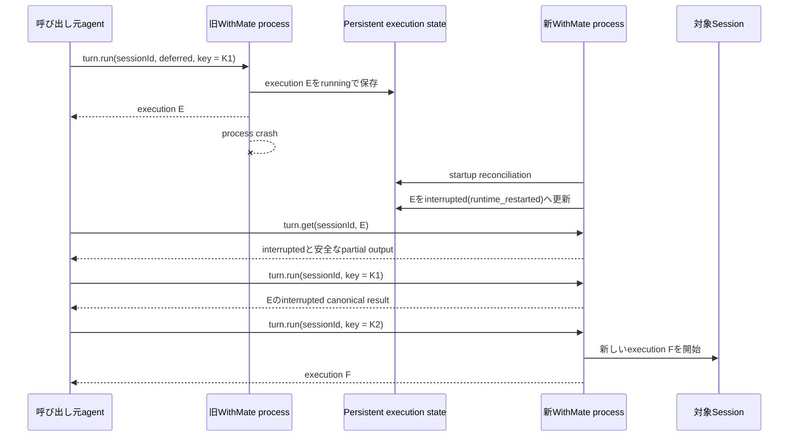
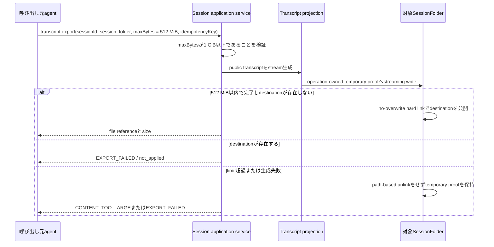

# Session External Runtime

- 状態: Active
- 作成日: 2026-08-10
- 対象: 通常SessionをCLIまたはMCPから操作するruntime境界

## 文書の役割

この文書は、Session CLI、Session MCP、Electron Main Process、操作対象Sessionの関係を示す。特に、MCPを呼び出すagentのSessionと操作対象のWithMate Sessionを区別する。

後戻り困難な選択理由はADR 021を正本とする。exact request、response、error、状態遷移、limitは、実装時に追加するtype、JSON schema、shared validation、executable contractを正本とする。この文書はそれらのfieldを網羅しない。

ADR 021で確定した非局所的な境界を本文に置き、未確定事項は末尾へ分離する。

## 用語

**呼び出し元agent**は、Session CLIまたはSession MCPを利用するagentである。WithMate内のSessionから呼び出す場合も、Codex AppなどWithMate外から呼び出す場合もある。

**対象Session**は、requestのSession IDで明示され、Session application serviceが解決する通常Sessionである。呼び出し元agent自身のSessionと同一とは限らない。

**execution**は、一回のTurn実行を追跡する単位である。Session、Turnの保存record、Messageとは別のidentityを持つ。

**queued execution**は、対象SessionのFIFO queueへ永続化され、実行のadmissionがまだ永続化されていないexecutionである。

**SessionFolder**は、対象Sessionに従属するWithMate managed directoryである。対象SessionのWorkspaceと同じdirectoryである場合と、別directoryである場合がある。

## Runtime topology

MemoryとCharacter Affectのruntimeはこの図に含めない。Session runtimeとはlistener、discovery、credential、route、public schemaを共有せず、低水準のtransport helperだけを再利用できる。

## Ownership

| Owner | Responsibilities | Does not own |
| --- | --- | --- |
| Electron Main Process | Session runtimeの起動と停止、application serviceのcomposition、discoveryとcredential | CLIまたはMCP固有の表示 |
| Session application service | validation、Session解決、状態遷移、provider実行、idempotency、public projection | transport固有envelope |
| CLI adapter | JSON入出力、exit code、接続診断、schema表示 | persistence、provider実行 |
| MCP adapter | tool schema、annotation、MCP result mapping | CLI process、persistence、provider実行 |
| Execution registry | execution ID、即時実行のadmission、Sessionごとの永続FIFO queue、wait、cancel、terminal projection | globalな固定並列数、Session metadataの任意更新 |
| Interaction service | interactionの列挙、対象検証、response、解決済み状態 | provider未対応interactionの代替 |
| 対象Session | Provider、Character、Workspace、Session kind、Turn履歴 | 呼び出し元agentのworkspace |
| SessionFolder | 対象Sessionの一時資料、添付、成果物 | global file catalog、orphan directoryの公開 |

GUI、CLI、MCPは兄弟入口である。GUIの既存IPCをCLIまたはMCPが呼ぶ構造にはせず、共通application serviceの上でそれぞれinputとoutputを変換する。

## Session作成と選択

CLIとMCPは通常Sessionを作成できる。titleは必須とし、自動生成または省略時のfallbackを設けない。Provider、Character、Workspace、Session kindは作成時に確定し、作成後は不変とする。外部surfaceでのmetadata変更はtitleのrenameだけを提供する。

Character selectorはCLIとMCPへ公開しない。CharacterはGUIのランダム起動と同じpolicyで解決し、作成resultへ解決済みidentityを返す。同じidempotency keyの再送では再抽選しない。

Workspaceは既存directoryまたはSessionFolder workspaceを明示的に選ぶ。Workspace指定の省略はvalidation errorとし、SessionFolder workspaceへfallbackしない。SessionFolder workspaceの作成はADR 005と同じMain Processの順序を使い、adapter側でSession IDまたはpathを組み立てない。

Sessionに依存しないProviderとmodelの候補はruntime catalogから取得する。Sessionを作成した後の正確なmodel、reasoning、approval、custom agent、provider固有optionはSession scopedなTurn option projectionから取得する。Turnの即時開始またはenqueue時はcatalog revisionを明示し、stale revisionと未対応tupleを拒否する。

## Turn execution

`wait`と`deferred`はdeliveryの違いであり、開始するexecutionは同じである。cancelとinteraction responseはSession ID、execution ID、対象固有IDを組にして検証する。

`turn.run`は即時開始専用である。対象Sessionが実行中、終了処理中のprovider processが残っている場合、またはqueued executionが一件でも存在する場合は`SESSION_BUSY`で拒否し、暗黙にqueueへ切り替えない。後発の`turn.run`は先着したFIFO headを追い越さない。

`turn.enqueue`はexecutionを対象Sessionごとの永続FIFO queueへ登録し、`executionId`と`queued` stateを直ちに返す。response modeは受け取らず、admission、interaction、terminal resultを待たない。対象Sessionがidleなら、受付commit後に先頭executionのadmissionを開始する。queued executionは`turn.get`と`turn.list`に現れ、admission前なら`turn.cancel`で取り消せる。一つのSessionでは同時に一つのTurnだけを実行する。異なるSession間にglobal queueまたは固定並列数上限は追加しない。

Sessionごとのqueueは、待機中のqueued executionを最大10件まで保持する。activeまたはrunningのexecutionはこの件数へ含めない。すでに10件が待機している場合、11件目の`turn.enqueue`はexecutionやidempotency effectを作成する前に`QUEUE_FULL`で拒否する。

`turn.run`と`turn.enqueue`は別operationとしてidempotency scopeを分ける。同じkeyを使って一方を他方へ変更しても、既存executionへ合流させない。

### Process restart recovery

executionのpublic identityと状態は、process内のprovider handleとは分けて永続化する。queue先頭を実行するときは、`queued`から`running`へのadmissionを永続化してからproviderへdispatchする。`running`はprovider dispatchの完了を意味せず、provider effectが生じた可能性があるため自動再dispatchできない状態とする。

起動時に`running`などadmit済みの非terminal executionが残っている場合は、providerへ到達したかを推測せず、terminal stateである`interrupted`へ収束させる。reasonは`runtime_restarted`とし、安全に保存済みのpartial outputがある場合だけpublic projectionへ含める。

確認済みのアプリ終了では、新規admissionを閉じ、実行中providerへcancelを要求した後、有限のgraceだけ待つ。grace内にsettleしない`running` executionは`interrupted(runtime_shutdown)`へ永続化してからstorageを閉じる。以後のlate provider completionは永続化境界へ到達させない。HTTP handlerのdrainも同じく有限とし、stuck providerまたはclient connectionへアプリ終了を依存させない。

admissionを永続化する前にcrashしたexecutionは`queued`のままなので再admitできる。admissionを永続化した後にcrashしたexecutionは、provider dispatch前に落ちた可能性があっても`interrupted`へ収束させ、自動再admitしない。起動時reconciliationでは、admit済みexecutionの収束とterminating guardの解放を確認してから、各Sessionのqueue先頭をFIFO順でadmitする。

`interrupted`へ収束したexecutionは自動resumeしない。同じidempotency keyで`turn.run`または`turn.enqueue`を再送した場合は保存済みexecutionのcanonical resultを返し、新しいTurnを作成しない。明示的に再実行するcallerは新しいidempotency keyを使う。

| Crash timing | Durable state | Startup result | Automatic dispatch |
| --- | --- | --- | --- |
| queue登録のcommit前 | executionなし | 同じidempotency keyで受付を再試行できる | なし |
| `queued`のcommit後、admissionのcommit前 | `queued` | FIFO位置を保持 | reconciliation後に可 |
| `running`のcommit後、provider dispatch前またはdispatch結果不明 | `running` | `interrupted(runtime_restarted)` | 不可 |
| provider実行中 | `running` | `interrupted(runtime_restarted)` | 不可 |

初期MCP adapterはMCP Tasks capabilityへ依存せず、application serviceのexecution ID、`deferred`、`turn.get`、`turn.cancel`を使う。将来MCP Tasksを採用する場合は別のexecutionを作らず、既存executionへtaskを投影する。

## Idempotency

副作用を持つoperationは、operationとidempotency keyの組でrecordを解決する。同じeffect-bearing inputはcanonical resultへ収束し、同じkeyへ異なるfingerprintを指定した場合はconflictを返す。

response mode、wait timeout、request IDはdelivery設定なのでfingerprintへ含めない。Session、execution、message、runtime option、target fileなど、副作用の内容を変える値はfingerprintへ含める。`turn.run`と`turn.enqueue`はoperationが異なるため、同じidempotency keyでも別scopeとして扱う。

未完了recordはterminalへ収束するまで保持する。terminal recordは24時間の再送保証を持ち、期限後はcleanupできる。cleanupは起動時と定期処理で行う。

## Pagination

`session.list`、`turn.list`、`interaction.list`、`session.files.list`は同じpagination contractを使う。既定の`limit`は50、serverが受理するhard maximumは500とする。指定値が500を超える場合は暗黙に丸めずvalidation errorを返す。

cursorはopaqueな文字列とし、callerは内容を解析または変更しない。serverはoperation、filter、sort、最後に返した一意な位置をcursorへ結び付ける。別operationまたは異なるfilterへcursorを流用した場合はvalidation errorを返す。

各operationは安定したsortと一意なIDのtie-breakerを定義する。offsetは公開しない。続きがある場合だけ`nextCursor`を返し、存在しない場合は列挙完了とする。exact sort keyとcursorのencodingは、実装時のtype、schema、shared validationを正本とする。

## Size limits

sizeはUTF-8 byte数で判定する。入力で指定する`maxBytes`はserver hard maximumを超えられず、超過値を暗黙に丸めない。

| Operation or result | Default | Server hard maximum |
| --- | ---: | ---: |
| `session.files.read_text` inline result | 1 MiB | 8 MiB |
| `session.files.write_text` input | 1 MiB | 8 MiB |
| transcript inline result | 1 MiB | 8 MiB |
| transcript SessionFolder export | 64 MiB | 1 GiB |
| loopback JSON request body | — | 8 MiB |
| loopback JSON response body | — | 8 MiB |

inline resultがlimitへ達した場合は切り詰めた成功を返さず、size limit errorを返す。SessionFolder exportはoperation-owned temporary proofへstreaming writeし、destinationが存在しない場合だけno-overwrite hard linkで公開する。既存destinationに対する`replace=true`はidentity-bound replacement primitiveがないため、公開前にfail closedする。limit超過、生成失敗、response lossではpath-based unlinkを行わず、temporary proofを回復証拠として保持する。

`session.files.write_text`とloopback request bodyのhard maximumは引数で拡張できない。これを超える成果物はMCP payloadで運搬せず、対象Sessionへ生成を指示してSessionFolderへ保存させる。

## Interaction

`wait`はterminal resultだけでなく、未解決interactionが現れた時点でも返る。interaction resultはproviderのraw payloadではなく、共通のpublic projectionを使う。

interaction responseはSession ID、execution ID、interaction IDを要求する。対象違い、解決済み、遅延responseを拒否する。同じidempotency keyと同じ回答の再送はcanonical resultを返す。

interaction responseにも`wait`と`deferred`を指定できる。`wait`の場合、response後の次のinteraction、terminal result、またはtimeoutまで待つ。

## SessionFolder

SessionFolderはSessionに従属し、Session IDなしでは操作できない。初期surfaceではSessionFolderに対するlist、UTF-8 text read、UTF-8 text writeだけを提供する。SessionFolderだけのglobal list、delete、rename、arbitrary path copy、binary uploadは提供しない。

Session詳細はWorkspaceとSessionFolderを別々に返し、SessionFolderがWorkspaceでもある場合はその関係を示す。Session一覧はWorkspace pathを返し、branchは返さない。`session.get`はdirectory Workspaceの現在branchをGitからbest effortで解決し、非Git directory、detached HEAD、SessionFolder、解決失敗では`null`を返す。

対象Sessionのprovider runtimeは、SessionFolderを常にeffective allowed directoryへ含める。レビューbriefなどの小さいtextはcallerがSessionFolderへ書き、Turnの添付として指定できる。画像、PDF、archiveなどの成果物は、callerがfileを運搬するのではなく、対象Sessionへ生成を指示することを基本とする。

すべてのrelative pathは対象SessionのSessionFolderをrootとして解決する。absolute path、`..`、junctionまたはsymlinkによるroot外へのescapeを拒否する。

## Transcript

Transcript exportはversioned JSONとMarkdownを提供する。JSONをcanonical projectionとし、Markdownは同じprojectionから生成する。

出力先の既定はinlineとする。SessionFolderへの出力を選んだ場合は、Session IDとrelative pathを指定し、atomic writeとidempotencyを適用する。Windows版v6.4では新規targetだけを公開でき、既存targetへの`replace=true`は安全なidentity-bound置換primitiveがないため副作用前にfail closedする。

Transcriptには利用者が観測できるmessage、effective Turn option、attachment、public tool event、interactionを含められる。secret、raw provider payload、内部system prompt、Character prompt、debug情報、stack trace、database内部情報は含めない。

## Representative scenarios

次のflowは、呼び出し元agent、Session adapter、application service、対象Sessionの責務境界を示す。exact fieldとtransport envelopeはversioned schemaを正本とする。

### Existing workspaceでSessionを作成してdeferred実行する

呼び出し元agentのworkspaceは暗黙に使わない。`session.create`で既存directoryを明示し、作成resultで対象SessionのWorkspaceとSessionFolderを区別して受け取る。

### SessionFolder workspaceへbriefを書いて成果物生成を依頼する

callerは任意host pathから画像をcopyしない。binary成果物は対象Session側で生成し、初期surfaceではlist結果のmetadataまたはfile referenceとして扱う。

### Session BからSession Cへ後続作業を引き継ぐ

AはBの作業内容、依存関係、CのSession IDをBへのpromptへ含める。Bは実際の変更、検証結果、確認してほしい競合を踏まえてC向けの自然文promptを生成し、汎用の`turn.enqueue`でCへ渡す。runtimeはprompt本文を構造化JSONへ変換せず、宛先、request schema、queue admission、execution identityを検証する。

引き継ぎ先は呼び出し元に固定しない。Bは明示された任意の対象Sessionへenqueueできる。B自身のSession IDや親Session IDを自動でpromptへ注入する`runtime.context`は初期surfaceに設けない。

Bが`turn.enqueue`を呼ぶ前に`failed`または`interrupted`へ到達した場合、Cのexecutionは作成されない。Aは保持したBのSession IDとexecution IDを`turn.get`へ渡して状態を確認する。terminal failureを別Sessionへ自動enqueueする仕組みは後続の契約として扱う。

### wait中のinteractionへ回答する

wait timeoutまたはclient切断はexecutionをcancelしない。cancelする場合は`turn.cancel`を別のmutationとして明示する。

### response loss後に同じmutationを再送する

deliveryだけを変える`deferred`、`wait`、wait timeoutはfingerprintへ含めない。同じkeyでSession、message、option、attachmentなどを変更した場合は`IDEMPOTENCY_CONFLICT`を返し、新しい副作用を開始しない。

### process再起動後に明示再実行する

開始済みexecutionの自動resumeは行わない。同じidempotency keyは過去executionへ収束し、新しいkeyだけが明示再実行を表す。開始前のqueued executionは、この再実行規則とは分けて起動時reconciliation後にadmitする。

### 大きいTranscriptをSessionFolderへexportする

inline出力の8 MiB hard maximumは引数で拡張しない。大きいTranscriptはSessionFolder出力を明示し、成功時だけ完成fileを公開する。

### Validationで副作用開始前に拒否する

| Request | Result | Effect |
| --- | --- | --- |
| titleを省略した`session.create` | `INVALID_INPUT` | `not_applied` |
| Workspace選択を省略した`session.create` | `INVALID_INPUT` | `not_applied` |
| `limit`が500を超えるlist | `LIMIT_EXCEEDED` | `not_applied` |
| 別operationまたは別filterのcursorを流用 | `INVALID_CURSOR` | `not_applied` |
| SessionFolder外へescapeするrelative path | `PATH_OUTSIDE_SESSION_FOLDER` | `not_applied` |
| inline hard maximumを超える`maxBytes` | `LIMIT_EXCEEDED` | `not_applied` |
| 実行中Sessionへの別の`turn.run` | `SESSION_BUSY` | `not_applied` |
| hard queue limitへ達したSessionへの`turn.enqueue` | `QUEUE_FULL` | `not_applied` |

validationはSession作成、execution登録、file作成より前に行う。副作用開始後のprovider terminal failureはこの表のtool execution errorとは分け、execution resultの`failed` stateとして返す。

## Public contract placement

| Information | Canonical placement |
| --- | --- |
| application boundaryを選んだ理由 | ADR 021 |
| 現在のservice、adapter、runtime wiring | source |
| request、response、error、status、limit | typeとversioned JSON schema |
| validation、状態遷移、idempotency、path containment | shared validationとexecutable contract |
| transport固有mapping | CLIとMCP adapter contract test |
| command、MCP設定、障害対応 | user guideまたはrunbook |

## Public operations and errors

application operation IDをCLIとMCPに共通する正本とする。MCP toolは同じdotted nameを使い、CLIは階層をspace区切りへ投影する。

| Application operation and MCP tool | CLI command |
| --- | --- |
| `runtime.catalog` | `runtime catalog` |
| `session.create` | `session create` |
| `session.list` | `session list` |
| `session.get` | `session get` |
| `session.rename` | `session rename` |
| `turn.options` | `turn options` |
| `turn.run` | `turn run` |
| `turn.enqueue` | `turn enqueue` |
| `turn.list` | `turn list` |
| `turn.get` | `turn get` |
| `turn.cancel` | `turn cancel` |
| `interaction.list` | `interaction list` |
| `interaction.respond` | `interaction respond` |
| `transcript.export` | `transcript export` |
| `session.files.list` | `session files list` |
| `session.files.read_text` | `session files read-text` |
| `session.files.write_text` | `session files write-text` |

`turn.get`は現在状態、未解決interaction、利用可能なpartial output、terminal resultを返す。重複する`turn.status`は公開しない。CLI固有の接続診断とschema表示はapplication operationに含めない。

unknown tool、未対応capability、壊れたMCP envelopeはMCP protocol errorとして返す。入力validation、対象不在、conflict、provider failureなどapplication operation内の失敗はtool execution errorとし、MCPでは`isError: true`を使う。

application errorは`code`、`message`、`retryable`、`effect`、`details`を持つ。`code`を機械判定の正本とし、`message`を解析させない。`effect`は`not_applied`、`applied`、`indeterminate`のいずれかとし、副作用が開始またはcommit済みの場合は`applied`としてcanonical resource IDを`details`へ含める。`details`にはsafeなpublic identifierとvalidation情報だけを含める。

provider実行がterminalの`failed`へ到達した場合、operationの受付自体は成功しているためprotocol errorにしない。`turn.run`または`turn.get`のapplication resultとしてexecution IDとterminal stateを返す。operationを開始できなかったfailureと、開始済みexecutionのterminal failureを分ける。

初期contractでは少なくとも次のcodeを定義する。各operationが返し得るcode、HTTP status、CLI exit code、MCP resultへの対応はversioned schemaとadapter contract testを正本とする。

- `INVALID_INPUT`
- `INVALID_CURSOR`
- `LIMIT_EXCEEDED`
- `CONTENT_TOO_LARGE`
- `SESSION_NOT_FOUND`
- `SESSION_KIND_UNSUPPORTED`
- `SESSION_BUSY`
- `QUEUE_FULL`
- `EXECUTION_NOT_FOUND`
- `EXECUTION_NOT_CANCELLABLE`
- `EXECUTION_INTERRUPTED`
- `INTERACTION_NOT_FOUND`
- `INTERACTION_ALREADY_RESOLVED`
- `IDEMPOTENCY_CONFLICT`
- `CATALOG_REVISION_STALE`
- `FILE_NOT_FOUND`
- `FILE_ALREADY_EXISTS`
- `PATH_OUTSIDE_SESSION_FOLDER`
- `EXPORT_FAILED`
- `RUNTIME_UNAVAILABLE`
- `PROVIDER_FAILURE`

## Open questions

次は未確定であり、現時点のaccepted contractとして扱わない。

- SessionFolderへのbinary uploadを将来追加する条件
- terminal failureを明示した対象Sessionへ自動enqueueする機能のdelivery保証と再試行契約

## Related documents

- `docs/adr/005-session-folder-workspace-launch.md`
- `docs/adr/021-session-cli-mcp-application-boundary.md`
- `docs/adr/022-session-runtime-windows-credential-directory.md`
- `docs/adr/020-memory-affect-mcp-application-boundary.md`
- `docs/design/session-local-files.md`
- `docs/design/session-run-lifecycle.md`
- `docs/design/session-turn-storage-v6.md`
