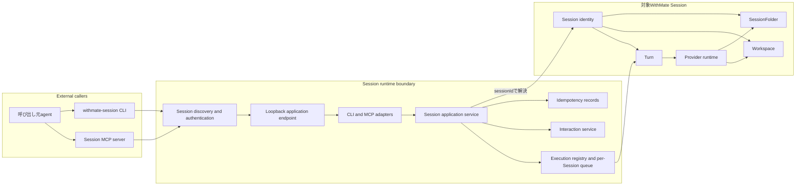
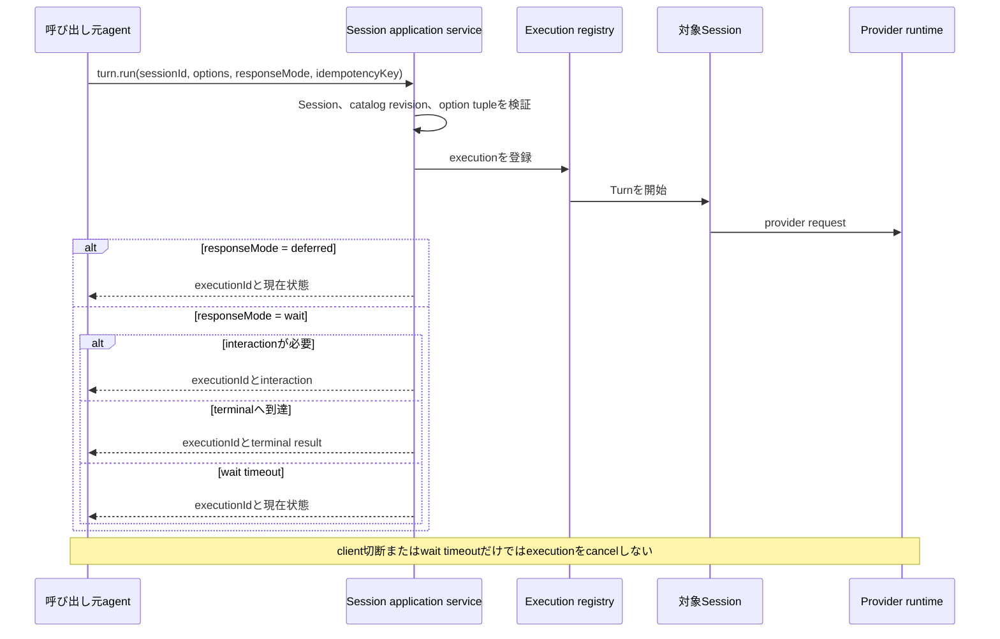
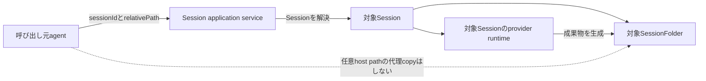
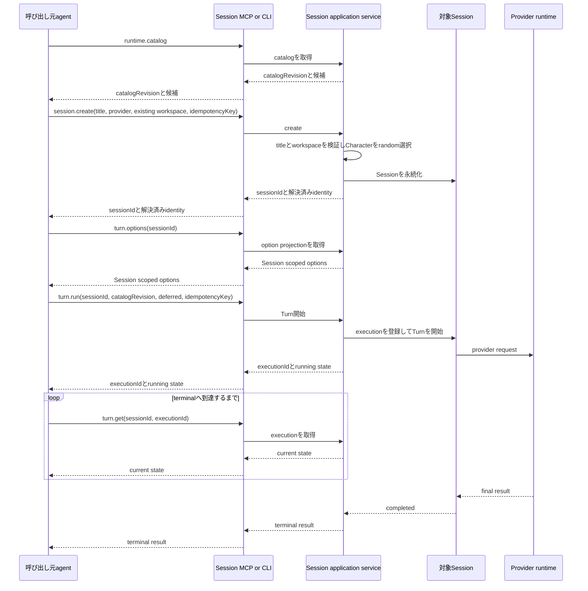
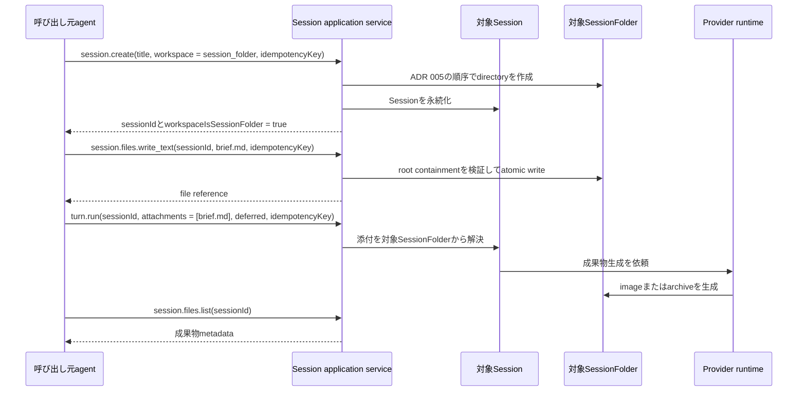
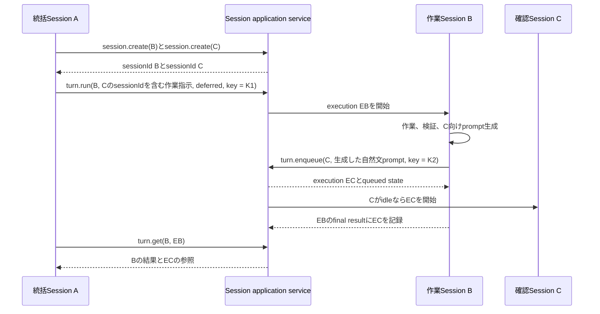
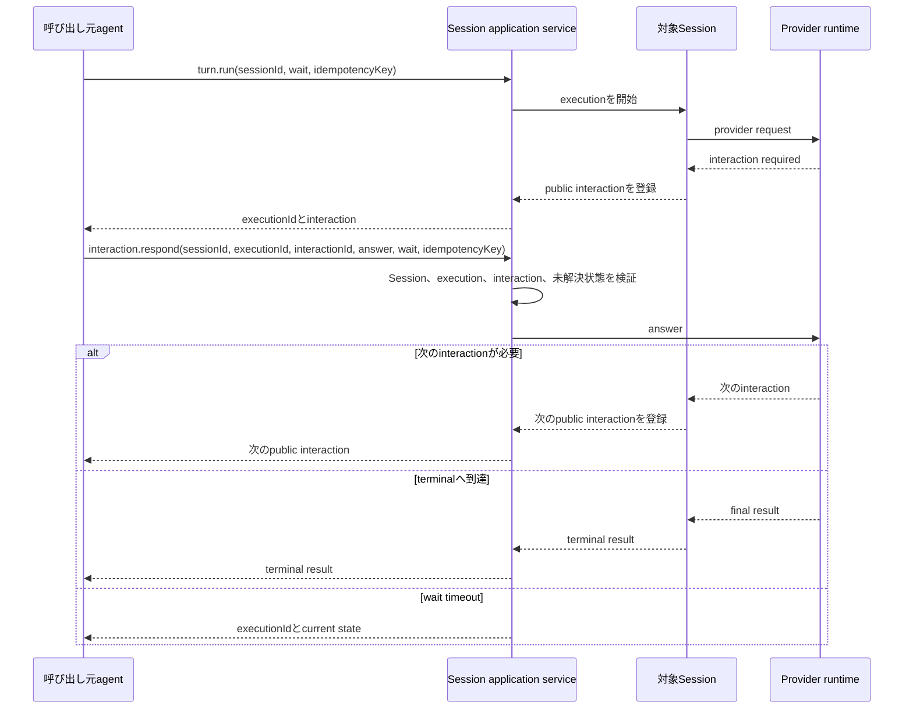
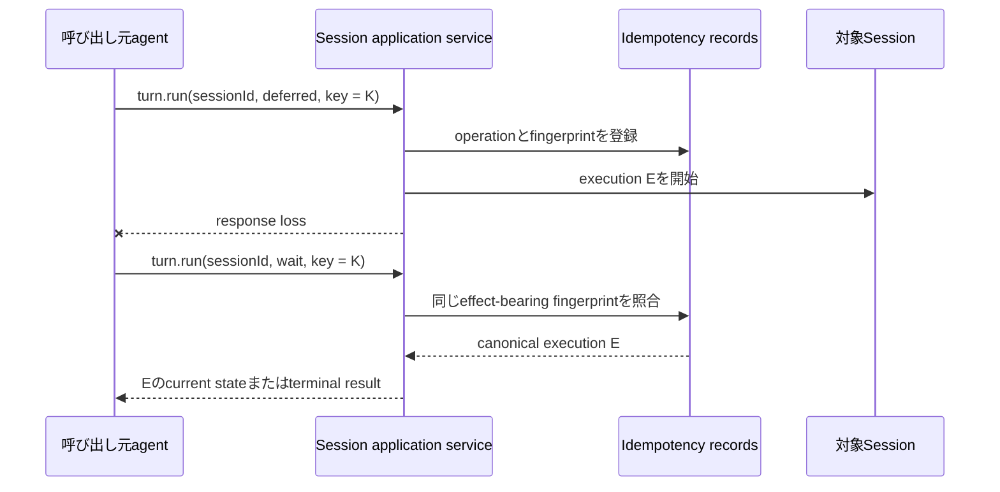
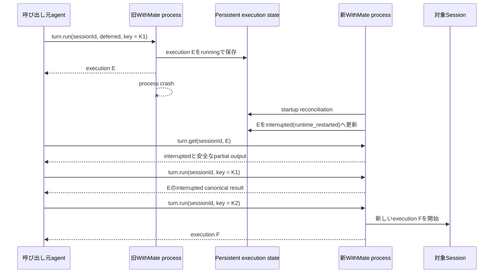
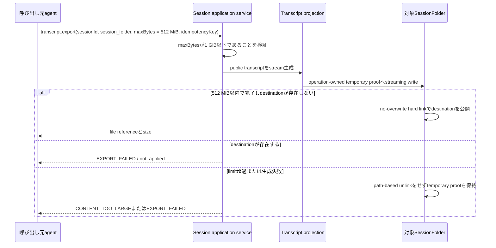

# Session External Runtime

- 状態: Active
- 作成日: 2026-08-10
- 対象: 通常SessionをCLIまたはMCPから操作するruntime境界

## 文書の役割

この文書は、Session CLI、Session MCP、Electron Main Process、操作対象Sessionの関係を示す。特に、MCPを呼び出すagentのSessionと操作対象のWithMate Sessionを区別する。

runtime bindingのauthority境界はADR 021、通常SessionのRole bindingはADR 026を正本とする。exact request、response、error、状態遷移、limitは、実装時に追加するtype、JSON schema、shared validation、executable contractを正本とする。この文書はそれらのfieldを網羅しない。

ADR 021で確定した非局所的な境界を本文に置き、未確定事項は末尾へ分離する。

## 用語

**呼び出し元agent**は、WithMateが発行したAgent runtime bindingを持ち、Session CLIまたはSession MCPを利用するAgent Sessionである。WithMate外からのunbound Session application operationはサポートしない。

**対象Session**は、requestのSession IDで明示され、Session application serviceが解決する通常Sessionである。呼び出し元agent自身のSessionと同一とは限らない。

**execution**は、一回のTurn実行を追跡する単位である。Session、Turnの保存record、Messageとは別のidentityを持つ。

**queued execution**は、対象SessionのFIFO queueへ永続化され、実行のadmissionがまだ永続化されていないexecutionである。

**SessionFolder**は、対象Sessionに従属するWithMate managed directoryである。対象SessionのWorkspaceと同じdirectoryである場合と、別directoryである場合がある。

## Runtime topology



MemoryとCharacter Affectのruntimeはこの図に含めない。Session runtimeとはlistener、discovery、credential、route、public schemaを共有せず、低水準のtransport helperだけを再利用できる。

## Ownership

| Owner | Responsibilities | Does not own |
| --- | --- | --- |
| Electron Main Process | Session runtimeの起動と停止、application serviceのcomposition、discoveryとcredential | CLIまたはMCP固有の表示 |
| Session application service | validation、Session解決、状態遷移、provider実行、idempotency、public projection | transport固有envelope |
| CLI adapter | JSON入出力、exit code、接続診断、schema表示 | persistence、provider実行 |
| MCP adapter | tool schema、annotation、MCP result mapping | CLI process、persistence、provider実行 |
| Execution registry | execution ID、即時実行のadmission、Sessionごとの永続FIFO queue、wait、cancel、terminal projection | globalな固定並列数、Session metadataの任意更新 |
| Interaction service | interactionの列挙、対象検証、response、解決済み状態 | provider未対応interactionの代替 |
| 対象Session | Provider、Character、Workspace、Session kind、immutable Role binding、Turn履歴 | 呼び出し元agentのworkspace |
| SessionFolder | 対象Sessionの一時資料、添付、成果物 | global file catalog、orphan directoryの公開 |

GUI、CLI、MCPは兄弟入口である。GUIの既存IPCをCLIまたはMCPが呼ぶ構造にはせず、共通application serviceの上でそれぞれinputとoutputを変換する。

通常SessionのGUI送信もExecution registryの同じ永続`turn.enqueue` ownerへ渡す。GUI adapterは選択中Sessionのruntime optionとclient request IDを内部requestへ固定し、受付結果が不明な再送では同じIDを使ってcanonical executionへ収束する。renderer内に別queueを持たず、Main Processが全active executionを永続FIFO順で既存message listへ投影する。queuedからrunningへadmitされたTurnはexecution IDを基準に同じmessage identityとinitiatorを維持し、Session履歴へuser messageが保存された後は重複messageを作らず保存済み行へexecution metadataを結び直す。AuxiliaryとCompanionの実行入口はこの決定の対象外とする。

## Session作成と選択

CLIとMCPの`session.create`は、binding actorのchildとなる通常Sessionを作成する。titleと`sessionRole`は必須で、Roleは`task-coordinator`または`executor`だけを受理する。parent、root、depth、actor、Character identityはrequestへ含めず、保存済みactor bindingと既存のCharacter選択ownerから導出する。Role規則またはdepthに違反するrequestはSession ID発行とSessionFolder作成より前に拒否する。

GUIは通常Sessionのrootだけを作成する。用途は左から`standalone`、`overall-coordinator`の順で表示し、既定を`standalone`とする。GUI、CLI、MCPはRoleごとに別の作成経路を持たず、同じSession作成ownerでRole bindingをSession rowと同じtransactionへ保存する。

Provider、Character、Workspace、Session kind、Role bindingは作成時に確定し、作成後は不変とする。外部surfaceでのmetadata変更はtitleのrenameだけを提供する。既存の通常Sessionはmigrationで`standalone` rootへ変換し、現行schemaの欠落、未知Role、unsupported revision、壊れたtupleは明示的に拒否する。

Character selectorはCLIとMCPへ公開しない。CharacterはGUIのランダム起動と同じpolicyで解決し、作成resultへ解決済みidentityを返す。同じidempotency keyの再送では再抽選しない。

Workspaceは既存directoryまたはSessionFolder workspaceを明示的に選ぶ。Workspace指定の省略はvalidation errorとし、SessionFolder workspaceへfallbackしない。SessionFolder workspaceの作成はADR 005と同じMain Processの順序を使い、adapter側でSession IDまたはpathを組み立てない。

Sessionに依存しないProviderとmodelの候補はruntime catalogから取得する。Sessionを作成した後の正確なmodel、reasoning、approval、custom agent、provider固有optionはSession scopedなTurn option projectionから取得する。Turnの即時開始またはenqueue時はcatalog revisionを明示し、stale revisionと未対応tupleを拒否する。

## Turn execution



`wait`と`deferred`はdeliveryの違いであり、開始するexecutionは同じである。cancelとinteraction responseはSession ID、execution ID、対象固有IDを組にして検証する。

`turn.run`は即時開始専用である。対象Sessionが実行中、終了処理中のprovider processが残っている場合、またはqueued executionが一件でも存在する場合は`SESSION_BUSY`で拒否し、暗黙にqueueへ切り替えない。後発の`turn.run`は先着したFIFO headを追い越さない。

`turn.enqueue`はexecutionを対象Sessionごとの永続FIFO queueへ登録し、`executionId`と`queued` stateを直ちに返す。response modeは受け取らず、admission、interaction、terminal resultを待たない。対象Sessionがidleなら、受付commit後に先頭executionのadmissionを開始する。queued executionは`turn.get`と`turn.list`に現れ、admission前なら`turn.cancel`で取り消せる。一つのSessionでは同時に一つのTurnだけを実行する。異なるSession間にglobal queueまたは固定並列数上限は追加しない。

Sessionごとのqueueは、待機中のqueued executionを最大10件まで保持する。activeまたはrunningのexecutionはこの件数へ含めない。すでに10件が待機している場合、11件目の`turn.enqueue`はexecutionやidempotency effectを作成する前に`QUEUE_FULL`で拒否する。

`turn.run`と`turn.enqueue`は別operationとしてidempotency scopeを分ける。同じkeyを使って一方を他方へ変更しても、既存executionへ合流させない。

### Session間Turn authorityと送信元projection

Agent起点の`turn.run`と`turn.enqueue`は、runtime bindingで確定したactor Sessionと、保存済みRole bindingから解決したtarget Sessionの関係をshared application serviceで検証する。authority入力はSQLiteからSession ID、title、canonical Role tupleだけを取得する専用queryで解決し、公開用Session CRUDやworkspaceのGit branch取得を経由しない。request bodyからRole、root、parent、depthを受け取らず、CLI、MCP、raw HTTPで別の判定を持たない。許可する関係は次のとおりとする。

| actor Role | 許可するtarget |
| --- | --- |
| `standalone` | actor自身 |
| `overall-coordinator` | actor自身、直属の`task-coordinator`、直属の`executor` |
| `task-coordinator` | actor自身、直属の`executor`、rootの`overall-coordinator`、同じrootかつ同じ親の兄弟`task-coordinator` |
| `executor` | actor自身、直属の`overall-coordinator`または`task-coordinator` |

異なるroot、孫executor、executorの兄弟または別branch、存在しないtargetはexecution、queue、Coordination Eventを作る前に拒否する。canonical replayはcurrent Role bindingとtargetの再検証より先に解決し、既存executionの再送結果をcurrent authorityの変化で置き換えない。GUI送信はtrusted user invocationとして同じexecution ownerを使うが、このAgent間authorityの対象にはしない。

cross-Session Turnのacceptanceでは、target側executionを正本としたまま`session_execution_origins_v6`へsource Session ID、canonical target Session ID、operation、target titleとRoleのsnapshot、送信本文、source Session message sequence anchor、canonical execution sequence、acceptance時刻を同じtransactionで保存する。source queryは`(source_session_id, execution_sequence)` indexを使い、`request_json`を走査しない。既存executionの補完はschema遷移後の一回だけ実行し、Session initiatorを持つAgent-origin executionに限定して、terminal failure notification executionを除外する。

source SessionWindowはorigin rowから外向きの関連Sessionメッセージをmessage sequence anchorの位置へcanonical execution sequence順で投影し、source側のchat messageを複製しない。targetのrename後も保存snapshotを履歴表示に使い、遷移先はcanonical target Session IDから現在値を解決する。現在値はIDとtitleだけを返すbatch summary queryで取得し、初回、missing、query errorをID単位で区別してrefresh中は直前値を維持する。target削除後もorigin rowを残して履歴表示を維持したままopen操作だけを無効にする。execution state変更はtargetとsourceの両SessionWindowへ再取得通知を送る。

Coordination Eventはこの通信経路の監査・可視化境界であり、Turnのtransport、delivery、source projectionを所有しない。Coordination Eventの有無でexecution acceptanceまたはorigin保存を変えない。

GUI scheduleはtrusted user invocationの同一Session enqueueであり、Agent actorや別Session targetを持たない。schedule fireからoriginを推測して外向きprojectionを作らない。

### Terminal failure notification

`turn.run`と`turn.enqueue`はoptionalな`terminalFailureNotification: { targetSessionId }`を受け付ける。対象は明示した一つの通常Sessionに限り、actor、caller、parent、source Sessionから補完しない。通知Turnのactorは失敗した主target Sessionであり、そのSessionから通知先への関係もAgent間Turnと同じcanonical Role / hierarchy authorityで検証する。sourceとtargetが同一、targetが不存在または非対応kind、authority違反、source SessionのCharacter snapshotを解決できない場合は、source executionとidempotency effectを作る前に拒否する。通知先はTurn fingerprintへ含め、canonical replayはcurrent target設定とCharacterの再解決より先に判定する。

新規source executionには、通知先とsource SessionのCharacter ID、表示名、icon参照のcanonical snapshotを保存する。GUI由来Turn、設定のないexecution、legacy executionへ通知設定を推測しない。sourceが`failed`または`interrupted`へterminal commitした後だけdeliveryを起動し、`completed`と`canceled`は`not_triggered`として投影する。notification executionは保存済みsource snapshotをSession initiatorとして使い、通知設定を持たない。

execution stateのWindow通知とobserver callbackはcommit後のbest-effort signalである。破棄済みrendererへの送信やobserver例外はWindow単位で隔離し、commit済みexecutionのprovider dispatch、queue admission、FIFO drain、terminal commitを失敗させない。

deliveryはsource execution ID、terminal state、target Session ID、契約versionからstable identityとenqueue idempotency keyを導出する。`pending`をdurableにclaimしてtransaction外で既存`turn.enqueue` ownerを呼ぶため、専用provider経路や専用queueは持たない。enqueue成功後のresponse loss、settle前crash、再起動retryは同じkeyを使い、canonical notification executionへ収束する。claim取得後からsettlementまでの未処理例外はclaim解放へ収束させる。claim解放にも失敗した場合は、同一process内にclaim解放intentを保持し、timerから保存済みclaim tokenを再確認して解放する。settlementが実際にはcommit済みなら、deliveryのcurrent stateを読み直して解放intentを破棄する。

delivery tableはsource execution IDとenqueue idempotency keyの一意性、claim tokenとclaimed timestampの同時null制約、`pending`、`enqueued`、`failed`ごとのnotification execution ID、error code、claimの組合せをschema validationで確認する。不完全な同名tableやindexは有効なV6 schemaとして受理しない。

通常のterminal callbackは確定したexecution IDだけをwake-upし、起動時は通知設定を持つ`failed`または`interrupted`かつdelivery未作成のexecutionをSQLで絞り、100件ごとにevent loopへ制御を返してreconcileする。未settle deliveryとstartupで`interrupted(runtime_restarted)`へ収束したexecutionも回収する。DB全再作成後はexecution recovery、notification dispatcher、schedule workerを同じruntime activation boundaryから再起動する。`QUEUE_FULL`、runtime shutdown、transient storage failure、effect不明のresponse lossに加え、`PROVIDER_DISABLED`、`PROVIDER_UNAVAILABLE`、`CATALOG_REVISION_STALE`はterminal確定から24時間、5秒開始の指数backoff、最大5分で再試行する。target不存在、非対応kind、owner mismatch、sender snapshot不正、期限切れはpermanent failureとする。delivery failureはsource state、result、error、interaction expiryを巻き戻さない。

public executionの`terminalFailureNotification`は、未設定を`null`、設定済み非terminalを`armed`、対象外terminalを`not_triggered`、配送を`pending`、`enqueued`、`failed`で表す。全状態にtarget Session IDとupdatedAtを含め、`enqueued`はnotification execution ID、`failed`はsafe error codeを含む。`turn.run`、`turn.enqueue`、`turn.get`、`turn.list`は同じprojectorを使う。履歴取得の`turn.list`はcursor paginationを維持し、GUIの常駐projectionはqueued/running executionと最新terminal executionに限定する。source GUIはauditのexecution IDを第一相関に使い、audit作成前に失敗した場合は、同じSession、terminal state、user messageを持つ最新terminal executionへ限定して通知状態を解決する。target GUIは既存message listで保存済みsource Character名とavatarを示す。Session initiatorなのでGUI cancelは許可しない。

通知promptはsource Session ID、source execution ID、terminal state、terminal timestamp、safe error code、公開済みreason、`turn.get`参照をpublic execution projectionから組み立てる。raw result、stack、provider payload、credential、system prompt、workspace path、private audit dataを含めず、caller自由入力fieldも設けない。

### Process restart recovery

executionのpublic identityと状態は、process内のprovider handleとは分けて永続化する。queue先頭を実行するときは、`queued`から`running`へのadmissionを永続化してからproviderへdispatchする。`running`はprovider dispatchの完了を意味せず、provider effectが生じた可能性があるため自動再dispatchできない状態とする。

起動時に`running`などadmit済みの非terminal executionが残っている場合は、providerへ到達したかを推測せず、terminal stateである`interrupted`へ収束させる。reasonは`runtime_restarted`とし、安全に保存済みのpartial outputがある場合だけpublic projectionへ含める。

確認済みのアプリ終了では、新規admissionを閉じ、実行中providerへcancelを要求した後、有限のgraceだけ待つ。grace内にsettleしない`running` executionは`interrupted(runtime_shutdown)`へ永続化してからstorageを閉じる。以後のlate provider completionは永続化境界へ到達させない。HTTP handlerのdrainも同じく有限とし、stuck providerまたはclient connectionへアプリ終了を依存させない。

admissionを永続化する前にcrashしたexecutionは`queued`のままなので再admitできる。admissionを永続化した後にcrashしたexecutionは、provider dispatch前に落ちた可能性があっても`interrupted`へ収束させ、自動再admitしない。起動時reconciliationでは、admit済みexecutionの収束とterminating guardの解放を確認してから、各Sessionのqueue先頭をFIFO順でadmitする。

`interrupted`へ収束したexecutionは自動resumeしない。同じidempotency keyで`turn.run`または`turn.enqueue`を再送した場合は保存済みexecutionのcanonical resultを返し、新しいTurnを作成しない。明示的に再実行するcallerは新しいidempotency keyを使う。

| Crash timing | Durable state | Startup result | Automatic dispatch |
| --- | --- | --- | --- |
| queue登録のcommit前 | executionなし | 同じidempotency keyで受付を再試行できる | なし |
| `queued`のcommit後、admissionのcommit前 | `queued` | FIFO位置を保持 | reconciliation後に可 |
| `running`のcommit後、provider dispatch前またはdispatch結果不明 | `running` | `interrupted(runtime_restarted)` | 不可 |
| provider実行中 | `running` | `interrupted(runtime_restarted)` | 不可 |

初期MCP adapterはMCP Tasks capabilityへ依存せず、application serviceのexecution ID、`deferred`、`turn.get`、`turn.cancel`を使う。将来MCP Tasksを採用する場合は別のexecutionを作らず、既存executionへtaskを投影する。

## Idempotency

副作用を持つoperationは、operationとidempotency keyの組でrecordを解決する。同じeffect-bearing inputはcanonical resultへ収束し、同じkeyへ異なるfingerprintを指定した場合はconflictを返す。

`session.create`はbinding actorをmutation principalとしてscopeへ加える。fingerprintはactor、requested child Role、導出したbinding tuple、既存create入力を含む。同じactor、key、入力は既存Sessionを返し、Roleまたは導出tupleが異なればconflictとする。別actorの同じkeyは独立scopeとして扱う。canonical replayはcurrent parent、current catalog、current Character状態の再検証より先に判定する。

response mode、wait timeout、request IDはdelivery設定なのでfingerprintへ含めない。Session、execution、message、runtime option、target fileなど、副作用の内容を変える値はfingerprintへ含める。`turn.run`と`turn.enqueue`はoperationが異なるため、同じidempotency keyでも別scopeとして扱う。

未完了recordはterminalへ収束するまで保持する。terminal recordは24時間の再送保証を持ち、期限後はcleanupできる。cleanupは起動時と定期処理で行う。

## Pagination

`session.list`、`turn.list`、`interaction.list`、`session.files.list`は同じpagination contractを使う。既定の`limit`は50、serverが受理するhard maximumは500とする。指定値が500を超える場合は暗黙に丸めずvalidation errorを返す。

cursorはopaqueな文字列とし、callerは内容を解析または変更しない。serverはoperation、filter、sort、最後に返した一意な位置をcursorへ結び付ける。別operationまたは異なるfilterへcursorを流用した場合はvalidation errorを返す。

各operationは安定したsortと一意なIDのtie-breakerを定義する。offsetは公開しない。続きがある場合だけ`nextCursor`を返し、存在しない場合は列挙完了とする。exact sort keyとcursorのencodingは、実装時のtype、schema、shared validationを正本とする。

## Size limits

sizeはUTF-8 byte数で判定する。入力で指定する`maxBytes`はserver hard maximumを超えられず、超過値を暗黙に丸めない。

| Operation or result | Default | Server hard maximum |
| --- | ---: | ---: |
| `session.files.read_text` inline result | 1 MiB | 8 MiB |
| `session.files.write_text` input | 1 MiB | 8 MiB |
| transcript inline result | 1 MiB | 8 MiB |
| transcript SessionFolder export | 64 MiB | 1 GiB |
| loopback JSON request body | — | 8 MiB |
| loopback JSON response body | — | 8 MiB |

inline resultがlimitへ達した場合は切り詰めた成功を返さず、size limit errorを返す。SessionFolder exportはoperation-owned temporary proofへstreaming writeし、destinationが存在しない場合だけno-overwrite hard linkで公開する。既存destinationに対する`replace=true`はidentity-bound replacement primitiveがないため、公開前にfail closedする。limit超過、生成失敗、response lossではpath-based unlinkを行わず、temporary proofを回復証拠として保持する。

`session.files.write_text`とloopback request bodyのhard maximumは引数で拡張できない。これを超える成果物はMCP payloadで運搬せず、対象Sessionへ生成を指示してSessionFolderへ保存させる。

## Interaction

`wait`はterminal resultだけでなく、未解決interactionが現れた時点でも返る。interaction resultはproviderのraw payloadではなく、共通のpublic projectionを使う。

interaction responseはSession ID、execution ID、interaction IDを要求する。対象違い、解決済み、遅延responseを拒否する。同じidempotency keyと同じ回答の再送はcanonical resultを返す。

interaction responseにも`wait`と`deferred`を指定できる。`wait`の場合、response後の次のinteraction、terminal result、またはtimeoutまで待つ。

## SessionFolder



SessionFolderはSessionに従属し、Session IDなしでは操作できない。初期surfaceではSessionFolderに対するlist、UTF-8 text read、UTF-8 text writeだけを提供する。SessionFolderだけのglobal list、delete、rename、arbitrary path copy、binary uploadは提供しない。

Session詳細はWorkspaceとSessionFolderを別々に返し、SessionFolderがWorkspaceでもある場合はその関係を示す。Session一覧はWorkspace pathを返し、branchは返さない。`session.get`はdirectory Workspaceの現在branchをGitからbest effortで解決し、非Git directory、detached HEAD、SessionFolder、解決失敗では`null`を返す。

対象Sessionのprovider runtimeは、SessionFolderを常にeffective allowed directoryへ含める。レビューbriefなどの小さいtextはcallerがSessionFolderへ書き、Turnの添付として指定できる。画像、PDF、archiveなどの成果物は、callerがfileを運搬するのではなく、対象Sessionへ生成を指示することを基本とする。

すべてのrelative pathは対象SessionのSessionFolderをrootとして解決する。absolute path、`..`、junctionまたはsymlinkによるroot外へのescapeを拒否する。

## Transcript

Transcript exportはversioned JSONとMarkdownを提供する。JSONをcanonical projectionとし、Markdownは同じprojectionから生成する。

出力先の既定はinlineとする。SessionFolderへの出力を選んだ場合は、Session IDとrelative pathを指定し、atomic writeとidempotencyを適用する。Windows版v6.4では新規targetだけを公開でき、既存targetへの`replace=true`は安全なidentity-bound置換primitiveがないため副作用前にfail closedする。

Transcriptには利用者が観測できるmessage、effective Turn option、attachment、public tool event、interactionを含められる。secret、raw provider payload、内部system prompt、Character prompt、debug情報、stack trace、database内部情報は含めない。

## Representative scenarios

次のflowは、呼び出し元agent、Session adapter、application service、対象Sessionの責務境界を示す。exact fieldとtransport envelopeはversioned schemaを正本とする。

### Existing workspaceでSessionを作成してdeferred実行する



呼び出し元agentのworkspaceは暗黙に使わない。`session.create`で既存directoryを明示し、作成resultで対象SessionのWorkspaceとSessionFolderを区別して受け取る。

### SessionFolder workspaceへbriefを書いて成果物生成を依頼する



callerは任意host pathから画像をcopyしない。binary成果物は対象Session側で生成し、初期surfaceではlist結果のmetadataまたはfile referenceとして扱う。

### Session BからSession Cへ後続作業を引き継ぐ



AはBの作業内容、依存関係、CのSession IDをBへのpromptへ含める。Bは実際の変更、検証結果、確認してほしい競合を踏まえてC向けの自然文promptを生成し、汎用の`turn.enqueue`でCへ渡す。runtimeはprompt本文を構造化JSONへ変換せず、宛先、request schema、queue admission、execution identityを検証する。

引き継ぎ先は呼び出し元に固定しない。Bは明示された任意の対象Sessionへenqueueできる。B自身のSession IDや親Session IDを自動でpromptへ注入する`runtime.context`は初期surfaceに設けない。

Bが`turn.enqueue`を呼ぶ前に`failed`または`interrupted`へ到達した場合、通常の成功時引き継ぎは作成されない。Bのsource execution作成時にCを`terminalFailureNotification.targetSessionId`として明示していれば、terminal commit後にsafeな失敗通知TurnだけをCのFIFOへ登録できる。設定していなければAは保持したBのSession IDとexecution IDを`turn.get`へ渡して状態を確認する。

### wait中のinteractionへ回答する



wait timeoutまたはclient切断はexecutionをcancelしない。cancelする場合は`turn.cancel`を別のmutationとして明示する。

### response loss後に同じmutationを再送する



deliveryだけを変える`deferred`、`wait`、wait timeoutはfingerprintへ含めない。同じkeyでSession、message、option、attachmentなどを変更した場合は`IDEMPOTENCY_CONFLICT`を返し、新しい副作用を開始しない。

### process再起動後に明示再実行する



開始済みexecutionの自動resumeは行わない。同じidempotency keyは過去executionへ収束し、新しいkeyだけが明示再実行を表す。開始前のqueued executionは、この再実行規則とは分けて起動時reconciliation後にadmitする。

### 大きいTranscriptをSessionFolderへexportする



inline出力の8 MiB hard maximumは引数で拡張しない。大きいTranscriptはSessionFolder出力を明示し、成功時だけ完成fileを公開する。

### Validationで副作用開始前に拒否する

| Request | Result | Effect |
| --- | --- | --- |
| titleを省略した`session.create` | `INVALID_INPUT` | `not_applied` |
| Workspace選択を省略した`session.create` | `INVALID_INPUT` | `not_applied` |
| `limit`が500を超えるlist | `LIMIT_EXCEEDED` | `not_applied` |
| 別operationまたは別filterのcursorを流用 | `INVALID_CURSOR` | `not_applied` |
| SessionFolder外へescapeするrelative path | `PATH_OUTSIDE_SESSION_FOLDER` | `not_applied` |
| inline hard maximumを超える`maxBytes` | `LIMIT_EXCEEDED` | `not_applied` |
| 実行中Sessionへの別の`turn.run` | `SESSION_BUSY` | `not_applied` |
| hard queue limitへ達したSessionへの`turn.enqueue` | `QUEUE_FULL` | `not_applied` |

validationはSession作成、execution登録、file作成より前に行う。副作用開始後のprovider terminal failureはこの表のtool execution errorとは分け、execution resultの`failed` stateとして返す。

## Public contract placement

| Information | Canonical placement |
| --- | --- |
| application boundaryを選んだ理由 | ADR 021 |
| 現在のservice、adapter、runtime wiring | source |
| request、response、error、status、limit | typeとversioned JSON schema |
| validation、状態遷移、idempotency、path containment | shared validationとexecutable contract |
| transport固有mapping | CLIとMCP adapter contract test |
| command、MCP設定、障害対応 | user guideまたはrunbook |

## Public operations and errors

application operation IDをCLIとMCPに共通する正本とする。MCP toolは同じdotted nameを使い、CLIは階層をspace区切りへ投影する。

| Application operation and MCP tool | CLI command |
| --- | --- |
| `runtime.catalog` | `runtime catalog` |
| `session.self` | `session self` |
| `session.create` | `session create` |
| `session.list` | `session list` |
| `session.get` | `session get` |
| `session.rename` | `session rename` |
| `turn.options` | `turn options` |
| `turn.run` | `turn run` |
| `turn.enqueue` | `turn enqueue` |
| `turn.list` | `turn list` |
| `turn.get` | `turn get` |
| `turn.cancel` | `turn cancel` |
| `interaction.list` | `interaction list` |
| `interaction.respond` | `interaction respond` |
| `transcript.export` | `transcript export` |
| `session.files.list` | `session files list` |
| `session.files.read_text` | `session files read-text` |
| `session.files.write_text` | `session files write-text` |
| `work.create` | `work create` |
| `work.list` | `work list` |
| `work.get` | `work get` |
| `work.transition` | `work transition` |
| `work.result` | `work result` |
| `work.cancel` | `work cancel` |
| `work.aggregation.get` | `work aggregation get` |
| `work.aggregation.list` | `work aggregation list` |
| `work.aggregation.decide` | `work aggregation decide` |
| `work.aggregation.retry` | `work aggregation retry` |
| `coordination.event.create` | `coordination event create` |
| `coordination.event.list` | `coordination event list` |
| `coordination.event.get` | `coordination event get` |
| `coordination.event.resolve` | `coordination event resolve` |
| `coordination.event.consume` | `coordination event consume` |
| `coordination.event.cancel` | `coordination event cancel` |
| `coordination.event.correct` | `coordination event correct` |

`/v1/status`、challenge、認証exchangeを除くSession runtime application operationは、provider実行へ発行されたvalidなruntime bindingを必須とする。bindingの欠落、空白、不正、失効、または`session.runtime.invoke` grant不足ではapplication handlerを呼ぶ前に拒否する。`session.self`はbindingからactor Session IDだけを返す。他のoperationは対象Session IDの明示入力を維持し、actorまたは`session.self`の結果を暗黙のtargetとして再利用しない。

## Work Item contract

Work Itemは一つのSession間委譲を表し、executionとは別のserver生成IDを持つ。root、creator、target、任意のparent、goal、scope、completion criteria、authority、source identityは作成後に変更しない。Role binding revision 1へWork Item IDを追加せず、Work ItemからSessionを参照する。

作成はruntime bindingで確定した`overall-coordinator | task-coordinator`に限り、既存のSession間Turn authorityで送信可能かつ`parentSessionId`がactor Sessionと一致する直属targetだけを受け付ける。root overall coordinatorや兄弟task coordinatorへの通信許可を委譲authorityへ流用しない。parentは同じrootでactor Sessionがtargetとなっているactive Work Itemに限定する。target Sessionは`pending -> in_progress -> waiting -> in_progress`の進行操作とterminal result報告を行い、creator Sessionはactive Work Itemを取消せる。全mutationはexpected revisionとprincipal Session単位のidempotency keyを要求する。canonical replayはcurrent Session bindingの再検証より先に返し、recordは24時間後にcleanupする。

`completed | partially_completed | failed`は同名のresult outcomeとstrict result envelopeを同じtransactionで保存し、DB CHECKでもstateとoutcomeの一致を保持する。`canceled`はresultを持たず、terminal stateから再開しない。resultはsummary、changes、verification results、findings、unverified items、remaining work、reporting Session、timestampを区別し、256 KiBを上限とする。

`turn.run | turn.enqueue`はoptionalな`workItemId`を受け付ける。新規executionの作成前にactor、root、target、active stateを検証し、execution保存transaction内でもtargetとactive stateを再検証してassociationを同時保存する。`workItemId | null`はTurnのidempotency fingerprintへ含め、同じkeyでassociation先だけを変更した要求はconflictにする。`turn.run | turn.enqueue | turn.get | turn.list`は`workItemId | null`を同じpublic projectionで返す。executionのterminal stateはWork Itemを暗黙に遷移させない。

`work.list`はruntime actorのrootを固定し、creator、target、stateの明示filterとsequence keyset cursorをstorage queryへ渡す。cursorはroot、actor Session、root全体またはactor関連だけを示すvisibility、明示filterへ束縛し、scopeが異なる再利用を`INVALID_CURSOR`で拒否する。overall coordinatorは同じrootを参照でき、それ以外のRoleは自分がcreatorまたはtargetのWork Itemだけを参照する。一覧はWork Itemをstorage iteratorから逐次hydrateし、8 MiBのpublic response上限へ達する前にpageを打ち切って`nextCursor`を返す。Work Item mutationはCoordination Eventを必須副作用にせず、Coordination Event schemaも変更しない。

Work Item aggregationはactiveな親と直属子だけを対象とし、孫をflattenしない。親target Sessionはterminalな直属子へ`accepted | excluded | retry_requested`のimmutable decisionを作成する。`excluded`は理由を必須とし、`canceled`は採用できない。retryは明示された新しいbindingでreplacementを作成し、decision、replacement、idempotency resultを同一transactionへ保存する。元Work Itemのstateとresultは変更しない。

`work.aggregation.get | list`はaggregate revisionと件数、およびidentity、state、result summary、decisionだけをbounded queryで返す。full resultは`work.get`で取得する。cursorはparent、actor、visibility、filterへ束縛する。直属子を持つ親の`work.result`はcurrent aggregate revisionを要求し、全直属子がterminalかつdecision済みであるsnapshotを親resultと同一transactionで検証する。親terminal確定後は直属子追加とdecision mutationを拒否する。

Coordination Eventは通常responseと分離したdedicated historyである。本文とactionをv6 databaseの専用tableへ保存し、stateを初期kindとaction履歴から投影する。actorとRole tupleはruntime bindingから解決し、authorityはcurrent `session_role_bindings_v6`を参照する。CLI、MCP、raw HTTPは七つのshared operationとstrict validatorを共有する。mutationはprincipal Session単位のidempotency keyを必須とし、commit後のpublication failureは`effect: applied`とevent IDを返す。

Coordination UIはSession右ペインへ置かず、単一のCoordination Windowへ集約する。Windowはtrusted GUI queryで全Sessionのeventを新しい順に取得し、初期状態ではSessionとcategoryを絞らない。利用者向けcategoryは、未回答の`user_decision_required`を示す要回答、未解決の`blocker | escalation`を示す未解決、回答された`user_decision_required`を示す回答済み、それ以外の記録済み、取消済み、更新済み、解決済みeventを示す履歴とする。categoryはtrusted GUI queryでserver-sideに適用し、rendererが読込済みevent pageだけをfilterしてはならない。Agent向けの`coordination.event.list`は引き続きbinding actorを基準とした`self | subtree` authorityを維持し、全Sessionを読むtrusted GUI queryをCLI、MCP、raw HTTPへ公開しない。

Eventのoriginはactor Sessionである。Windowはcanonical Session projectionからSession titleを主表示し、Character iconを識別補助として表示する。Character nameとiconをCoordination Eventへ複製保存しない。Session filterはHome相当のSession title検索と逐次読み込みで対象を選び、選択後のevent queryへ`sessionId`を渡す。rendererが読込済みevent pageだけをfilterしてはならない。Session groupingとCoordination eventを持つSessionだけを列挙するaggregateはfirst sliceへ含めない。

detailは選択時に取得する。Agent向け`coordination.event.resolve`は、宛先となった`escalation`またはactor自身の`blocker`だけを対象とし、任意の`note`を受け付ける。Agent入力へ`optionId`を公開しない。Coordination Windowのtrusted GUI IPCは、`user_decision_required`に提示optionのstable IDまたは自由回答のどちらか一方を、`blocker`に空白でない自由記述のresponseを受け付ける。自由記述はactionの`note`へ保存し、`optionId`は`null`とする。`blocker`へのtrusted GUI responseは`responded` actionであり、Eventを`resolved`へ遷移させない。owner Sessionがconsumeするまでは新しい`responded` actionで変更でき、pending projectionは最新revisionだけを一件返す。`blocker`を`resolved`へ遷移できるのは、そのEventを作成したAgent自身だけとする。Main Processは対象Eventのactor Sessionから現行Role bindingを取得し、canonical binding検証を通してからmutationを行う。全Sessionを操作する合成principalやcanonical bindingの迂回は作らない。

trusted GUIからresponseを受けた`user_decision_required | blocker`は、owner Sessionがconsumeするまで各通常Turnへ未確定responseとして投影する。`user_decision_required`は`resolved`、`blocker`は`open | resolved`を許容する。対象は応答の古い順に最大20件とし、各項目はkind、request、最新responseとその`resolutionSequence`を持つ。response本文と反映後のconsume指示はConversation Timingの後かつUser Inputの前にinput contextとして置き、ユーザーresponseをsystem authorityへ昇格させない。静的なCoordination利用規則はMCP server instructionsとtool descriptionを正本とする。Agentはresponseを実作業へ反映した後に限り、`coordination.event.consume`へEvent ID、投影された`resolutionSequence`をそのまま使う`expectedResolutionSequence`、caller-owned idempotency keyを渡す。単にresponseを読んだ場合、Turnが失敗した場合、または反映可否を判断できない場合はconsumeしない。

`consume`はEventを作成したSessionのcurrent canonical bindingだけに許可する。対象Eventはまだ`consumed` actionを持たない`user_decision_required | blocker`でなければならず、`user_decision_required`では最新のtrusted GUI `resolved` sequence、`blocker`では最新のtrusted GUI `responded` sequenceが`expectedResolutionSequence`と一致しなければならない。response変更後に古いrevisionをconsumeしようとした場合はstate conflictとしてeffect-noneで拒否し、最新responseをpendingに残す。同じinputとkeyの再送はcanonical replayを返し、別keyによる二重consumeもstate conflictとして拒否する。`consumed`はresponseを投影対象から除外するためのactionであり、Eventのpublic stateを変更しない。Coordination Windowはblocker自体の`未解決 | 解決済み`とresponseの`確定済み`を別に表示し、確定後はresponse編集を閉じる。

storage commit後signalは再読込の契機である。rendererはevent filter、Session ID、request generationを照合し、Event pageとorigin Session projectionの両方が揃った結果だけを表示へ反映する。initial load、通知の追い越し、Session切替後の古いresponseは破棄し、選択中Eventは再取得して維持する。Session pickerとEvent listは末尾sentinelによる自動paginationとし、手動の追加読込操作を持たない。external streaming endpointは持たない。

`turn.run`と`turn.enqueue`は、bindingのactor Session IDとcanonical Character stateから次のinitiatorをexecution作成時に確定し、`request_json`へ保存する。GUI送信は`{ kind: "user" }`を保存する。

```ts
type TurnInitiator =
  | { kind: "user" }
  | {
      kind: "session";
      sessionId: string;
      character: { characterId: string; name: string; iconFilePath: string };
    };
```

Session initiatorのsnapshotはrename、archive、削除後も再解決しない。iconを表示できない場合はsnapshot名と汎用avatarを使う。initiatorのない既存external requestだけをlegacyとして`外部`表示する。新規requestをanonymous、CLI、MCP、`外部`として保存しない。

GUIでは対象Sessionの応答を左、Session initiatorとlegacy externalの入力を右へ配置し、発話主体を位置で区別する。Session initiatorのavatar下には詳細表示を置く。詳細は保存snapshotのSession IDを常に使い、呼出元Sessionが現存する場合だけ現在のタイトルを、そのSession Windowを開く操作として表示する。rename、archive、削除後の現在値で保存snapshotのCharacter名とavatarを上書きしない。呼出元Sessionが削除済みでも詳細表示と保存Session IDは維持し、欠落を説明する常設文は表示しない。

Turn作成fingerprintはinitiator kindとSession actor IDを含み、transport adapter、binding reference/ID/generation、Character名、icon参照を含めない。同じactor、target、payload、keyのMCP→CLI retryは同じexecutionへ収束し、別actorの同一keyはconflictになる。canonical replayはCharacter snapshot解決より先に判定する。

`turn.get`は現在状態、未解決interaction、利用可能なpartial output、terminal resultを返す。重複する`turn.status`は公開しない。CLI固有の接続診断とschema表示はapplication operationに含めない。

unknown tool、未対応capability、壊れたMCP envelopeはMCP protocol errorとして返す。入力validation、対象不在、conflict、provider failureなどapplication operation内の失敗はtool execution errorとし、MCPでは`isError: true`を使う。

application errorは`code`、`message`、`retryable`、`effect`、`details`を持つ。`code`を機械判定の正本とし、`message`を解析させない。`effect`は`not_applied`、`applied`、`indeterminate`のいずれかとし、副作用が開始またはcommit済みの場合は`applied`としてcanonical resource IDを`details`へ含める。`details`にはsafeなpublic identifierとvalidation情報だけを含める。

provider実行がterminalの`failed`へ到達した場合、operationの受付自体は成功しているためprotocol errorにしない。`turn.run`または`turn.get`のapplication resultとしてexecution IDとterminal stateを返す。operationを開始できなかったfailureと、開始済みexecutionのterminal failureを分ける。

初期contractでは少なくとも次のcodeを定義する。各operationが返し得るcode、HTTP status、CLI exit code、MCP resultへの対応はversioned schemaとadapter contract testを正本とする。

- `INVALID_INPUT`
- `INVALID_CURSOR`
- `LIMIT_EXCEEDED`
- `CONTENT_TOO_LARGE`
- `SESSION_NOT_FOUND`
- `SESSION_KIND_UNSUPPORTED`
- `SESSION_TURN_FORBIDDEN`
- `SESSION_BUSY`
- `QUEUE_FULL`
- `EXECUTION_NOT_FOUND`
- `EXECUTION_NOT_CANCELLABLE`
- `EXECUTION_INTERRUPTED`
- `INTERACTION_NOT_FOUND`
- `INTERACTION_ALREADY_RESOLVED`
- `IDEMPOTENCY_CONFLICT`
- `CATALOG_REVISION_STALE`
- `FILE_NOT_FOUND`
- `FILE_ALREADY_EXISTS`
- `PATH_OUTSIDE_SESSION_FOLDER`
- `EXPORT_FAILED`
- `RUNTIME_UNAVAILABLE`
- `PROVIDER_FAILURE`

## Open questions

次は未確定であり、現時点のaccepted contractとして扱わない。

- SessionFolderへのbinary uploadを将来追加する条件

## Related documents

- `docs/adr/005-session-folder-workspace-launch.md`
- `docs/adr/021-session-cli-mcp-application-boundary.md`
- `docs/adr/022-session-runtime-windows-credential-directory.md`
- `docs/adr/020-memory-affect-mcp-application-boundary.md`
- `docs/design/session-local-files.md`
- `docs/design/session-run-lifecycle.md`
- `docs/design/session-turn-storage-v6.md`
