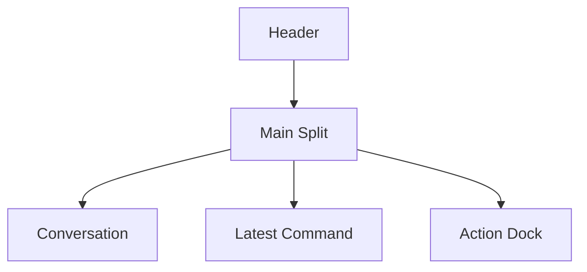

# Session Live Command Monitor

## Goal

- Session 実行中に、会話本文を潰さずに `command_execution` を常時確認できるようにする
- safety / trust 観点で必要な情報を `最新 command 1 件` に絞り、見落としや情報過多を減らす
- 実行中と待機中で right pane の責務を切り替えやすい host を残す

## Problem

`Activity Monitor` に live step 一覧を積む構成は、実況性は高いが safety monitor としては情報が多すぎる。

- command が多い turn では、どの command が今重要なのかが埋もれやすい
- assistant 本文、step 一覧、詳細ログが同じ右 rail で競合しやすい
- 「危ない command が走っていないかを見る」という用途に対して、一覧全体の scan cost が高い

## Design Summary

- pending bubble は引き続き `assistantText` と run indicator だけを表示する
- right pane は `Latest Command` だけを表示する単一 pane にする
- `Latest Command` は次の優先順で決める
  - 実行中なら `liveRun.steps` の最後の `command_execution`
  - 待機中なら直近 terminal Audit Log に含まれる最後の `command_execution`
- それ以外の step list や詳細な実況履歴は right pane 常設から外し、確定後は artifact timeline / Audit Log を見る

## Layout

### Conversation

- message list と pending bubble の専用面
- `assistantText` を読む主面として扱う
- `message follow` banner は既存どおり list 下端の導線に留める

### Latest Command

- wide desktop では右 pane に常設する
- 表示対象は 1 件だけ
- 内容は次に絞る
  - status badge
  - raw command text
  - source label (`live` / `last run`)
  - 危険度の rough badge (`DELETE / WRITE / NETWORK`)
  - 必要時だけ開く `details`
- `liveRun.errorMessage` がある時は card 内の alert として併記する

### Action Dock

- SessionWindow 下端の full-width 操作面
- 次を内包する
  - retry banner
  - attachment / skill toolbar
  - attachment chips
  - textarea と `Send / Cancel`
  - `Approval / Model / Depth`
  - sendability feedback

## Responsive Rules

### Desktop Width

- `Latest Command` を右 pane に置く
- `Action Dock` は左右ペインの下に full-width で置く
- splitter で会話面と right pane の幅を調整できる

### Narrow Width

- main split は縦 stack に戻す
- `Latest Command` は message list の下、`Action Dock` の上へ置く
- `Action Dock` は引き続き最下段に固定面として扱う

## Data Mapping

- provider adapter や `liveRun` schema は変更しない
- Renderer 側で `liveRun.steps` と terminal Audit Log から最新 command だけを抽出する
- command 以外の live step は right pane へ出さない

## Non-Goals

- full step timeline の常設表示
- `Character Stream` 本体実装
- command の危険度判定を完全自動化すること
- Audit Log の構造変更

## References

- `docs/design/desktop-ui.md`
- `docs/design/session-window-layout-redesign.md`
- `docs/design/audit-log.md`
