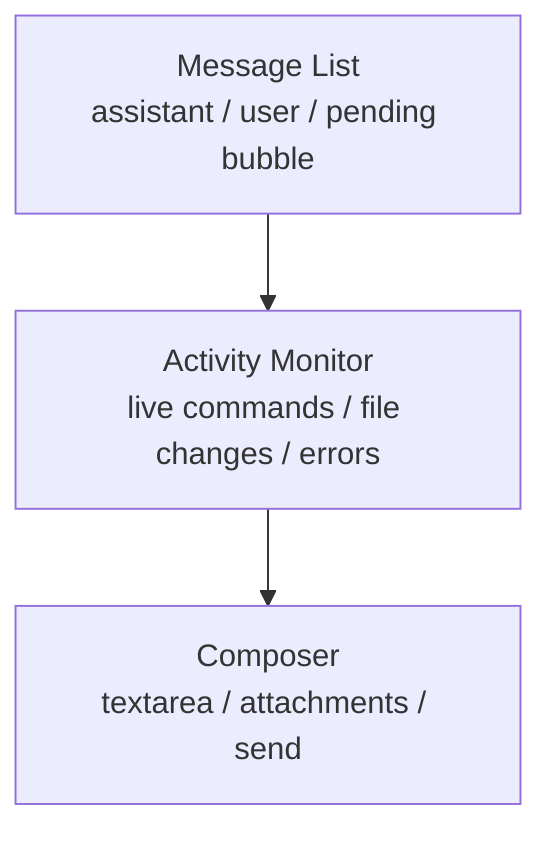

# Session Live Activity Monitor

## Goal

- Session Window 実行中に、会話本文とコマンド実況の両方で最新状態を見失わないようにする
- `command_execution` を常時見えるまま維持しつつ、assistant の本文が長い command list に押し流される状態をなくす
- live run の情報密度を保ちながら、通常の chat 読みやすさを崩さない

## Problem

現行の Session Window は pending bubble の中に `assistantText` と `live run step` を同居させている。

- command が多い turn では、step list が縦に伸びて assistant の本文が見切れる
- safety / trust の観点では command を隠したくない
- 結果として `会話を読む面` と `実況を見る面` が 1 つの bubble で競合している

## Design Summary

- pending bubble は `assistantText` と `runState` 表示だけを持つ chat surface に寄せる
- `live run step` は message list から分離し、composer の直上に dock する `Activity Monitor` へ移す
- message list と `Activity Monitor` は scroll / follow を独立させ、両方の最新が同時に見える状態を優先する
- turn 完了後の確定ログは従来どおり artifact timeline と Audit Log に集約する

## Layout

### Message List

- 通常の chat surface として扱う
- pending bubble では次だけを表示する
  - 実行中 indicator
  - `assistantText`
  - `liveRun.errorMessage` がある場合の短い alert
- `live run step` 一覧は表示しない

### Activity Monitor

- Session Window 下部、composer の直上に dock する
- 高さは固定寄りの clamp とし、message list を押し潰しすぎない
  - 例: `min 140px / ideal 220px / max 320px`
- 中身は current turn の live activity だけを表示する
- command / file change / reasoning / failed / canceled を realtime に流す
- panel 自体に独立 scroll を持ち、長い実況でも chat surface を押し流さない

## Activity Monitor Behavior

### Follow Mode

- `Activity Monitor` も message list とは別に follow mode を持つ
- 既定は最新 activity へ追従する
- ユーザーが monitor 内を読み返したら追従を止める
- 追従停止中に新着 activity が来た時は badge を `新着あり` にし、`最新へ` で復帰させる
- 追従停止中は `最新へ` の最小導線だけを出す

### Ordering

- `in_progress` を先頭グループに置く
- `failed / canceled` は alert tone で次に置く
- `completed` は後段へ置く
- 同一 group 内は arrival order を維持する

### Step Presentation

- `command_execution`
  - command 文字列を常時表示する
  - monospace block を維持する
- `file_change`
  - path list を scan しやすい行表示にする
- `reasoning` / `agent_message`
  - monitor では短い要約だけを許可する
  - 会話本文として読ませたい内容は pending bubble 側の `assistantText` を正本にする
- `details`
  - stdout / stderr / raw details だけを折りたたむ

### Visibility Lifecycle

- `runState === "running"` の間だけ monitor を表示する
- turn 完了後は自動で閉じる
- 確定結果は assistant message の artifact timeline と Audit Log を見に行く
- `failed / canceled` でも live monitor 自体は turn 終了時点で閉じ、停止地点の理解は retry banner / artifact / Audit Log に委ねる

## Responsive Rules

### Desktop Width

- `Activity Monitor` は composer 上に横幅いっぱいで表示する
- message list と縦 stacked にし、左右 2 カラム化は initial scope に含めない

### Narrow Width

- 同じく composer 直上に置く
- 高さだけを少し縮め、message list の可視行数を優先する

## Data Mapping

- Main Process の `liveRun.assistantText` と `liveRun.steps` はそのまま使う
- protocol や persistence 形式は増やさない
- Renderer 側の責務だけを変更する
  - pending bubble: `assistantText`
  - `Activity Monitor`: `steps / usage / live error`

## Non-Goals

- turn 完了後の artifact timeline を廃止する
- provider adapter の event schema を増やす
- `Activity Monitor` を permanent な side pane にする
- command の全文ログ保存責務を monitor に持たせる

## References

- `docs/design/desktop-ui.md`
- `docs/design/provider-adapter.md`
- `docs/design/audit-log.md`
