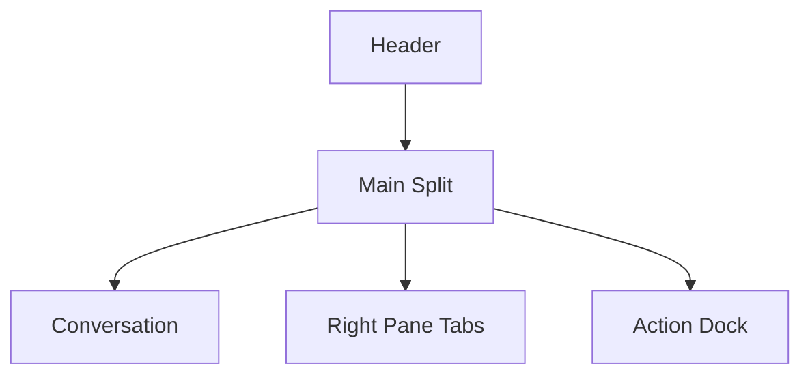

# Session Live Activity Monitor

## Goal

- Session 実行中に、会話本文を潰さずに `command_execution` を常時確認できるようにする
- safety / trust 観点で必要な情報を `最新 command 1 件` に絞り、見落としや情報過多を減らす
- right pane を `Latest Command / Memory生成 / 独り言` の activity host にする

## Problem

`Activity Monitor` に live step 一覧を積む構成は、実況性は高いが safety monitor としては情報が多すぎる。

- command が多い turn では、どの command が今重要なのかが埋もれやすい
- assistant 本文、step 一覧、詳細ログが同じ右 rail で競合しやすい
- 「危ない command が走っていないかを見る」という用途に対して、一覧全体の scan cost が高い

## Design Summary

- pending bubble は引き続き `assistantText` と run indicator だけを表示する
- right pane は `LatestCommand / MemoryGeneration / Monologue` の 3 面を持つ
- 手動切り替えは左右ボタンで常時可能にする
- 自動切り替えは `running` を基準にする
  - `Latest Command` は session run 中を最優先で表示する
  - `Memory生成` は background memory extraction が `running` の時に自動表示する
  - `独り言` は将来の monologue 実行が `running` の時に自動表示する
- `Latest Command` は次の優先順で決める
  - 実行中なら `liveRun.steps` の最後の `command_execution`
  - 待機中なら直近 terminal Audit Log に含まれる最後の `command_execution`
- run 中は `Latest Command` の下に、確定済み live step のうち直近数件だけを `Details` 面として補助表示してよい
  - 対象は `completed / failed / canceled` の step
  - 直近の in-progress command と full timeline は常設しない
- `Memory生成` は専用 background activity state を main process から受ける
- `独り言` は background activity と recent monologue stream を表示する
- それ以外の step list や詳細な実況履歴は right pane 常設から外し、確定後は artifact timeline / Audit Log を見る

## Layout

### Conversation

- message list と pending bubble の専用面
- `assistantText` を読む主面として扱う
- `message follow` banner は既存どおり list 下端の導線に留める

### Right Pane Switcher

- wide desktop では右 pane に常設する
- 上部に `現在の面名 + 左右切り替え` を置く
- badge は current 面の状態だけを最小表示する
- inactive 面は常時並べず、狭い幅でも詰まらないことを優先する

#### Latest Command

- 表示対象は 1 件だけ
- 内容は次に絞る
  - status badge
  - raw command text
  - source label (`live` / `last run`)
  - 危険度の rough badge (`DELETE / WRITE / NETWORK`)
  - 必要時だけ開く `details`
- run 中に確定した step があれば、同じ面の下段に `CONFIRMED Details` として数件だけ補助表示してよい
  - `command_execution` は command block を維持する
  - `mcp_tool_call` / `todo_list` / `file_change` / `reasoning` などは summary + optional `details` を出す
- `liveRun.errorMessage` がある時は card 内の alert として併記する

#### MemoryGeneration

- `Session Memory extraction` と `Character Memory` 更新の background activity を表示する
- head の `Generate Memory` から Session Memory extraction を手動実行できる
- 内容は次に絞る
  - status badge
  - summary
  - trigger / model / reasoning と、更新された Memory 内容を含む `details`
  - failure 時の error block

#### Monologue

- `character reflection cycle` の生成結果を表示する
- session `stream` に保存された recent monologue を新しい順で表示する
- 将来の monologue plane へ差し替えやすい host として扱う

### Action Dock

- SessionWindow 下端の full-width 操作面
- 次を内包する
  - retry banner
  - attachment / skill toolbar
  - attachment chips
  - textarea と `Send / Cancel`
  - `Approval / Model / Depth`
  - sendability feedback

## Responsive Rules

### Desktop Width

- right pane の tab host を常設する
- `Action Dock` は左右ペインの下に full-width で置く
- splitter で会話面と right pane の幅を調整できる

### Narrow Width

- main split は縦 stack に戻す
- right pane は message list の下、`Action Dock` の上へ置く
- `Action Dock` は引き続き最下段に固定面として扱う

## Data Mapping

- provider adapter や `liveRun` schema は変更しない
- Renderer 側では `session-ui-projection` helper が `liveRun.steps` と terminal Audit Log から最新 command だけを抽出する
- `Memory生成` と `独り言` は session 単位の background activity state を main process から IPC event で受ける
- Copilot quota summary と active tab の badge / tone / 自動切り替えも `session-ui-projection` helper に寄せる
- in-progress の command 以外は right pane へ主表示しない
- 確定済み step だけは補助表示してよいが、常設 timeline へは戻さない

## Non-Goals

- full step timeline の常設表示
- 確定済み step を無制限に並べること
- monologue 専用 plane の独立 provider 化
- command の危険度判定を完全自動化すること
- Audit Log の構造変更

## References

- `docs/design/desktop-ui.md`
- `docs/design/audit-log.md`
