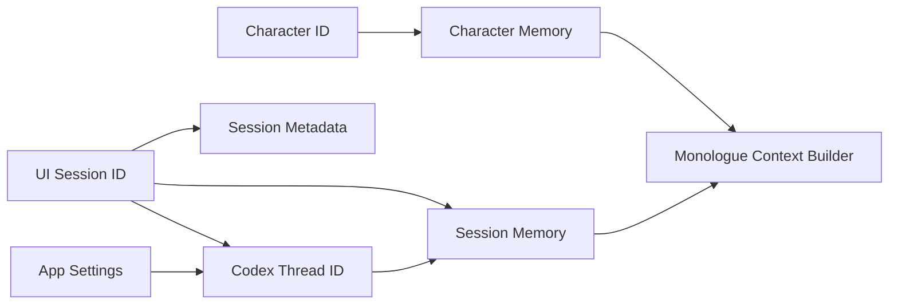

# Session Persistence

- 作成日: 2026-03-12
- 対象: セッション継続に必要な永続化設計
- 関連 Issue:
  - `#3 LangGraphを使ってMemoryの永続化と共有`

## Goal

WithMate のセッション再開体験を成立させるために、
`UI Session` `Codex Thread` `Session Memory` の対応関係を定義し、
どの情報をどこへ保存するかを明文化する。

## Persistence Layers

WithMate では、永続化対象を 5 層に分ける。

1. `Session Metadata`
- セッション一覧や resume picker に必要な情報

2. `Execution Continuity`
- Codex 側の thread 再開に必要な識別子
- turn summary など UI 継続に必要な情報

3. `Audit Log`
- session 実行の監査と事後精査に必要な履歴

4. `App Settings`
- app 全体で共有する固定設定
- prompt prefix のような app 共通指示

5. `Session Memory`
- セッション単位の継続知識
- 独り言用 context 抽出の素材

## Data Model

### Session Metadata

保持する情報:

- session id
- task title
- workspace path
- provider
- catalog revision
- character id
- model
- reasoning depth
- character name
- status
- created at / updated at
- last active at

補足:

- current 実装では session row に character の軽量 snapshot と `catalogRevision` が残るため、元データが変わっても一覧表示自体は継続できる場合がある。
- ただし、この snapshot は将来の実行継続を保証するものではない。

用途:

- `Recent Sessions`
- Home / resume picker
- 新規 window 起動時の一覧表示

### Execution Continuity

保持する情報:

- codex thread id
- approval mode
- selected provider
- selected catalog revision
- selected model
- selected reasoning depth
- run state の最後の確定値
- crash recovery 用の `interrupted` 補正対象
- 最新 turn summary
- 最新 changed files summary

補足:

- current 実装では `selected catalog revision` を session 側に保持し、adapter 実行時も参照する。
- model catalog import 時には session も自動 migrate される前提とし、`catalogRevision` は「長期に旧 revision を pin し続けるための値」ではなく、「その session に現在反映済みの revision」を示す。

用途:

- `resumeThread()` 相当の再開
- 直前状態の UI 復元
- Main Process の provider adapter が thread 再開に使う

### Session Memory

保持する情報:

- session goal summary
- confirmed decisions
- open questions
- recent change summaries
- monologue context 生成に必要な compressed facts

用途:

- Character Stream 入力の素材
- 長いセッションでも継続性を保つための要約面

### Audit Log

保持する情報:

- `running / completed / canceled / failed`
- system prompt
- input prompt
- composed prompt
- assistant response
- 操作要約
- raw turn items
- usage
- error

用途:

- 実行内容の監査
- セッションごとの事後精査
- provider 実行失敗時の追跡

### App Settings

保持する情報:

- system prompt prefix
- provider ごとの enabled state
- provider ごとの API key

用途:

- app 共通の fixed prompt 管理
- prompt composition の system レイヤ拡張

## Identity Mapping

## Storage Direction

### MVP

MVP では、保存責務を次のように切る。

- `Session Metadata`
  - Electron Main Process 側 SQLite
- `Execution Continuity`
  - 同じ SQLite row + Codex thread id
- `Audit Log`
  - Electron Main Process 側 SQLite の独立 table
- `App Settings`
  - Electron Main Process 側 SQLite の key-value table
- `Session Memory`
  - LangGraph checkpointer を中心に管理する第一候補
- `Character Memory`
  - LangGraph Store を中心に管理する第一候補

### Rationale

- Session 一覧の表示はアプリ側で高速に引ける必要がある
- Codex thread の正本は Codex 側にあり、アプリは thread id を保持すればよい
- app 共通の固定 prompt は character 定義と混ぜず、app settings で持った方が運用しやすい
- Memory は独り言生成の入力最適化責務があるため、LangGraph 境界で扱う方が整理しやすい
- session metadata と execution continuity は MVP のうちは 1 row にまとめてよい

## Update Triggers

### Session Metadata

更新タイミング:

- 新規セッション作成時
- セッション切り替え時
- turn 完了時
- status 変更時

### Execution Continuity

更新タイミング:

- Codex thread 作成時
- turn 完了時
- approval mode 変更時
- model / reasoning depth 変更時
- changed files / run summary 確定時
- アプリ再起動時の recovery 判定時

補足:

- model または reasoning depth を変更した時は、既存 `threadId` を破棄して次回 turn を新規 thread で開始する
- UI 上の chat history は session に残るが、provider 側の継続コンテキストは切り替わる
- model catalog import 時も session 側の `catalogRevision` は自動 migrate 対象になる
- import 後に旧 revision を保持したまま実行し続けることは current milestone の目標にしない

### App Settings

更新タイミング:

- Settings overlay で保存した時
- provider 有効化 / API key 更新時も同じ Settings 保存で扱う

### Session Memory

更新タイミング:

- assistant turn 完了時
- artifact summary 確定時
- セッション終了時の圧縮時

## Resume Flow

1. アプリ起動
2. Session Metadata を読み込み `Recent Sessions` を表示
3. セッション選択
4. `thread id` と Execution Continuity を復元
5. 前回が `running` のまま残っていた場合は `interrupted` へ補正する
6. App Settings を読み込み prompt composition に反映する
7. Session Memory を読み込み、Character Stream 用の基礎状態も復元する

## Missing Character の扱い

- character を解決できない session は reopen 自体は許可するが、`browse-only` / `view-only` として扱う。
- 過去ログ、audit、diff の閲覧は維持する。
- 新規 turn 送信や別 character への自動再接続は行わない。

## Crash Recovery

- アプリが強制終了した場合、SQLite 上に `runState = running` が残ることがある
- 実行前後の `running / completed / canceled / failed` は SQLite の監査ログにも残る
- 次回起動時は、その session を `runState = interrupted` / `status = idle` へ補正する
- 補正時には assistant message として「前回の実行は中断された可能性がある」旨を 1 回だけ追記する

この補正により、UI 上で永続的に `running` のまま取り残されるのを避ける。

## Monologue Integration

Session Persistence は、Character Stream のために次の責務を持つ。

- 現在の task 文脈を失わない
- 直近の決定事項を引き継ぐ
- 独り言入力をフル履歴依存にしない

そのため、Session Memory は `ログの保存` ではなく `継続文脈の圧縮保存` を目的にする。

## Non Goals

- turn の生ログ全文を無制限に永続化すること
- Codex の内部実行ログをアプリ側で完全ミラーすること
- Session Metadata と Memory を同一責務で扱うこと

## Open Questions

- turn summary の正本をどこに置くか
- Session Memory 更新の粒度を every turn にするか checkpoint にするか
- LangGraph backend とアプリ storage の境界をどこで切るか
- import 時自動 migrate の具体的な正規化ルールをどこまで session-persistence で持つか

## References

- `docs/design/memory-architecture.md`
- `docs/design/monologue-provider-policy.md`
- LangGraph JavaScript Persistence: https://docs.langchain.com/oss/javascript/langgraph/persistence
- LangGraph JavaScript Memory: https://docs.langchain.com/oss/javascript/langgraph/add-memory
- LangGraph TTL configuration: https://docs.langchain.com/langsmith/configure-ttl
