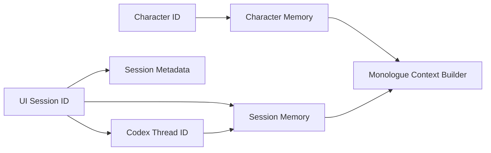

# Session Persistence

- 作成日: 2026-03-12
- 対象: セッション継続に必要な永続化設計
- 関連 Issue:
  - `#3 LangGraphを使ってMemoryの永続化と共有`

## Goal

WithMate のセッション再開体験を成立させるために、
`UI Session` `Codex Thread` `Session Memory` の対応関係を定義し、
どの情報をどこへ保存するかを明文化する。

## Persistence Layers

WithMate では、永続化対象を 3 層に分ける。

1. `Session Metadata`
- セッション一覧や resume picker に必要な情報

2. `Execution Continuity`
- Codex 側の thread 再開に必要な識別子
- turn summary など UI 継続に必要な情報

3. `Session Memory`
- セッション単位の継続知識
- 独り言用 context 抽出の素材

## Data Model

### Session Metadata

保持する情報:

- session id
- task title
- workspace path
- provider
- character id
- status
- created at / updated at
- last active at

用途:

- `Recent Sessions`
- Home / resume picker
- 新規 window 起動時の一覧表示

### Execution Continuity

保持する情報:

- codex thread id
- approval mode
- run state の最後の確定値
- 最新 turn summary
- 最新 changed files summary

用途:

- `resumeThread()` 相当の再開
- 直前状態の UI 復元

### Session Memory

保持する情報:

- session goal summary
- confirmed decisions
- open questions
- recent change summaries
- monologue context 生成に必要な compressed facts

用途:

- Character Stream 入力の素材
- 長いセッションでも継続性を保つための要約面

## Identity Mapping

## Storage Direction

### MVP

MVP では、保存責務を次のように切る。

- `Session Metadata`
  - Electron Main Process 側 store
- `Execution Continuity`
  - アプリ側 storage + Codex thread id
- `Session Memory`
  - LangGraph checkpointer を中心に管理する第一候補
- `Character Memory`
  - LangGraph Store を中心に管理する第一候補

### Rationale

- Session 一覧の表示はアプリ側で高速に引ける必要がある
- Codex thread の正本は Codex 側にあり、アプリは thread id を保持すればよい
- Memory は独り言生成の入力最適化責務があるため、LangGraph 境界で扱う方が整理しやすい

### TTL Direction

LangGraph の公式 docs では、checkpointer と store の両方に TTL を設定できる。
WithMate では次を第一候補とする。

- checkpoints / thread state
  - session 再開要件に合わせて比較的長めに保持する
- store items / cross-thread memory
  - Character Memory の鮮度とコストを見ながら個別管理する

MVP では TTL の具体値は固定せず、実運用で決める。

## Update Triggers

### Session Metadata

更新タイミング:

- 新規セッション作成時
- セッション切り替え時
- turn 完了時
- status 変更時

### Execution Continuity

更新タイミング:

- Codex thread 作成時
- turn 完了時
- approval mode 変更時
- changed files / run summary 確定時

### Session Memory

更新タイミング:

- assistant turn 完了時
- artifact summary 確定時
- セッション終了時の圧縮時

## Resume Flow

1. アプリ起動
2. Session Metadata を読み込み `Recent Sessions` を表示
3. セッション選択
4. `thread id` と Execution Continuity を復元
5. 必要なら `resumeThread()` を呼ぶ
6. Session Memory を読み込み、Character Stream 用の基礎状態も復元する

## Monologue Integration

Session Persistence は、Character Stream のために次の責務を持つ。

- 現在の task 文脈を失わない
- 直近の決定事項を引き継ぐ
- 独り言入力をフル履歴依存にしない

そのため、Session Memory は `ログの保存` ではなく `継続文脈の圧縮保存` を目的にする。

## Non Goals

- turn の生ログ全文を無制限に永続化すること
- Codex の内部実行ログをアプリ側で完全ミラーすること
- Session Metadata と Memory を同一責務で扱うこと

## Open Questions

- Session Metadata の保存先を SQLite に固定するか
- turn summary の正本をどこに置くか
- Session Memory 更新の粒度を every turn にするか checkpoint にするか
- LangGraph backend とアプリ storage の境界をどこで切るか

## References

- `docs/design/memory-architecture.md`
- `docs/design/monologue-provider-policy.md`
- LangGraph JavaScript Persistence: https://docs.langchain.com/oss/javascript/langgraph/persistence
- LangGraph JavaScript Memory: https://docs.langchain.com/oss/javascript/langgraph/add-memory
- LangGraph TTL configuration: https://docs.langchain.com/langsmith/configure-ttl
