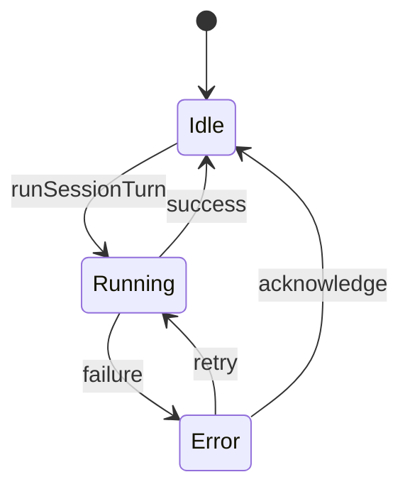

# Session Run Lifecycle

- 作成日: 2026-03-14
- 対象: 実行中 session の close / quit / relaunch 制御

## Goal

実行中の coding agent session が、`Session Window` の close やアプリ終了操作で意図せず失われにくいようにする。
session 実行の正本を Main Process に置き、window はその投影であることを明確にする。

## Decision

- session 実行は Main Process が保持する
- `Session Window` は session 実行の viewer / input surface として扱う
- 実行中 session の `Session Window` を閉じても、実行自体は継続する
- アプリ終了は実行中 session がある場合に確認ダイアログを出す
- 全 window が閉じても実行中 session がある場合は `Home Window` を再生成して、アプリ全体の終了を避ける

## Lifecycle Model

window は上の状態機械とは分離する。
`Running` 中に `Session Window` が閉じても、session state は Main Process 内で継続する。

## Ownership

### Main Process

- 実行中 session の registry
- `runSessionTurn()` の開始と完了
- session metadata / message persistence
- close / quit 時の保護判定

### Session Window

- 実行中 session の表示
- ユーザー入力
- diff / artifact の閲覧
- session title の変更
- session 削除
- `interrupted` session の再送 UI

`Session Window` は閉じられても再度開き直せるため、session 実行の正本にしない。

## Close Behavior

### Session Window Close

- 対象 session が `running` でなければ、そのまま閉じる
- 対象 session が `running` の場合:
  - 確認ダイアログを出す
  - `閉じない`: close をキャンセル
  - `閉じて続行`: window は閉じるが session 実行は継続

### Session Delete

- 対象 session が `running` でなければ、確認後に削除できる
- 対象 session が `running` の場合:
  - UI では削除ボタンを無効化する
  - Main Process 側でも削除を拒否する

### Home Window Close

- 単純な close は許可する
- ただし全 window が閉じた時点で実行中 session が存在する場合、`Home Window` を再生成する

## Quit Behavior

### App Quit

- 実行中 session が無い場合:
  - そのまま終了する
- 実行中 session がある場合:
  - 確認ダイアログを出す
  - `戻る`: quit をキャンセル
  - `終了する`: 実行中 session を中断してアプリを終了する

この段階では graceful cancellation は入れず、明示確認によって accidental quit を防ぐ。

## Background Continuation

MVP では tray 常駐までは行わない。
その代わり、全 window が閉じても実行中 session がある場合は `Home Window` を再表示し、処理の継続を優先する。

将来的には次を検討する。

- tray icon による完全バックグラウンド継続
- 実行中 session の OS notification
- graceful shutdown / cancellation API

## Persistence Expectations

- `runState = running` は SQLite に保存される
- アプリが強制 kill された場合、次回起動時に `running` のまま残る可能性がある
- 次回起動時は `interrupted` へ補正し、assistant message を 1 件だけ追加する
- `interrupted` session は `Session Window` から直前 user message を同じ内容で再送できる

現時点では graceful resume までは入れず、`interrupted` からの明示再送を最小導線として扱う。

## Relation To Existing Docs

- [window-architecture.md](./window-architecture.md)
  - window ごとの責務
- [electron-window-runtime.md](./electron-window-runtime.md)
  - Electron Main Process の lifecycle
- [session-persistence.md](./session-persistence.md)
  - session metadata の永続化
