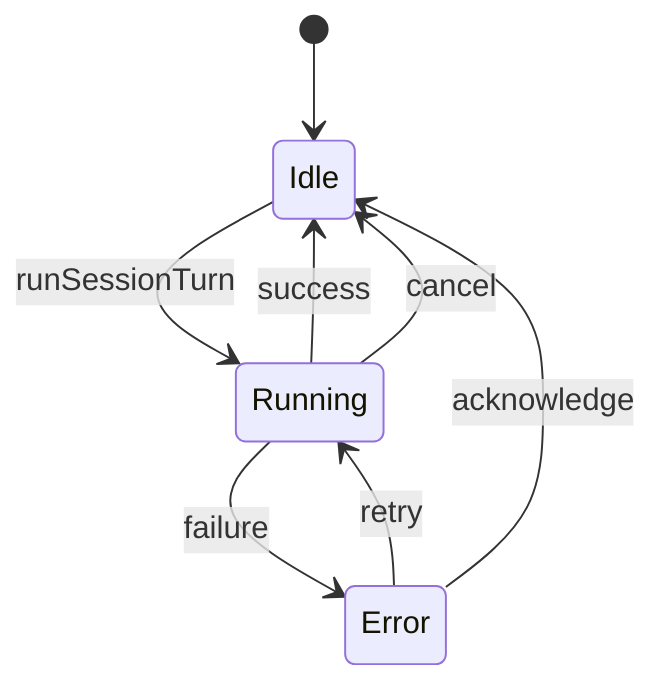

# Session Run Lifecycle

- 作成日: 2026-03-14
- 対象: 実行中 session の run / cancel / close / relaunch 制御

## Goal

実行中の coding agent session が、`Session Window` の close やアプリ終了操作で意図せず失われにくいようにする。  
session 実行の正本を Main Process に置き、window はその投影であることを明確にする。

## Position

- この文書は `running` session の lifecycle と保護制御の正本とする
- persistence orchestration は `docs/design/electron-session-store.md` を参照する
- BrowserWindow / preload detail は `docs/design/electron-window-runtime.md` を参照する
- window 構成全体は `docs/design/window-architecture.md` を参照する

## Decision

- session 実行は Main Process が保持する
- `Session Window` は session 実行の viewer / input surface として扱う
- 実行中 session の `Session Window` を閉じても、実行自体は継続する
- `Session Window` から実行中 session を明示キャンセルできる
- turn 完了後の Session Memory extraction と Character Reflection は background task として分離する
- `SessionStart` では monologue only の character reflection path を起動する
- `Session Window` close では Session Memory extraction を強制実行し、character reflection は trigger に使わない
- アプリ終了は実行中 session がある場合に確認ダイアログを出す
- 全 window が閉じても実行中 session がある場合は `Home Window` を再生成して、アプリ全体の終了を避ける
- 実行中 session の metadata 更新は制限し、少なくとも approval / model / depth / title / delete は UI と Main Process の両方でブロックする

## Lifecycle Model

window は上の状態機械とは分離する。  
`Running` 中に `Session Window` が閉じても、session state は Main Process 内で継続する。

## Ownership

### Main Process

- 実行中 session の registry
- close / quit 時の保護判定
- service wiring

### SessionRuntimeService

- `runSessionTurn()` の事前検証
- in-flight 管理
- provider coding adapter 実行
- stale thread / session 起因エラーに対する 1 回だけの internal reset + retry
- audit log の running / completed / failed / canceled 更新
- live run state の更新
- turn 完了後の background task 起動

### SessionWindowBridge

- `Session Window` の registry
- 既存 window の再利用
- running 中 close の確認ダイアログ制御
- `session-start` の character reflection 起動
- `session-window-close` の Session Memory extraction 起動

### SessionApprovalService

- pending approval の待機
- resolve / deny
- abort cleanup

### SessionObservabilityService

- live run
- provider quota telemetry
- session context telemetry
- background activity

### MemoryOrchestrationService

- Session Memory extraction trigger
- Character Reflection trigger
- background audit 更新

### Session Window

- 実行中 session の表示
- ユーザー入力
- 実行中 session のキャンセル
- diff / artifact の閲覧
- session title の変更
- session 削除
- `interrupted` session の再送 UI

## Close Behavior

### Session Window Close

- 対象 session が `running` でなければ、そのまま閉じる
- 対象 session が `running` の場合:
  - 確認ダイアログを出す
  - `閉じない`: close をキャンセル
  - `閉じて続行`: window は閉じるが session 実行は継続する
- close 時には Session Memory extraction を強制実行する

### Session Run Cancel

- `Session Window` の `Cancel` は Main Process の `AbortController` を通して provider 実行を止める
- キャンセル後の session は `runState = idle` に戻る
- chat にはキャンセル結果を 1 件追加する
- 監査ログは同じ turn record を `phase = canceled` へ更新し、`errorMessage` にユーザーキャンセルを残す
- 実行中は approval を含む session 設定変更を受け付けない
- stale thread / session 起因エラーを Main Process が検知した場合だけ、同一 turn の内部で `threadId clear + provider cache invalidate` を行って 1 回だけ再試行する
- internal retry は same turn の処理として扱い、user message / assistant message / audit log record を二重化しない

### Session Delete

- 対象 session が `running` でなければ、確認後に削除できる
- 対象 session が `running` の場合:
  - UI では削除ボタンを無効化する
  - Main Process 側でも削除を拒否する

### Home Window Close

- 単純な close は許可する
- ただし全 window が閉じた時点で実行中 session が存在する場合、`Home Window` を再生成する

## Quit Behavior

### App Quit

- 実行中 session が無い場合:
  - そのまま終了する
- 実行中 session がある場合:
  - 確認ダイアログを出す
  - `戻る`: quit をキャンセル
  - `終了する`: 実行中 session を中断してアプリを終了する

キャンセルは `Session Window` から明示操作で行い、アプリ終了時の accidental quit 保護とは別責務で扱う。

## Background Continuation

current 実装では tray 常駐までは行わない。  
その代わり、全 window が閉じても実行中 session がある場合は `Home Window` を再表示し、処理の継続を優先する。

## Persistence Expectations

- `runState = running` は SQLite に保存される
- アプリが強制 kill された場合、次回起動時に `running` のまま残る可能性がある
- 次回起動時は `interrupted` へ補正し、assistant message を 1 件だけ追加する
- `interrupted` session は `Session Window` から直前 user message を同じ内容で再送できる

現時点では graceful resume までは入れず、`interrupted` からの明示再送を最小導線として扱う。

## Relation To Existing Docs

- `window-architecture.md`
  - window ごとの責務
- `electron-window-runtime.md`
  - Electron Main Process の lifecycle
- `electron-session-store.md`
  - session / audit / memory persistence orchestration
- `database-schema.md`
  - session metadata と audit / memory の保存構造
- `refactor-roadmap.md`
  - runtime orchestration の段階的分離方針
