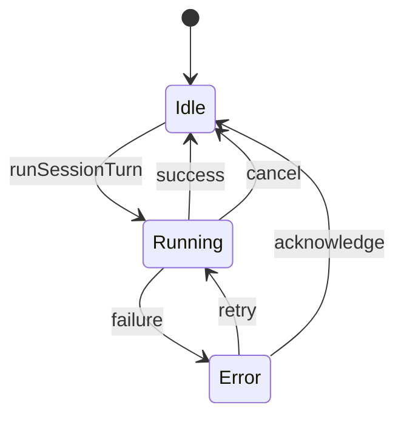

# Session Run Lifecycle

## Auxiliary Session (Issue #710)

AuxiliaryのrunはMainや兄弟Auxiliaryと独立し、非表示でも継続・terminal保存する。新規追加・表示切り替え・折りたたみはProvider turnを開始せず、同一会話内の二重実行だけを拒否する。Window close、親削除、設定変更では親配下の全Auxiliary runを列挙して扱う。正常terminalで確定した最終assistant本文は、必要な場合に一覧preview projectionを更新する。

- 作成日: 2026-03-14
- 対象: 実行中 session の run / cancel / close / relaunch 制御

## Goal

実行中の coding agent session が、`Session Window` の close やアプリ終了操作で意図せず失われにくいようにする。  
session 実行の正本を Main Process に置き、window はその投影であることを明確にする。

## Position

- この文書は `running` session の lifecycle と保護制御の正本とする
- persistence orchestration は `docs/design/electron-session-store.md` を参照する
- BrowserWindow / preload detail は `docs/design/electron-window-runtime.md` を参照する
- window 構成全体は `docs/design/window-architecture.md` を参照する

## Decision

- session 実行は Main Process が保持する
- `Session Window` は session 実行の viewer / input surface として扱う
- 実行中 session の `Session Window` を閉じても、実行自体は継続する
- `Session Window` から実行中 session を明示キャンセルできる
- V5 preview では turn 完了後の Session Memory extraction / Character Reflection を current background task として起動しない
- `SessionStart` で monologue only の character reflection path を起動しない
- `Session Window` close では Session Memory extraction を自動実行しない
- Memory / Growth history は V5 Character runtime prompt に常設注入しない
- アプリ終了は実行中 session がある場合に確認ダイアログを出す
- 全 window が閉じても実行中 session がある場合は `Home Window` を再生成して、アプリ全体の終了を避ける
- 実行中 session の metadata 更新は制限し、少なくとも approval / model / depth / title / delete は UI と Main Process の両方でブロックする

## Lifecycle Model

```mermaid
stateDiagram-v2
    [*] --> Idle
    Idle --> Running: runSessionTurn
    Running --> Idle: success
    Running --> Idle: cancel
    Running --> Error: failure
    Error --> Running: retry
    Error --> Idle: acknowledge
```

window は上の状態機械とは分離する。  
`Running` 中に `Session Window` が閉じても、session state は Main Process 内で継続する。

## Ownership

### Main Process

- 実行中 session の registry
- close / quit 時の保護判定
- service wiring

### SessionRuntimeService

- `runSessionTurn()` の事前検証
- in-flight 管理
- provider coding adapter 実行
- stale thread / session、または meaningful partial を持たない Codex bootstrap failure に対する 1 回だけの internal reset + retry
- audit log の running / completed / failed / canceled 更新
- live run state の更新
- turn 完了後の background task 起動

### SessionWindowBridge

- `Session Window` の registry
- 既存 window の再利用
- running 中 close の確認ダイアログ制御
- `session-start` の character reflection 起動

### SessionApprovalService

- pending approval の待機
- resolve / deny
- abort cleanup

### SessionObservabilityService

- live run
- provider quota telemetry
- session context telemetry
- background activity

### Legacy Memory Orchestration

V5 preview では Session Memory extraction / Character Reflection trigger を current runtime path として起動しない。既存 data や background audit record は legacy compatibility として保持してよいが、新規 Character prompt の正本にはしない。

### Session Window

- 実行中 session の表示
- ユーザー入力
- 実行中 session のキャンセル
- diff / artifact の閲覧
- session title の変更
- session 削除
- `interrupted` session の再送 UI

## Close Behavior

### Session Window Close

- 対象 session が `running` でなければ、そのまま閉じる
- 対象 session が `running` の場合:
  - 確認ダイアログを出す
  - `閉じない`: close をキャンセル
  - `閉じて続行`: window は閉じるが session 実行は継続する
- close 時に Session Memory extraction は自動実行しない

### Session Run Cancel

- `Session Window` の `Cancel` は Main Process の `AbortController` を通して provider 実行を止める
- キャンセル後の session は `runState = idle` に戻る
- setup または provider が cancel grace 後も生存する場合、表示上の turn は収束させるが、元処理の実終了までは terminating guard として in-flight admission を維持し、同一 session の再送を拒否する
- chat にはキャンセル結果を 1 件追加する
- 監査ログは同じ turn record を先に最小 `phase = canceled` へ更新し、`errorMessage` にユーザーキャンセルを残す。詳細は bounded enrichment として後段で更新する
- 実行中は approval を含む session 設定変更を受け付けない
- stale thread / session 起因エラー、または meaningful partial を持たない Codex bootstrap failure を Main Process が検知した場合だけ、同一 turn の内部で `threadId clear + provider cache invalidate` を行って 1 回だけ再試行する
- internal retry は same turn の処理として扱い、user message / assistant message / audit log record を二重化しない

### Session Delete

- 対象 session が `running` でなければ、確認後に削除できる
- 対象 session が `running` の場合:
  - UI では削除ボタンを無効化する
  - Main Process 側でも削除を拒否する

V6 の通常更新と terminal 保存は、作成とは別の既存行限定 API を使う。存在確認を要求受付時だけで済ませず、保存 transaction 内で再確認する。削除が先に確定した場合は `SessionNotFoundError` で更新を拒否し、古い Session 本文、terminal marker、cache、provider binding を再作成しない。単体削除と期間指定削除で同じ契約を適用する。

単体・期間指定削除は、実行中判定、DB 削除、cache 除去、親子の agent binding 失効とローカル投影までを ownership 境界内で確定する。provider thread の外部後処理はその境界を解放してから待つ。後処理が遅れても無関係な Session の削除・Affect 適用を待たせない。後処理に失敗した場合も残りの削除対象の後処理を試み、削除済みデータを復元せず、失敗を集約して呼出元へ返す。

Session の owner は ID だけでなく行の `incarnationId` で識別する。同じ ID を削除後に再作成しても新しい incarnation を発行し、古い通常更新・terminal・running 開始の保存を拒否する。既存行の更新では incarnation を保持する。

provider 後処理は ownership 解放前に全対象の旧 runtime 参照を同期的に切り離してから、外部切断の完了だけを解放後に待つ。古い切断の完了が、同じ ID で作成された新 runtime を無効化してはならない。

### Character Affect の完了後評価

pending は Session incarnation を保存し、回収時と評価適用時に current owner と照合する。既存 V6 行は `legacy:<id>` へ移行し、incarnation 列のない旧 pending も同じ owner と解釈する。新規行には UUID を発行するため、旧 pending は同じ ID の再作成行に適用されない。既存の要求 fingerprint は変更しない。

unready pending の Session 読取待ちでも storage identity を再確認し、交換された旧 storage への ready / discard を行わない。close / recreate 時には drain cursor も破棄する。

外部 Provider による Affect 評価は ownership coordinator を保持せずに実行する。無関係な Session の作成・削除を、評価完了待ちへ結合しない。

適用直前の Session 生存、Character owner、committed assistant turn の検証と、既存 `expectedVersion` による appraise、settlement 確定を同じ ownership 境界に置く。評価中に owner が削除された場合は結果を破棄し、Affect を適用しない。同じ Character の競合は既存の version conflict / idempotency / bounded retry 契約で扱い、確定済みの通常 Turn を巻き戻さない。

非同期処理中に settlement storage または Memory runtime の instance が交換された場合、その評価試行は `invalidated` とする。await 後と適用前に instance identity を確認し、閉じた storage へ評価結果や failure を書かず、新 instance の同名要求にも結果を引き継がない。これは現行 Main の lifecycle 保護であり、Worker 全体の generation 契約の実装完了を意味しない。

Memory runtime だけが交換され、元の settlement storage がまだ current の場合は、その correlation の attempt を既存の中断回収処理へ戻す。旧試行の未保存評価・遅延応答は採用せず、閉じた storage を操作せず、current DB に試行中のまま残ることを防ぐ。

交換前に durable pending へ保存済みの評価は、この失効だけでは破棄しない。appraise 開始前の ownership 待ち・owner 読取待ちで交換した場合も、次回 drain は同じ candidate 列・expected version・評価世代・idempotency key を使い、現 owner と version を再検証する。appraise dispatch 後に交換した場合は適用の有無を失効した応答から確定せず、同じ保存済み評価を再照合する。runtime 交換だけを理由に新しい key で再評価すると、既に commit した event を二重化し得る。新しい評価世代へ進むのは、既存 ADR 020 の `effect: none` version conflict で未commitを確認できた場合等の明示された遷移だけとする。

この分離は Issue #726 の一部である。作成準備の広域排他、Settings の全 snapshot 更新、storage Worker、Auxiliary 作成取消の残作業は `docs/plans/20260919-session-operation-boundaries/plan.md` で管理する。

### Home Window Close

- 単純な close は許可する
- ただし全 window が閉じた時点で実行中 session が存在する場合、`Home Window` を再生成する

## Quit Behavior

### App Quit

- 実行中 session が無い場合:
  - そのまま終了する
- 実行中 session がある場合:
  - 確認ダイアログを出す
  - `戻る`: quit をキャンセル
  - `終了する`: 実行中 session を中断してアプリを終了する

キャンセルは `Session Window` から明示操作で行い、アプリ終了時の accidental quit 保護とは別責務で扱う。

## Background Continuation

current 実装では tray 常駐までは行わない。
全 window が閉じても app process は終了せず、Memory V6 runtime API / CLI discovery を維持する。Windows では single instance lock と `second-instance` handler により、Start Menu などから再起動されたときに既存 process の `Home Window` を再表示・focus する。
実行中 session がある場合は `window-all-closed` 時点でも `Home Window` を再表示し、処理の継続を優先する。

## Persistence Expectations

- `runState = running` は SQLite に保存される
- アプリが強制 kill された場合、次回起動時に `running` のまま残る可能性がある
- 次回起動時は `interrupted` へ補正し、assistant message を 1 件だけ追加する
- `interrupted` session は `Session Window` から直前 user message を同じ内容で再送できる

現時点では graceful resume までは入れず、`interrupted` からの明示再送を最小導線として扱う。

## Relation To Existing Docs

- `window-architecture.md`
  - window ごとの責務
- `electron-window-runtime.md`
  - Electron Main Process の lifecycle
- `electron-session-store.md`
  - session / audit / memory persistence orchestration
- `database-schema.md`
  - session metadata と audit / memory の保存構造
- `refactor-roadmap.md`
  - runtime orchestration の段階的分離方針
