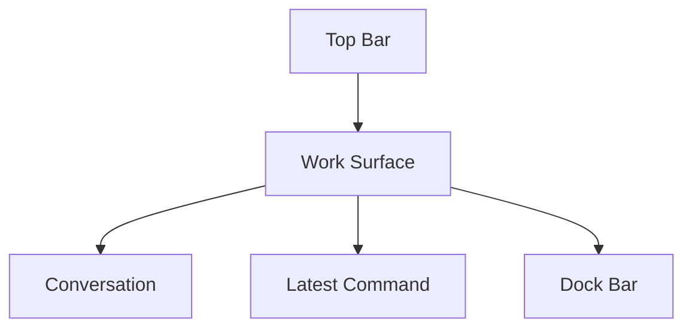

# Session Window Chrome Reduction

## Status

- 状態: current design
- 前提: SessionWindow の主要機能は揃っており、現段階では viewport の広さと面の圧迫感を優先して改善する

## Goal

- chat viewport を広げ、会話本文が窮屈に見える状態を解消する
- `Top Bar` と `Action Dock` を必要時だけ強く見せ、通常時は最小限の chrome に落とす
- panel / padding / frame を整理し、SessionWindow 全体を 1 枚の work surface として見せる

## Current Design Summary

- SessionWindow は `Top Bar + Work Surface + Dock Bar` の 3 層で扱う
- `Top Bar` は thin strip とし、管理操作は drawer に寄せる
- `Work Surface` は外側 card を持たず、message list と right pane を直接配置する
- `Dock Bar` は compact / expanded を持ち、通常時は compact を優先する

## Layout

## Top Bar

- window 上端に沿う薄い strip とする
- 常時表示するのは `title / Audit Log / Terminal / More / Close`
- `Terminal` は session の `workspacePath` を使って外部 terminal を開く軽量 action とする
- `Rename / Delete` は `More` で展開した drawer にだけ置く
- title 編集中は drawer を自動で開いた状態にする

## Work Surface

- `panel chat-panel` の外側 card は持たない
- message list と `Latest Command` pane は window background に近い面で直接配置する
- gap / padding / radius は wide layout 初期版より削る
- message viewport の高さを最優先にし、right pane と dock の chrome は必要最小限に留める

## Dock Bar

- `Action Dock` は 2 状態にする
  - compact
    - draft preview
    - `Send / Cancel`
  - expanded
    - attachment group (`File / Folder / Image`)
    - `Skill`
    - `retry banner`
    - textarea
    - `Approval / Model / Depth`
- manual toggle を持つ
- session 切替時の既定は compact とする
- textarea focus で expanded に戻す
- 次の状態では expanded を強制する
  - `retry banner`
  - skill picker open
  - `@path` 候補 open
  - retry draft conflict
  - blocked feedback

## Right Pane

- `Latest Command` の 1 面 host を維持する
- pane 自体の余白と card chrome は wide layout 初期版より削る
- 将来 `Character Stream` を入れる場合も、right pane は単一 host の考え方を維持する

## Non-Goals

- `Latest Command` の data mapping 変更
- `Character Stream` 本体実装
- Home / Character Editor の同時改修

## References

- `docs/design/desktop-ui.md`
- `docs/design/session-window-layout-redesign.md`
- `docs/design/session-live-activity-monitor.md`
