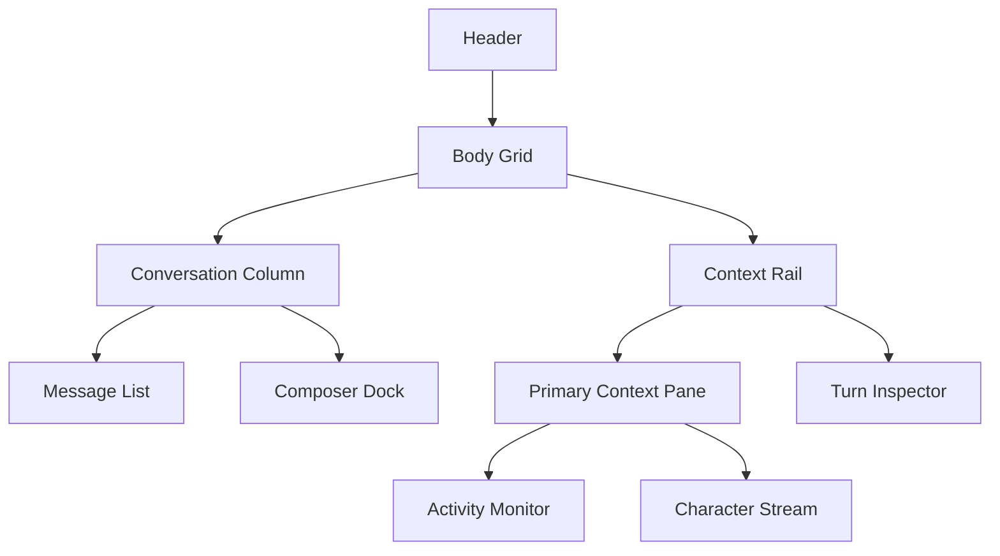

# Session Window Layout Redesign

## Status

- 状態: target design
- 前提: `1920x1080` のディスプレイで `Session Window` をフル表示した利用を基準に再配置する
- 実装状況: 未実装

## Goal

- Session Window を「会話を読む面」「実行中 activity を監視する面」「現在 turn の成果物を確認する面」に分け、横幅を使って情報密度を上げる
- 将来の `Character Stream` を同じ右 rail に収められる host layout にする
- command 実況の realtime 可視性を維持したまま、assistant / user message の可読域を広げる
- composer を常に見失わない固定面として扱い、実行中 / retry / 再送の操作導線を安定させる

## Problem

現状は縦方向の stack が主体で、`1920x1080` では横幅を十分使えていない。

- message list と `Activity Monitor` と composer が同じ縦列に積まれ、長い run では高さの奪い合いが起きる
- artifact detail や turn の補助情報も message flow の中に寄りやすく、会話本文と文脈確認の面が混ざる
- header action、Audit Log、session metadata が上部に散り、実行中に視線往復が増える
- 将来 `Character Stream` を足すと、現状の縦 stack では置き場が競合しやすい

## Layout Summary

## Baseline Layout

### Window Frame

- header は 1 行固定で `72px` 前後を基準にする
- body は `minmax(0, 1fr)` の 2 カラムにする
- baseline column は `minmax(0, 1.75fr) 420px` を第一候補にする
- 右 rail は `400px` 未満に縮めず、message list の最小可読幅を優先する
- conversation column と context rail の間には draggable splitter を置き、左右幅をユーザーが直接調整できるようにする
- split 比率は window 単位で保持し、次回同サイズ帯で再表示した時は最後の比率を優先して復元する

### Conversation Column

- 左カラムは `message list` と `composer dock` の 2 段構成にする
- `message list` は常に最優先の可読面として扱い、assistant / user / pending bubble だけに集中させる
- `message follow` banner は list 下端に浮く compact な sticky action に寄せ、常設 block にしない
- per-message artifact は inline detail を維持してよいが、summary を短くし、重い確認は右 rail の `Turn Inspector` に寄せる

### Composer Dock

- composer は左カラム下端の固定 dock とする
- レイアウトは 3 段を基本とする
  - 上段: attachment / skill / utility buttons
  - 中段: textarea
  - 下段: sendability feedback と `Send / Cancel`、approval / model / depth
- `retry banner` は composer dock の最上段へ内包し、message list の高さを削りすぎない

### Context Rail

- 右 rail は session 実況と turn 文脈の専用面とする
- 上段は `Primary Context Pane` とし、状態に応じて `Activity Monitor` または `Character Stream` を主表示する
- 下段は `Turn Inspector`
- 両面は独立 scroll を持つが、rail 全体のスクロールは避ける

## Context Rail Details

### Primary Context Pane

- run 中は `Activity Monitor` を主表示する
- idle 時や待機時間帯は `Character Stream` を主表示できる host とする
- provider / memory / monologue 実装が入るまでは `Character Stream` は placeholder 扱いでよい
- pane 自体の高さ優先度は `Turn Inspector` より高くする

### Activity Monitor

- `runState === "running"` の間は右 rail 上段に固定表示する
- command / file change / error / usage を realtime で監視する主面とする
- monitor 自身の follow / unread / `最新へ` は現行仕様を維持する
- baseline 高さは `300px` 前後を第一候補にし、turn inspector より優先度を高くする

### Character Stream

- `runState !== "running"` の間の主表示候補とする
- coding agent 本体とは別 plane のキャラ面として扱い、会話本文の主面へは混ぜない
- initial redesign では host だけを確保し、本実装の UI は follow-up で定義する

### Turn Inspector

- 対象は「最新 assistant turn」または「現在選択中 assistant message」とする
- 初期スコープでは最新 assistant turn を対象にする
- 内容は次を上から並べる
  - turn title / 実行状態 summary
  - changed files 要約
  - run checks
  - operation timeline 要約
  - `Open Diff` などの補助 action
- inline artifact detail と同じ生データを使い、Renderer で別 view を作る

## Header Redesign

- 左: session title、character、workspace basename
- 右: `Audit Log`、rename / delete、window action
- 実行状態 badge と provider / model の現在値は header 直下へ出さず、composer dock または turn inspector へ寄せる
- header は管理操作に集中させ、実況や送信設定を混ぜない

## Responsive Rules

### 1920x1080 Baseline

- 2 カラムを前提にする
- conversation column を主役にしつつ、右 rail を常設する
- `message list` は 18 行前後の可視行数を目安に確保する
- draggable splitter の初期値は baseline 比率を使うが、実利用では conversation を広めに保てることを優先する

### 1440px 前後

- 右 rail を `360px` まで縮めて維持する
- `Turn Inspector` の secondary block は折りたたみ既定へ寄せる
- splitter で右 rail を広げすぎても conversation の最小可読幅は下回らない clamp を入れる

### Narrow Width

- `1400px` を下回ったら現在に近い縦 stack へ戻す
- `Activity Monitor` は composer 直上
- `Turn Inspector` は inline artifact / overlay に戻す
- `Character Stream` は rail 常設ではなく overlay か別 toggle に逃がす

## Non-Goals

- provider adapter や `liveRun` schema の変更
- `Audit Log` の構造変更
- artifact persistence の変更
- mobile / portrait 基準の専用レイアウト最適化

## Open Questions

- `Turn Inspector` を最新 assistant turn 固定にするか、message click で選択可能にするか
- `message follow` banner を sticky chip 化するか、現行 banner のまま compact 化するか
- composer 下段で `approval / model / depth` を action row に統合するか、右端ブロックとして残すか
- split 比率の保存先を renderer local storage にするか、window layout 設定として永続化するか

## References

- `docs/design/desktop-ui.md`
- `docs/design/session-live-activity-monitor.md`
