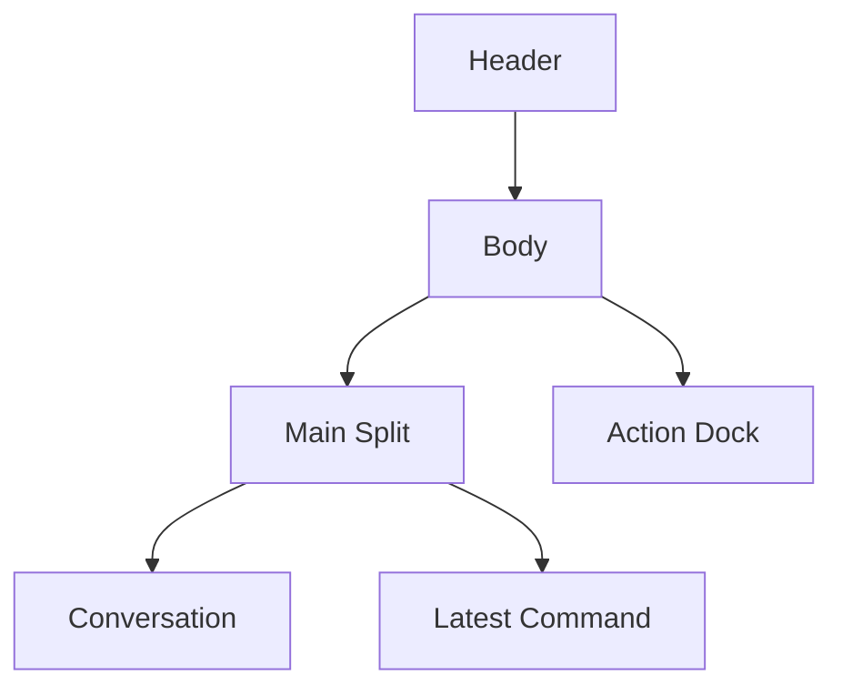

# Session Window Layout Redesign

## Status

- 状態: current design
- 前提: `1920x1080` のディスプレイで `Session Window` をフル表示した利用を基準にする
- 実装状況: `conversation + latest command` の中央 2 分割、下段 `Action Dock`、splitter、compact な `Top Bar` を実装済み
- chrome 削減を含む現仕様は `docs/design/session-window-chrome-reduction.md` を参照する

## Goal

- 会話面と command 安全確認面を分離し、会話本文の可読域を広く保つ
- textarea や送信設定を下段の操作面へ分離し、閲覧面と操作面を明確にする
- 将来 `Character Stream` を right pane へ差し込める host layout を残す

## Layout Summary

## Baseline Layout

### Window Frame

- 上段に `Top Bar`、下段に `main split + action dock` を置く
- `Top Bar` は thin strip とし、`Rename / Delete` は展開時だけ見せる
- `Top Bar` には `workspacePath` で外部 terminal を開く `Terminal` action を常設する
- `main split` は `minmax(0, 1.75fr) 420px` を第一候補にする
- 会話面と right pane の間には draggable splitter を置く
- splitter 比率は renderer local state で保持し、永続化は follow-up にする

### Conversation

- 左面は message list 専用に寄せる
- pending bubble では `assistantText` と run indicator だけを表示する
- `message follow` banner は list 下端の compact action とする
- assistant artifact detail は message flow 内の inline detail を維持する

### Latest Command

- 右 pane は `Latest Command` の単一 pane とする
- 表示対象は 1 件だけ
  - 実行中は live step の最後の `command_execution`
  - 実行後は直近 terminal Audit Log に含まれる最後の `command_execution`
- 表示情報は `status / raw command / source / risk badge / details` に絞る
- run 中に command がまだない時は empty state を出す
- idle 時は将来 `Character Stream` を差し込む placeholder host として扱う

### Action Dock

- body 最下段の full-width 操作面
- `retry banner`、attachment / skill、textarea、`Send / Cancel`、`Approval / Model / Depth` をまとめる
- 入力操作はこの面だけで完結し、左右ペインには混ぜない
- compact / expanded の 2 状態を持つ
- compact では draft preview 全体を reopen hit area にし、`Send / Cancel` だけを残す
- skill picker、`@path` 候補、retry conflict、blocked feedback がある間は expanded を維持する

## Responsive Rules

### Desktop Width

- 中央 2 分割を維持する
- right pane は常設し、splitter で幅を調整できる
- `Action Dock` は full-width のまま下段へ置く

### Narrow Width

- `main split` は縦 stack に戻す
- order は `Conversation -> Latest Command -> Action Dock`
- splitter は非表示にする

## Non-Goals

- `Character Stream` 本体実装
- provider adapter や `liveRun` schema の変更
- Audit Log の構造変更

## Open Questions

- `Character Stream` 実装時に idle pane をそのまま差し替えるか、tab 化するか
- splitter 比率の保存先を renderer local storage にするか、window layout 設定に持つか

## References

- `docs/design/desktop-ui.md`
- `docs/design/session-live-activity-monitor.md`
- `docs/design/session-window-chrome-reduction.md`
