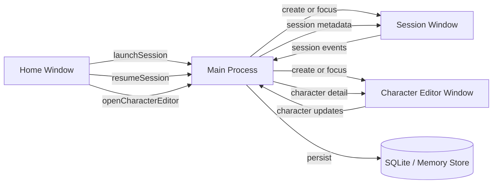

# Window Architecture

- 作成日: 2026-03-12
- 対象: `Home Window` / `Character Editor Window` / `Session Window` / `Diff Window` / `Settings Window` / `Session Monitor Window` の責務分離

## Goal

Issue `#2 Homeとセッションは別ウインドウにする` に合わせて、WithMate の UI を
`Home Window` / `Character Editor Window` / `Session Window` / `Diff Window` / `Settings Window` / `Session Monitor Window`
へ分離する。Home は管理ハブ、Character Editor は Character 作成・編集面、Session は chat 実行面として役割を固定し、V5 preview では legacy MateTalk window / `mate-talk` chat mode を current window として扱わない。Electron 実装時の window lifecycle を明確にする。

## Boundary

- window の上位責務と window 間の役割分担の正本はこの文書とする
- current UI の見た目やレイアウトは `docs/design/desktop-ui.md` を正本とする
- Electron 実装詳細や preload 境界は `docs/design/electron-window-runtime.md` を参照する
- 実行中 session の close / quit / background continuation は `docs/design/session-run-lifecycle.md` を参照する

## Manual Test Maintenance

- window 責務や lifecycle を変更した場合は `docs/manual-test-checklist.md` の関連項目も同じ変更単位で更新する
- 更新方針の正本は `docs/design/manual-test-checklist.md` と `docs/adr/001-manual-test-checklist-policy.md` とする

## Decision

- `Home Window`
  - セッション管理
  - Character catalog の表示
  - Character 作成・編集 window の起点
  - 新規セッション起動
  - `Settings Window` の起点
- `Character Editor Window`
  - Character metadata / icon / theme 編集
  - `character.md` runtime definition 編集
  - `character-notes.md` authoring notes 編集
  - validation / preview / default / archive 操作
- `Session Window`
  - coding agent の作業実行
  - `character-update` mode の更新作業実行
  - Agent / Companion の chat mode
  - artifact summary の閲覧
  - session title の rename
  - session 削除
- `Diff Window`
  - 広い面積での diff 深掘り
- `Settings Window`
  - app / provider / model catalog / DB reset の管理
- `Session Monitor Window`
  - open な session の監視専用 compact window
- `Memory Management Window` と legacy MateTalk window は V5 preview current から外す

`Recent Sessions` を session 側へ常設する構成は採用しない。
既存セッションの再開判断は `Home Window` に集約する。

## Window Responsibilities

### Home Window

Home は `PowerShell -> cd -> codex resume` の手前にある判断をまとめる面とする。

- `Recent Sessions`
  - `codex resume` picker 相当
- `New Session`
  - `cd -> codex` 起動前設定
- `Characters`
  - Character catalog の一覧
  - `Create Character`
  - Character Editor Window の起点
- `Settings`
  - 独立した `Settings Window` を開く
  - model catalog import / export の起点
- 将来的な session / Character 情報の検索、並び替え

Home に置かないもの:

- `Work Chat`
- legacy `MateTalk`
- legacy `Monologue` の閲覧面
- diff viewer
- audit log viewer
- turn 単位 artifact summary
- Character の詳細編集フォーム
- settings 編集フォーム本体

### Character Editor Window

Character Editor は V5 Character catalog の 1 Character を集中して編集する面とする。

- `Profile`
  - name / description / icon / theme
  - default state / `Set Default`
- `character.md`
  - runtime definition の正本
  - save 前 validation
  - import / replace
- `character-notes.md`
  - authoring notes / evidence / revision notes
  - runtime prompt へ常設注入しない境界説明
- `Preview`
  - Home card / launch selector preview
  - runtime snapshot boundary の説明
- `Archive`
  - destructive confirmation を挟む

Character Editor に置かないもの:

- Character 定義自動生成
- LLM 添削 workflow
- section editor
- revision / diff / rollback
- Character Update Workspace
- provider instruction sync への Character 書き込み

### Session Window

Session は `codex` 起動後の実作業面とする。
ただし chat layout は Session 固有ではなく、Agent / Companion が共有する唯一の chat UI とする。
各会話機能の差分は専用 layout ではなく、mode / capability / service adapter で切り替える。

- `Session Header`
  - session title の変更
  - approval mode の変更
  - session 削除
  - audit log overlay の起点
  - close action
- `Work Chat`
  - ユーザー入力
  - assistant response
  - turn summary
- `Diff Viewer`
  - 必要時に開く深掘り面
  - `Open In Window` の起点
- `Audit Log`
  - 必要時に開く実行精査面

Session に置かないもの:

- 全セッションの一覧常設
- Mate 一覧の管理 UI
- 新規 session launch form
- Mate 編集フォーム

### Diff Window

Diff は `Session Window` 内 overlay でも読めるが、長い 1 行や広い比較を読むときは専用 window を開く。

- `split diff`
  - `Before / After`
  - 左右ペインの横スクロール同期
  - 左右ペインの縦スクロール同期
  - 狭幅では `Before / After` を縦 stack に倒しても読める下限を持つ
- `Close`

Diff Window に置かないもの:

- chat composer
- session 一覧
- mate 管理 UI

### Settings Window

- app settings 編集
- coding provider enable / disable
- session 表示設定
- Diagnostics
- model catalog import / export

Settings Window に置かないもの:

- session 一覧
- chat composer
- diff viewer
- Character raw editor

### Session Monitor Window

- open な session の compact monitor
- `always on top` の narrow window
- Home への復帰導線

Session Monitor Window に置かないもの:

- session 詳細編集
- settings 編集
- diff viewer

## Launch And Resume Flow

### New Session

1. ユーザーが `Home Window` で `New Session` を押す
2. launch dialog で `title / workspace / provider` を決める
3. アプリが新しい session record を作る
4. `Session Window` を新規作成してその session を開く
5. 最初の prompt は `Session Window` の chat composer から送る

### MateTalk

V5 preview では legacy MateTalk runtime / window / `mode=mate-talk` route を current window として提供しない。Character Chat が必要になった場合は、V5 Character catalog から選択した Character を使う別 Issue として再設計する。

### Character Editing

1. ユーザーが `Home Window` の `Characters` で `Create Character` または既存 Character の `Edit` を押す
2. Main Process が `Character Editor Window` を create mode または edit mode で開く
3. Editor は Main Process の Character storage API から detail を読み、保存時も Main Process 経由で更新する
4. 保存後の catalog 更新は Home / launch selector の次回取得に反映される
5. 既存 session / companion は作成時点の `CharacterRuntimeSnapshot` を使い続け、catalog 現在値へ自動追従しない

### Session Policy Update

1. ユーザーが `Session Window` で approval mode を変更する
2. Main Process が session metadata を更新する
3. 次の turn から新しい approval mode を反映する

workspace path は session identity に近いため、作成後は変更しない。
approval mode は実行ポリシーのため、session 中の変更を許可する。

### Resume Session

1. ユーザーが `Home Window` の `Recent Sessions` から対象を選ぶ
2. 既存 session に対応する `Session Window` が無ければ新規作成する
3. 既に開いていればその window を foreground に出す
4. 必要なら Home は開いたままにし、別 session も続けて開ける

## Window Placement Policy

- アプリ起動時に最初に出る `Home Window` は current default bounds を使う
- `Session / Settings / Diff / Session Monitor` の新規 window は、cursor がある display の workArea を基準に開く
- 新規 window の左上は cursor そのものではなく、視認しやすいよう少し右下へ offset して置く
- display workArea からはみ出す場合は clamp し、少なくとも titlebar が画面外へ消えないようにする
- 既に開いている window を再利用する時は位置を変えず、restore / focus だけを行う

## Window Lifecycle

### Home Window Lifecycle

- アプリ起動時に 1 つだけ作成する
- 基本は常駐の管理ハブとして扱う
- 閉じてもアプリ終了にするかどうかは後で OS ごとに詰める
- `Settings Window` と `Session Monitor Window` の起点を持つ
- split-screen を考慮し、single-column layout が機能する幅まで縮められるようにする

### Session Window Lifecycle

- session を開くたびに必要に応じて生成する
- 1 session = 1 window を基本ルールにする
- 同じ session を二重に開かない
- 閉じても session 自体は残る
- 実行中 session を閉じる時は確認ダイアログを出す
- `閉じて続行` を選んだ場合、window は閉じても Main Process 側の session 実行は継続する
- `sessionKind = "character-update"` でも window lifecycle 自体は通常 session と同じにする
- split-screen でも `message list + Action Dock -> right pane` の縦 stack へ到達できる幅まで縮められるようにする

### Settings Window Lifecycle

- `Home Window` から必要時に開く
- 1 window を再利用する
- 閉じても app 全体は継続する

### Character Editor Window Lifecycle

- `Home Window` から create / edit の必要時に開く
- edit mode は `characterId` ごとに 1 window を再利用する
- create mode は `new` editor window を再利用する
- 閉じても app 全体は継続する
- 未保存変更がある場合は close guard を出す

### Legacy Memory Management Window Lifecycle

V5 preview では `Memory Management Window` を current window として提供しない。既存 data の閲覧 / delete 導線を残す場合は legacy maintenance scope として別途扱い、V5 Character prompt の main route には接続しない。

### Session Monitor Window Lifecycle

- `Home Window` から必要時に開く
- 1 window を再利用する
- close しても session 実行は継続する

## State Ownership

### Home 側が持つ状態

- session list の取得とフィルタ条件
- Character catalog の取得
- launch dialog の入力途中状態
- Settings / Session Monitor / Character Editor の起動導線

### Character Editor 側が持つ状態

- 編集中 Character draft
- selected tab
- validation / dirty / saving / archive confirm の UI 状態

### Session 側が持つ状態

- 選択中 session の header 情報
- chat messages
- turn artifacts
- diff viewer の開閉状態
- approval mode 変更中の UI 状態

### 共有状態

- session metadata
- Character catalog metadata
- 現在開いている session window の対応表

共有状態は Main Process 側で一元管理し、各 window には必要最小限の読み取り専用投影を渡す。
Character catalog metadata の正本は SQLite、runtime definition body の正本は `characters/<character-id>/character.md` とする。

## Electron Main Process Implication

Main Process は少なくとも次の責務を持つ。

- `Home Window` の生成と再表示
- `Settings Window` の生成、再利用、フォーカス
- `Session Monitor Window` の生成、再利用、フォーカス
- `Session Window` の生成、再利用、フォーカス
- `Character Editor Window` の生成、再利用、フォーカス
- `Diff Window` の生成
- `sessionId -> BrowserWindow` と Character editor window の対応表管理
- 実行中 session の registry 管理
- launch / resume / Character edit 時の IPC 受け口
- close / quit 時の保存と保護確認

## IPC Boundary Sketch

## UX Consequences

- `Recent Sessions` は常時 session 面に出さない
- session を複数同時に開ける
- Home は作業面ではなく、管理面として情報密度を調整する
- Session は coding agent 体験に集中し、resume 導線を持ち込みすぎない
- 実行中 session は `Session Window` を閉じても直ちには止めない
- アプリ終了だけは明示確認を要求する

## Relation To Existing Docs

- `docs/design/session-launch-ui.md`
  - launch dialog の親を `Home Window` に変更する
- `docs/design/desktop-ui.md`
  - 現行 desktop UI の構成を管理する
- `docs/design/manual-test-checklist.md`
  - 実機テスト項目表の更新方針
- `docs/design/product-direction.md`
  - UI mapping を 2-window 前提へ更新する
- `docs/design/session-run-lifecycle.md`
  - 実行中 session の close / quit 制御

## Open Questions

- Home を閉じたまま Session だけ残す挙動をどうするか
- session 終了時に Home へ戻る導線をどこへ置くか
- Character Editor で更新した内容を開いている Session へどう反映するか
- 独り言を将来再実装する場合の表示場所をどうするか
