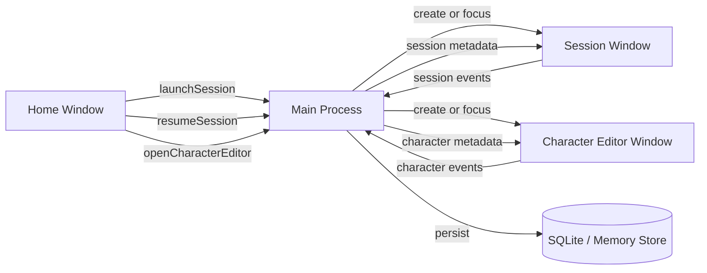

# Window Architecture

- 作成日: 2026-03-12
- 対象: `Home Window` / `Session Window` / `Character Editor Window` / `Diff Window` の責務分離

## Goal

Issue `#2 Homeとセッションは別ウインドウにする` に合わせて、WithMate の UI を
`Home Window` / `Session Window` / `Character Editor Window` / `Diff Window` の 4 種類へ分離する。
Home は管理ハブ、Session は coding agent 実行面、Character Editor はキャラ編集面として役割を固定し、Electron 実装時の window lifecycle を明確にする。

## Manual Test Maintenance

- window 責務や lifecycle を変更した場合は `docs/manual-test-checklist.md` の関連項目も同じ変更単位で更新する
- 更新方針の正本は `docs/design/manual-test-checklist.md` と `docs/adr/001-manual-test-checklist-policy.md` とする

## Decision

- `Home Window`
  - セッション管理
  - キャラクター選択
  - 新規セッション起動
  - `Settings` overlay の親面
- `Character Editor Window`
  - キャラクター作成
  - キャラクター編集
  - キャラクター削除
- `Session Window`
  - coding agent の作業実行
  - artifact summary の閲覧
  - session title の rename
  - session 削除
- `Diff Window`
  - 広い面積での diff 深掘り

`Recent Sessions` を session 側へ常設する構成は採用しない。
既存セッションの再開判断は `Home Window` に集約する。

## Window Responsibilities

### Home Window

Home は `PowerShell -> cd -> codex resume` の手前にある判断をまとめる面とする。

- `Recent Sessions`
  - `codex resume` picker 相当
- `New Session`
  - `cd -> codex` 起動前設定
- `Characters`
  - 利用可能なキャラの確認
  - card 全体クリックと `Add Character` の起点
- `Settings`
  - Home 上の overlay で開く
  - model catalog import / export の起点
- 将来的な session / character の検索、並び替え

Home に置かないもの:

- `Work Chat`
- `Character Stream`
- diff viewer
- audit log viewer
- turn 単位 artifact summary
- キャラクターの詳細編集フォーム
- 独立した settings window

### Session Window

Session は `codex` 起動後の実作業面とする。

- `Session Header`
  - session title の変更
  - approval mode の変更
  - session 削除
  - audit log overlay の起点
  - close action
- `Work Chat`
  - ユーザー入力
  - assistant response
  - turn summary
- `Diff Viewer`
  - 必要時に開く深掘り面
  - `Open In Window` の起点
- `Audit Log`
  - 必要時に開く実行精査面

Session に置かないもの:

- 全セッションの一覧常設
- キャラクター一覧の管理 UI
- 新規 session launch form
- キャラクター編集フォーム

### Diff Window

Diff は `Session Window` 内 overlay でも読めるが、長い 1 行や広い比較を読むときは専用 window を開く。

- `split diff`
  - `Before / After`
  - 左右ペインの横スクロール同期
  - 左右ペインの縦スクロール同期
- `Close`

Diff Window に置かないもの:

- chat composer
- session 一覧
- character 管理 UI

## Launch And Resume Flow

### New Session

1. ユーザーが `Home Window` で `New Session` を押す
2. launch dialog で `title / workspace / character / provider` を決める
3. アプリが新しい session record を作る
4. `Session Window` を新規作成してその session を開く
5. 最初の prompt は `Session Window` の chat composer から送る

### Session Policy Update

1. ユーザーが `Session Window` で approval mode を変更する
2. Main Process が session metadata を更新する
3. 次の turn から新しい approval mode を反映する

workspace path は session identity に近いため、作成後は変更しない。
approval mode は実行ポリシーのため、session 中の変更を許可する。

### Resume Session

1. ユーザーが `Home Window` の `Recent Sessions` から対象を選ぶ
2. 既存 session に対応する `Session Window` が無ければ新規作成する
3. 既に開いていればその window を foreground に出す
4. 必要なら Home は開いたままにし、別 session も続けて開ける

## Window Lifecycle

### Home Window Lifecycle

- アプリ起動時に 1 つだけ作成する
- 基本は常駐の管理ハブとして扱う
- 閉じてもアプリ終了にするかどうかは後で OS ごとに詰める
- Settings は別 window を作らず、この window 上の overlay として開閉する

### Character Editor Window Lifecycle

- `Add Character` または Home の character card クリックから必要時に生成する
- create mode は 1 window、edit mode は `characterId` ごとに 1 window を基本にする
- 保存や削除を行ったら Home の character list へ反映する

### Session Window Lifecycle

- session を開くたびに必要に応じて生成する
- 1 session = 1 window を基本ルールにする
- 同じ session を二重に開かない
- 閉じても session 自体は残る
- 実行中 session を閉じる時は確認ダイアログを出す
- `閉じて続行` を選んだ場合、window は閉じても Main Process 側の session 実行は継続する

## State Ownership

### Home 側が持つ状態

- session list の取得とフィルタ条件
- character list の取得
- launch dialog の入力途中状態
- settings overlay の開閉状態

### Character Editor 側が持つ状態

- 編集中 character の入力途中状態
- save / delete の UI 状態

### Session 側が持つ状態

- 選択中 session の header 情報
- chat messages
- turn artifacts
- diff viewer の開閉状態
- approval mode 変更中の UI 状態

### 共有状態

- session metadata
- character metadata
- 現在開いている session window の対応表

共有状態は Main Process 側で一元管理し、各 window には必要最小限の読み取り専用投影を渡す。
character metadata の正本は file system 上の character storage とする。

## Electron Main Process Implication

Main Process は少なくとも次の責務を持つ。

- `Home Window` の生成と再表示
- `Session Window` の生成、再利用、フォーカス
- `Character Editor Window` の生成、再利用、フォーカス
- `Diff Window` の生成
- `sessionId -> BrowserWindow` と `characterId -> BrowserWindow` の対応表管理
- 実行中 session の registry 管理
- launch / resume / character edit 時の IPC 受け口
- close / quit 時の保存と保護確認

## IPC Boundary Sketch

## UX Consequences

- `Recent Sessions` は常時 session 面に出さない
- session を複数同時に開ける
- Home は作業面ではなく、管理面として情報密度を調整する
- Session は coding agent 体験に集中し、resume 導線を持ち込みすぎない
- 実行中 session は `Session Window` を閉じても直ちには止めない
- アプリ終了だけは明示確認を要求する

## Relation To Existing Docs

- `docs/design/recent-sessions-ui.md`
  - `Recent Sessions` の配置先を Home へ変更する
- `docs/design/session-launch-ui.md`
  - launch dialog の親を `Home Window` に変更する
- `docs/design/desktop-ui.md`
  - 現行 desktop UI の構成を管理する
- `docs/design/manual-test-checklist.md`
  - 実機テスト項目表の更新方針
- `docs/design/product-direction.md`
  - UI mapping を 2-window 前提へ更新する
- `docs/design/session-run-lifecycle.md`
  - 実行中 session の close / quit 制御

## Open Questions

- Home を閉じたまま Session だけ残す挙動をどうするか
- session 終了時に Home へ戻る導線をどこへ置くか
- Character Editor で更新した内容を開いている Session へどう反映するか
- 独り言 UI を再導入するとき、`Session Window` に戻すか別面に分離するか

