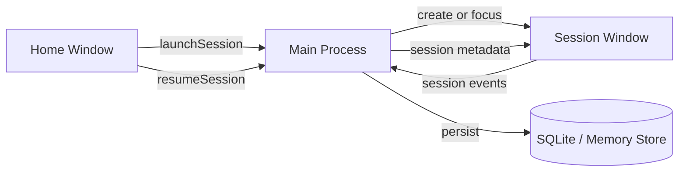

# Window Architecture

- 作成日: 2026-03-12
- 対象: `Home Window` と `Session Window` の責務分離

## Goal

Issue `#2 Homeとセッションは別ウインドウにする` に合わせて、WithMate の UI を
`Home Window` と `Session Window` の 2 種類へ分離する。
Home は管理面、Session は coding agent 実行面として役割を固定し、Electron 実装時の window lifecycle を明確にする。

## Decision

- `Home Window`
  - セッション管理
  - キャラクター管理
  - 新規セッション起動
- `Session Window`
  - coding agent の作業実行
  - `Character Stream`
  - diff / artifact summary の閲覧

`Recent Sessions` を session 側へ常設する構成は採用しない。
既存セッションの再開判断は `Home Window` に集約する。

## Window Responsibilities

### Home Window

Home は `PowerShell -> cd -> codex resume` の手前にある判断をまとめる面とする。

- `Recent Sessions`
  - `codex resume` picker 相当
- `New Session`
  - `cd -> codex` 起動前設定
- `Character Catalog`
  - 利用可能なキャラの確認と管理
- 将来的な session / character の検索、並び替え、削除

Home に置かないもの:

- `Work Chat`
- `Character Stream`
- diff viewer
- turn 単位 artifact summary

### Session Window

Session は `codex` 起動後の実作業面とする。

- `Current Session Header`
  - workspace
  - provider
  - branch
  - run state
  - approval
- `Work Chat`
  - ユーザー入力
  - assistant response
  - turn summary
- `Character Stream`
  - 独り言 / 内心 / ムード表示
- `Diff Viewer`
  - 必要時に開く深掘り面

Session に置かないもの:

- 全セッションの一覧常設
- キャラクター一覧の管理 UI
- 新規 session launch form

## Launch And Resume Flow

### New Session

1. ユーザーが `Home Window` で `New Session` を押す
2. launch dialog で `workspace / character / provider / approval` を決める
3. アプリが新しい session record を作る
4. `Session Window` を新規作成してその session を開く
5. 最初の prompt は `Session Window` の chat composer から送る

### Resume Session

1. ユーザーが `Home Window` の `Recent Sessions` から対象を選ぶ
2. 既存 session に対応する `Session Window` が無ければ新規作成する
3. 既に開いていればその window を foreground に出す
4. 必要なら Home は開いたままにし、別 session も続けて開ける

## Window Lifecycle

### Home Window Lifecycle

- アプリ起動時に 1 つだけ作成する
- 基本は常駐の管理ハブとして扱う
- 閉じてもアプリ終了にするかどうかは後で OS ごとに詰める

### Session Window Lifecycle

- session を開くたびに必要に応じて生成する
- 1 session = 1 window を基本ルールにする
- 同じ session を二重に開かない
- 閉じても session 自体は残る

## State Ownership

### Home 側が持つ状態

- session list の取得とフィルタ条件
- character catalog の取得
- launch dialog の入力途中状態

### Session 側が持つ状態

- 選択中 session の header 情報
- chat messages
- turn artifacts
- character stream items
- diff viewer の開閉状態

### 共有状態

- session metadata
- character metadata
- 現在開いている session window の対応表

共有状態は Main Process 側で一元管理し、各 window には必要最小限の読み取り専用投影を渡す。

## Electron Main Process Implication

Main Process は少なくとも次の責務を持つ。

- `Home Window` の生成と再表示
- `Session Window` の生成、再利用、フォーカス
- `sessionId -> BrowserWindow` の対応表管理
- launch / resume 時の IPC 受け口
- session close 時の保存と後始末

## IPC Boundary Sketch

## UX Consequences

- `Recent Sessions` は常時 session 面に出さない
- session を複数同時に開ける
- Home は作業面ではなく、管理面として情報密度を調整する
- Session は coding agent 体験に集中し、resume 導線を持ち込みすぎない

## Relation To Existing Docs

- `docs/design/recent-sessions-ui.md`
  - `Recent Sessions` の配置先を Home へ変更する
- `docs/design/session-launch-ui.md`
  - launch dialog の親を `Home Window` に変更する
- `docs/design/ui-react-mock.md`
  - 単一 window mock は暫定状態として扱い、分離後の target layout を明記する
- `docs/design/product-direction.md`
  - UI mapping を 2-window 前提へ更新する

## Open Questions

- Home を閉じたまま Session だけ残す挙動をどうするか
- session 終了時に Home へ戻る導線をどこへ置くか
- 複数 Session Window があるときの character stream 通知をどう扱うか
- Home から character を編集したとき、開いている Session へどう反映するか
