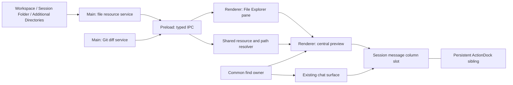

# Session File Explorer and Preview Plan

- Status: Implementation Complete / Review In Progress
- Created: 2026-08-02
- Target: Agent Session UI and Auxiliary Session UI
- Out of scope: Companion UI

## Task Brief

- Goal: Session UI から作業対象のファイル、Markdown、画像、Git 差分を確認できるようにする。
- Target behavior: 左ペインで許可済みディレクトリを遅延展開し、ActionDock を維持したまま message column と中央プレビューを切り替える。
- Failure mode: パス解決失敗、文字コード誤判定、巨大表示による UI 停止、古い非同期結果の混入、Git コマンドへの任意引数混入を防ぐ。
- Scope: 左右ペイン排他、ファイル列挙・読込 IPC、中央プレビュー、共通検索、Markdown 画像、パスリンク、1 ファイル単位の Git Diff。
- Canonical anchors: `src/App.tsx`、`src/session-components.tsx`、`src/chat/chat-window.tsx`、`src/file-explorer/`、`src/MessageRichText.tsx`、`src-electron/session-file-explorer-service.ts`、`src-electron/workspace-git-changes-service.ts`、`src-electron/open-path.ts`。
- Done: 受入条件を executable contract と手動確認で満たし、型検査・テスト・ビルドが通り、必要な ADR と利用者向け設計文書が更新されている。
- Risks: OS ファイル関連付け、Windows パス表現、symlink、外部画像の自動通信、無制限コンテンツの瞬間メモリ、virtualized view を横断する検索。

## 調査で確認した現状

- right pane の永続値は `sessionRightPaneVisible: boolean` で、専用更新境界と window-local state の関係を ADR 006 が定めている。
- `src/MessageRichText.tsx` は Markdown の `img` を常に null render し、`index.html` の CSP も HTTP / HTTPS image を許可していない。
- chat link は Workspace を唯一の base directory として `openPath` を呼び、失敗を空の `catch` で破棄している。このため path 解決または OS open の失敗が無反応に見える。
- `src-electron/open-path.ts` は fragment/query の除去と percent decode を行う。通常の Open は file / directory とも OS の既定アプリだけを使い、失敗時に Explorer 表示へ自動で切り替えない。
- `src/DiffViewer.tsx` は diff row を全件 DOM render する。`src-electron/workspace-diff-policy.ts` が扱う artifact snapshot diff と、今回追加する現在の Workspace に対する live Git Diff は別機能・別データ源である。
- 現行の `SessionChatScreen` では message column と ActionDock が `session-message-stack` 内の兄弟要素である。中央プレビューは message column の表示境界だけを切り替えれば ActionDock を維持できる。
- 計画調査時の Node v24.18 / ICU 78.3 では、`TextDecoder("shift_jis", { fatal: true })` が「あい」と Windows-31J 拡張文字「①」を decode できることを確認済みだが、file preview 用の判定・切替 UI は未実装である。

## 受入条件

### Session UI のレイアウト

- 左に File Explorer ペインを追加する。
- 左の File Explorer と右の Context ペインは同時表示しない。
- 表示状態は `files | context | none` の単一状態で所有し、片方を開く操作はもう片方を原子的に閉じる。
- 現在開いているペインのトグル操作は `none` に戻す。
- ペイン状態は既存の right pane 専用設定更新境界を置き換えて永続化する。
- 新しい Session window は永続値を初期値として読み、既存 window は各 window のローカル状態を維持する。
- File Explorer の表示対象は Agent Session UI と Auxiliary Session UI とする。Companion 固有対応は行わない。

### File Explorer のルートと列挙

- 次のルートを別々のトップレベル項目として表示する。
  - Workspace
  - Session Folder
  - AddDirectory で許可した追加ディレクトリ
- Auxiliary Session では親 Session の Session Folder を使う。
- dotfile、`.git`、ignore 対象、`node_modules` を含め、ディレクトリ直下の項目を省略せず表示する。
- 初期表示ではルート情報だけを取得し、ディレクトリを展開した時点で直下だけを読み込む。
- Session Folder がまだ存在しない通常の Workspace Session では、Session Folder root の初回展開時に空ディレクトリを作成する。
- ディレクトリ行の選択は展開・折りたたみだけを行い、中央 preview は切り替えない。
- 再帰的な事前走査は行わない。閉じた枝の子孫は破棄してよく、再展開時に再取得する。
- ディレクトリ単位の件数上限は設けない。表示側は flat tree と virtualization で DOM 数を抑える。
- symlink は表示するが展開対象にしない。Main process は認可済み root の canonical path 外にある実体を file resource として返さない。
- Renderer へ任意の filesystem API を公開しない。Main process が root authorization、path traversal、存在確認、種別確認を所有する。

### 中央表示とライフサイクル

- 中央領域は `chat | file | git-diff` のいずれか一つを表示する。
- ファイル選択時は message column だけを隠して中央プレビューへ切り替える。ActionDock は常に表示し、展開・折りたたみ、入力、添付、送信を利用できる。
- チャットの React state、入力 draft、scroll/follow 状態、進行中 run は維持する。
- プレビュー中に送信しても中央表示を自動で chat へ戻さない。既存の ActionDock 自動折りたたみ設定は維持する。
- プレビュー中の run、approval、elicitation は Back to Chat の状態表示と常設の ActionDock から確認できる。message column 自体はプレビュー終了まで非表示のまま維持する。
- 「チャットへ戻る」で chat に戻せる。Escape は開いている find bar を先に閉じ、find bar が閉じている場合だけ chat に戻す。ペインの開閉状態は変えない。
- 別ファイルまたは別表示種別へ切り替えるたびに、前の本文・diff model・画像 blob URL を破棄する。
- 非同期読込には request identity または abort を持たせ、遅れて完了した古い結果を現行表示へ反映しない。
- 初期実装では filesystem watcher とファイル本文キャッシュを持たない。Reload または再選択で再読込する。

### 共通ツールバー

- 操作は左から、Back to Chat、file name / path、表示種別固有の control、Find、Reload の順に配置する。content copy は置かない。
- path は省略表示できるが、hover で全文を確認できる。狭い幅では file name / path を先に縮め、操作は折り返して到達性を維持する。

### プレビュー内の選択コピー

- Text / Source、Markdown Preview、Git Diff では、本文を選択したときに chat message と同じ floating action を選択範囲の近くへ表示する。
- 初期実装で preview の floating action に出す操作は Copy だけとし、Quote は追加しない。
- Copy は選択中の文字列だけを clipboard へ書く。ファイル全体、Markdown source 全体、diff 全体を一括コピーする toolbar 操作は設けない。
- Ctrl+C は platform 標準の選択コピーとして維持する。
- 行番号、diff の行番号 gutter、非表示の control text は選択結果へ含めない。
- chat message の selection detection、floating position、clipboard failure handling を共有境界へ抽出し、preview と chat で同じ表示と操作感を使う。preview を `SessionMessageColumn` の内部実装へ直接依存させない。
- Image と unsupported binary は選択コピーの対象外とする。

### 共通検索

- Ctrl+F で中央領域共通の find bar を toolbar 直下に開く。ActionDock の textarea に focus がある場合も同じ shortcut を使う。
- find bar は query、match count、previous、next、close を持つ。Enter は next、Shift+Enter は previous、Escape は find bar を閉じて元の focus へ戻す。
- current match は Chat では対象 message、Text / Source / Git Diff では対象行を強調表示する。Markdown Preview は preview container 内の rendered text node だけを検索し、該当 range を選択して中央へ移動する。
- 検索対象は現在の中央表示だけとし、file preview 中に chat を同時検索しない。
- find bar の UI と shortcut contract を共有し、query state、検索、移動は active surface が所有する。
  - Chat: DOM に mount されていない message も含め、現在の session の message projection を検索して対象 message へ scroll する。
  - Text / Source: decoded text model の全行を検索し、virtualized row へ scroll する。
  - Markdown Preview: rendered text を検索して該当要素へ移動する。Source 表示では raw Markdown を検索する。
- Git Diff: hunk header、追加・削除・context line を検索し、該当 row へ scroll する。
  - Image / unsupported binary: find bar を開かず、検索不能であることを通知する。
- browser の DOM find だけには依存しない。Chat、Text、Diff の virtualization で未 mount の内容が検索対象から欠落するためである。

### 読み込み、空表示、エラー

- local file は事前に取得した total bytes と read bytes から determinate progress を表示する。Main process は 1 MiB 以下の chunk contract を提供し、Renderer は選択変更時に古い revision の結果を破棄する。
- Markdown image は resolving / loading / error を表示する。Git status / diff は処理中表示と結果別 message を持つ。
- unsupported binary、not-found、OS open failure、image load failure、Git process failure を無反応にせず、利用可能な Reload、Open、Show in Explorer を提示する。

### ファイル種別と文字コード

- 拡張子の allowlist だけではなく、拡張子、MIME 推定、先頭 byte の binary 判定を組み合わせて表示方法を決める。
- 次の表示種別を初期対応に含める。
  - Text: source、設定、log、data、拡張子なしを含む text-decodable file
  - Markdown: `.md`、`.markdown`
  - Image: PNG、JPEG、GIF、WebP、BMP、SVG
  - Unsupported binary: metadata と「既定アプリで開く」「Explorer で表示」を提示する
- テキストの文字コードは Auto、UTF-8、Shift_JIS / Windows-31J、UTF-16LE、UTF-16BE を切り替えられる。
- Auto は BOM を優先し、BOM がなければ UTF-8 の strict decode、Shift_JIS / Windows-31J の順に判定する。UI では Auto と各手動指定を切り替えられる。
- 文字コード変更時は元 byte から再 decode し、ファイルを再読込しない。
- Text / Source は行番号を常に表示する。soft wrap は viewport の右端で行う固定設定とし、切替 control は設けない。折り返した継続行に新しい行番号は付けない。
- ファイルサイズ、行数、画像寸法、diff 行数に hard reject 上限を設けない。
- 全読込前に metadata を取得し、実測で UI 停止が懸念される大きさでは警告を出す。ただし「そのまま開く」を選べるようにし、サイズだけを理由に閲覧不能にしない。
- 大きい text、Changes、diff は virtualization を使う。Markdown Preview は構文 tree と block 間参照を壊す分割 render を行わず、全体 parse のまま offscreen block に `content-visibility` を適用する。表示破棄は累積メモリを抑えるが、現在開いている一件の parse / DOM peak memory をなくさないことを前提に設計する。

### Markdown、画像、リンク

- Markdown file preview は `src/MessageRichText.tsx` を共有し、Preview / Source を切り替えられる。新しく開いた Markdown file は Preview を既定値とする。
- 現在の GFM、数式、Mermaid の挙動を維持する。
- 現行の `img: () => null` を置き換え、chat と file preview の双方で画像を表示する。
- local、HTTP、HTTPS、data、blob の画像を確認なしで既定表示する。protocol-relative URL は local / UNC path として扱わず HTTPS に正規化する。
- `index.html` の CSP は HTTP / HTTPS 画像を許可するよう更新する。
- 外部画像の取得により送信元へ接続情報が伝わり得ることを ADR へ明記する。既定表示という今回の選択を UI の確認ダイアログで覆さない。
- SVG は `` の画像リソースとしてだけ描画し、user-provided SVG を inline DOM または `dangerouslySetInnerHTML` へ渡さない。
- Markdown 内の相対画像は Markdown file の親ディレクトリを基準にする。chat 内の local image は absolute path または `file:` URL を扱い、root をまたぐ相対 path 探索は行わない。
- Markdown file preview の相対画像と相対 link は、その Markdown file と同じ認可済み root の親ディレクトリを基準にする。absolute path と `file:` image も登録済み root に対応付けてから Main process の認可済み read を使う。root をまたぐ basename 検索、root 外への直接読込、相対 link 失敗時の raw target fallback は行わない。
- absolute local path、`file:`、HTTP、HTTPS、fragment を分類し、local file は `shell.openPath`、external URL は `shell.openExternal`、同一文書 fragment はプレビュー内移動へ送る。
- open 操作は `opened | revealed | not-found | failed` の typed result を返し、空の `catch` で失敗を隠さない。
- `#`、`?`、space、Unicode、percent encoding、Windows drive path、UNC path を path と URL の境界で混同しない。
- 既定アプリで開けない場合は理由を通知し、通常の Open から Explorer 表示へ自動で切り替えない。「Explorer で表示」は独立した明示操作として扱う。

### 画像表示

- raster image と SVG は intrinsic size の 100% を既定値として表示し、viewport を超えた部分は scroll する。
- toolbar に Zoom Out、現在倍率兼 100% reset、Zoom In、Fit を置く。
- Fit は縦横比を維持して viewport 内へ収める。100% は intrinsic size に戻す。
- intrinsic size を決められない SVG は初回だけ Fit へ fallback する。
- 画像を切り替えた場合は zoom state を破棄し、新しい画像を 100% で開く。

### Git Diff

- Git Diff は command history の文字列再実行ではなく、専用の read-only Main process service を追加する。
- File Explorer pane の上部に `Files | Changes` の切替を置き、初期表示は Files とする。Changes を Git Diff の主要な起動経路とする。
- Changes を開いた時点で Git status を取得し、Working Tree と Staged の group に変更ファイルを分けて表示する。polling は行わず、再表示または Reload で更新する。
- Git status の対象は Workspace だけとする。Session Folder と additional directory 内の別 repository は初期 scope に含めない。
- Workspace が Git repository でない場合も Changes は消さず、「Git repository ではありません」という empty state を表示する。
- 同じ file に staged と unstaged の両方がある場合は両 group に表示し、選択した group が取得する diff scope を決める。
- Changes の file row を選択すると、該当する 1 file の diff を取得して中央を Git Diff 表示へ切り替える。
- file preview 中の file に live Git change がある場合だけ Open Diff を出す。Working Tree と Staged の両方に変更がある場合は scope 別の操作を出す。
- 既存の chat artifact にある Open Diff は今回の Git Diff 機能とは無関係とし、既存の modal / Open In Window 経路を変更しない。artifact snapshot を Changes、通常 file preview の Open Diff、中央 live Git Diff のデータ源または起動経路として扱わない。
- まず変更ファイルの path と status だけを列挙し、選択した 1 ファイルの差分をその時点で取得する。
- 初期 scope は Working Tree と Staged の 2 種類とする。
  - Working Tree: `git diff -- <path>`
  - Staged: `git diff --cached -- <path>`
- Git 引数は service 側で固定し、Renderer から raw command、任意 option、shell string を受け取らない。diff は `--no-ext-diff --no-textconv --no-color` を固定し、user configuration による external command 実行を許可しない。
- Git executable は process-start PATH の絶対 entry から絶対 real path へ固定し、継承元の `GIT_*` は大文字小文字を区別せずすべて除去する。
- Git process は認可時に確定した Workspace、Git directory、common directory の canonical identity へ lease で固定し、操作中の rename / replacement を成立させない。identity を保持できない platform では typed failure とする。
- HEAD と Workspace scope の index を操作ごとの一時 Git directory へ投影し、status / diff は元 repository の local config を読み込まない隔離 invocation で実行する。
- index projection は `assume-unchanged`、`skip-worktree`、存在しない intent-to-add path、空 file の staged rename を含む scope semantics を維持する。nested Workspace の isolated status は Workspace current directory と pathspec で直接限定し、取得後の表示 filtering だけに依存しない。
- 対象 file で有効な Git filter に `clean` または `process` command が設定されている場合は typed failure として Changes を利用不可にする。事前確認後に filter が追加された場合も、隔離 invocation は external command 設定を読み込まず実行しない。
- Git operation は process 全体の active 2件、pending 16件を上限とする。同じ Session の同種の待機要求は新しい要求で置き換え、60秒の deadline 後は child process の close を待ってから lease と一時 Git directory を解放する。cleanup failure は timeout より優先する typed failure とし、bounded retry 後も残った resource は process lifetime の backlog から次の service instanceでも再試行する。
- Workspace が repository root より下位にある場合も、status path を Workspace-relative へ変換し、Workspace 外の変更を Changes に混ぜない。diff pathspec は repository root 基準の literal path とする。
- path は Workspace 配下の変更一覧から発行した opaque identifier または検証済み相対 path に限定する。
- non-Git Workspace、rename、delete、untracked、empty diff、process failure を観測可能な結果として返す。binary diff と submodule change は Git が返した patch 表現をそのまま表示する。
- untracked file は差分を合成せず、file preview を開く導線を出す。
- live Git Diff は既存の artifact `DiffViewer` と分離した virtualized unified view に表示する。artifact の inline / popout split view は変更しない。

## 責務境界



- Main process
  - root authorization、directory listing、stat、chunk read、Git process、OS open side effect を所有する。
  - path を canonicalize してから root scope と照合する。列挙用 API と Markdown の明示的 local resource read は別 contract にする。
- Preload / IPC types
  - file resource、Git result、OS open result を typed API として公開する。
  - stale file revision、not-found、unsupported、Git scope failure、OS open failure を consumer が識別できる形で返す。
- Renderer
  - pane state、lazy tree projection、active preview、find owner / adapter、loading projection、virtualized rendering、encoding selection、cleanup を所有する。
  - filesystem path の認可判断や Git command 組み立てを行わない。
- Shared Markdown renderer
  - chat と file preview の Markdown 構文、画像、link event を一系統に保つ。
  - 呼び出し元から resource context を受け、base directory の違いだけを data で切り替える。

## Source of Truth と Knowledge Placement

### Source / executable contract

- Session layout: `src/App.tsx`、`src/session-components.tsx`、`src/chat/chat-window.tsx`
- ActionDock layout/state: `src/chat/chat-window.tsx`、`src/session-components.tsx`、`src/action-dock-state.ts`
- Selection copy: `src/session-components.tsx`、`src/chat/message-text-actions.ts`
- Side pane preference: `src/session-side-pane-preference.ts` と対応する Main / preload / settings type
- Rich text: `src/MessageRichText.tsx` と `scripts/tests/message-rich-text.test.ts`
- Path open: `src-electron/open-path.ts`、`src/App.tsx` の link handler、対応 test
- Additional directories: `src-electron/additional-directories.ts`
- Session Folder: `src-electron/session-files.ts`
- Live Git diff: `src/file-explorer/SessionFilePreview.tsx`、`src/file-explorer/WorkspaceChangesPane.tsx`、`src-electron/workspace-git-changes-service.ts`
- IPC/public surface: `src-electron/main.ts`、`src-electron/preload.ts`、`src/withmate-window-api.ts`、`src/withmate-window-types.ts`、`src/renderer-env.d.ts`

### ADR gate

実装開始時に次の ADR を作成する。Plan の作成だけを理由に ADR は先行作成しない。

- `docs/adr/011-session-side-pane-preference-boundary.md`
  - `docs/adr/006-session-right-pane-preference-boundary.md` を supersede する。
  - boolean から `files | context | none` への変更、window-local state と永続値の関係、migration/default を記録する。
- `docs/adr/012-markdown-resource-loading-policy.md`
  - local / external image を既定取得する判断、resource resolution、SVG 非 inline、代替案と privacy/security consequence を記録する。
- `docs/adr/013-explicit-local-path-open-policy.md`
  - 元 file を既定アプリで開く UX、handoff 前の root authorization、path-only OS API に残る再解決競合を記録する。
- `docs/adr/014-isolated-workspace-git-preview.md`
  - Git executable、environment、canonical directory lease、config / index projection を一つの安全境界として固定し、Workspace 由来の external command と root 差し替えを拒否する。

Git service は review で root identity と external command 非実行を同じ invocation へ結び付ける必要が生じたため、隔離方式と platform consequence を ADR 014 に記録する。

### 設計文書 gate

- `docs/design/desktop-ui.md`: 左右排他と中央表示の非局所的な UI contract だけを更新する。
- `docs/design/message-rich-text.md`: chat / file preview 共通 renderer、resource policy、source pointer だけに絞り、現行 source から復元できる構文一覧の複製を減らす。
- `docs/design/session-local-files.md`: Session Folder と追加ディレクトリの所有境界が変わる場合だけ更新する。
- 現行 class 構成、IPC 一覧、通常の状態遷移を新しい恒久設計文書へ複製しない。

## 実装 Slice

### Slice 0: Contract と migration の固定

依存: なし

- side pane enum、preview kind、file resource request/result、open result、Git diff scope/result の型を決める。
- `sessionRightPaneVisible` から新しい side pane preference への migration/default を決め、ADR 011 を作る。
- Markdown resource policy を ADR 012 に記録する。
- 各 contract の failure mode と consumer-visible result を test 名へ落とす。

完了条件:

- public type と既存 consumer の移行方針が確定し、required/default/failure semantics が曖昧でない。
- `contract-closure` の Candidate Definition に使える accepted contract と executable anchor が揃っている。

### Slice 1: Path / resource resolution と open failure の修正

依存: Slice 0

- URL / local path の分類と OS open / explicit reveal は `src-electron/open-path.ts` を正本とする。Markdown file 内の相対 resource は認可済み root と file 親 directory から解決する。
- `openPath` を typed result に変更し、Renderer の空 catch を通知へ置き換える。
- Markdown 画像を表示し、CSP と SVG の描画境界を更新する。

完了条件:

- 現在の「同じ形式の path でも開く時と開かない時がある」failure を代表ケースで再現し、修正後に結果または明示エラーへ変わる。
- local / external / relative / invalid の各 path family、既定アプリ失敗、明示的な Explorer 表示が executable contract で検証される。

### Slice 2: File resource service と lazy tree

依存: Slice 0、Slice 1 の resolver contract

- Session ごとの root projection を Main process に追加する。
- direct children listing、metadata、byte read、MIME/binary 判定に必要な IPC を追加する。
- File Explorer の lazy expansion、flat tree projection、virtualization を実装する。
- Auxiliary Session の親 Session Folder を解決する。

完了条件:

- root 外 traversal と symlink cycle が拒否または停止される。
- dotfile を含む直下全項目が展開時だけ読み込まれ、再帰 preload が発生しない。
- 大量項目でも mounted row 数が viewport に比例する。

### Slice 3: Side pane と central preview shell

依存: Slice 0、Slice 2

- existing right pane boolean を side pane enum へ移行する。
- left/right/none の排他 toggle と永続化を実装する。
- `SessionChatScreen` の message column slot だけを chat / preview で切り替え、ActionDock は既存の sibling slot に常駐させる。
- Back to Chat、file name / path、view control、Find、Reload の順で共通 toolbar を作る。content copy は toolbar に置かない。
- 共通 find bar と active surface ごとの検索 adapter を追加し、chat message projection も検索対象にする。
- preview 中の message unread と user action required を Back to Chat と ActionDock から確認できるようにする。

完了条件:

- 左右同時表示へ到達する state transition が存在しない。
- file preview 中も ActionDock から入力・添付・送信でき、chat draft、scroll state、live run が維持される。
- Ctrl+F、Enter、Shift+Enter、Escape の focus と navigation が active surface に対して一貫して動く。
- window 再生成時だけ永続値が反映され、既存 window state を別 window の更新で上書きしない。

### Slice 4: Text / Markdown / image preview

依存: Slice 1、Slice 2、Slice 3

- byte decode と Auto/manual encoding selection を追加する。
- 行番号と固定 soft wrap を持つ virtualized text viewer、Preview 既定の Markdown Preview/Source、100% 既定で Zoom/Fit 可能な raster/SVG image viewer を実装する。
- chat の selection copy を共有境界へ抽出し、Text / Source、Markdown Preview、Git Diff の選択範囲へ Copy floating action を表示する。
- stale result rejection と object URL revoke を中央 preview owner に集約する。
- hard cap を設けず、大きい一件を開く前の warning と open-anyway を追加する。
- local file の byte progress、Markdown image の loading / error、unsupported / failure state を実装する。

完了条件:

- Shift_JIS / Windows-31J を含む対象文字コードを自動・手動で表示できる。
- file switch、chat return、window close で古い本文と blob URL が残らない。
- Markdown の local / external image、SVG、relative link が chat と file preview の双方で同じ方針になる。
- Chat、Text、Markdown、Git Diff の未 mount 内容を Ctrl+F で検索できる。

### Slice 5: Git Diff

依存: Slice 3

- read-only Git diff service と typed IPC を追加する。
- File Explorer pane に Files / Changes を追加し、changed-file list を先に取得して選択ファイルの Working Tree / Staged diff だけを取得する。
- file preview の Open Diff を中央 live Git Diff surface へ接続する。対象が Working Tree / Staged の両方にある場合は scope を選択し、一方だけなら直接開く。
- 既存 chat artifact の `SessionDiffModal` と Open In Window は変更しない。今回追加する Git status / diff service、Changes、file preview の Open Diff、中央 live Git Diff surface とは接続しない。
- live Git Diff 専用の virtualized unified view を追加し、artifact `DiffViewer` は既存経路のまま維持する。

完了条件:

- Renderer から任意 command または option を注入できない。
- non-Git、binary、rename、delete、untracked、process failure が空表示にならない。
- 1 ファイルずつ取得・破棄され、大きい diff でも全行 DOM render が発生しない。

### Slice 6: Integration、docs、manual verification

依存: Slice 1 から 5

- source と executable contract の整合を再確認する。
- ADR と直接影響する設計文書を更新する。
- Markdown の local link と toolbar の Open / Show in Explorer を root-authorized IPC に統合し、Main で opened handle と realpath を確認してから元 file の canonical path を OS へ渡す。OS handoff 後の path 再解決境界は ADR 013 の明示的な例外とする。
- directory listing の認可、handle、worker は process 全体の固定同時数へ収め、待機列にも固定上限を設ける。上限超過時は同じ Session / root / path の古い待機要求だけを置き換え、別 Session の待機要求は破棄しない。
- direct children の metadata `stat` は固定同時数で処理し、展開件数と同数の filesystem request を同時生成しない。
- Markdown 内の local image は preview 単位の固定同時数キューで解決し、file、reload、表示 mode、encoding の切替または unmount では待機中の処理を破棄する。実行中の処理も現行 preview かを chunk 間で確認し、stale な object URL を表示しない。表示を継続する切替では同じ source も current generation へ再登録する。
- UTF-16 BOM を binary heuristic より先に扱い、text preview と encoding selector へ到達させる。
- minimum/default window width、theme、keyboard、focus、screen reader label を確認する。
- full test、typecheck、build、manual smoke を実行する。

完了条件:

- 未解決の blocking finding がない。
- 実行できなかった検証、upstream limit、accepted risk が最終報告に明示されている。

## Executable Contract と検証

### Targeted tests

- Side pane
  - `files | context | none` の全遷移と左右排他
  - legacy boolean からの migration と default
  - window-local state と persisted initial state の分離
- Directory / file service
  - Workspace、Session Folder、additional directory、Auxiliary parent session
  - direct-child only、dotfile、空 directory
  - `..` traversal、root 外の real path、stale revision
  - local link / Open / Show in Explorer の OS handoff 前 root authorization と symlink / junction escape 拒否
  - 大量直下項目の metadata `stat` 同時数制限
  - directory listing の待機列上限、認可 handle 同時数、古い待機要求の破棄
  - chunk offset、total bytes、monotonic progress projection
- Decode / type detection
  - UTF-8、Shift_JIS / Windows-31J、UTF-16LE/BE、BOM、invalid sequence
  - BOM 付き UTF-16 text が binary preview へ誤分類されないこと
  - extensionless text、binary、SVG、unsupported binary
- Preview lifecycle（component / manual）
  - stale read が現行選択を上書きしない
  - switch / return / unmount で object URL と model が解放される
  - ActionDock が preview 中も入力・添付・送信でき、chat state と live run が維持される
  - preview 中の送信では preview が維持され、message unread / user action required が通知される
  - local file の determinate loading と Markdown image の loading / error を表示する
- Preview selection / find
  - chat と preview の floating Copy が同じ selection、position、dismissal、failure contract を持つ
  - Copy は選択範囲だけを書き、line number gutter と control text を含めない
  - Image / unsupported binary では floating Copy を表示しない
  - Ctrl+F、Enter、Shift+Enter、Escape と focus restore
  - virtualized chat message、text line、diff row の未 mount match へ移動する
  - active surface 切替時の query / match projection と unsupported surface
- Markdown resource / path open
  - local relative、absolute、HTTP、HTTPS、data、blob、SVG ``
  - 多数の local image でも inspect / read が固定同時数を超えず、preview 切替後に待機中の処理が開始されないこと。encoding 切替時は queued / active / loaded の同じ source が current generation へ再登録されること
  - Workspace base、Markdown parent base、認可済み root 外の拒否
  - not-found、OS open failure、明示的な Explorer 表示と通知
  - space、Unicode、`#`、`?`、percent encoding、drive path、UNC path
  - CSP に HTTP / HTTPS image source が含まれる
- Git Diff
  - fixed Git args、path validation、option-like filename、non-Git
  - Git executable resolver failure、localized non-Git failure、active / pending 上限、operation deadline、temp / lease cleanup failure
  - Files / Changes の切替、Changes 初回取得、Reload、Working Tree / Staged group
  - staged / unstaged 両方を持つ file の group-specific scope
  - nested Workspace の scope 外 file が isolated status の走査・結果へ入らないこと、先頭空白 prefix、`assume-unchanged`、`skip-worktree`、存在しない intent-to-add、空 file の staged rename
  - Changes row と file preview の各起動経路、Working Tree / Staged scope
  - 既存 chat artifact の Open Diff が live Git Diff service と中央 live Git Diff surfaceへ接続されないこと
  - Working Tree / Staged、rename、delete、untracked、empty patch
  - virtualized unified row

### Broader checks

```text
npm test
npm run typecheck
npm run build
```

### Manual smoke

- Agent と Auxiliary Session で各 root を展開し、左右ペインが排他になることを確認する。
- minimum/default window width と light/dark theme で tree、toolbar、selected、focus、error の contrast を確認する。
- 大量ファイル directory、大きい text、長い一行、大きい diff、巨大画像を順に開き、操作可能性と解放後のメモリ傾向を確認する。
- UTF-8、Shift_JIS / Windows-31J、UTF-16 の同一内容を Auto と手動で切り替える。
- Text / Source の行番号と viewport 端での固定 soft wrap を確認する。
- Markdown から local relative image、external image、SVG、local file link、external URL を開く。
- Markdown が Preview で開き、Source へ切り替えられることを確認する。
- raster image と SVG が 100% で開き、Zoom Out / In、100%、Fit で表示位置が不自然に飛ばないことを確認する。
- local file の byte progress、Markdown image の loading / error を確認する。
- Text、Markdown、Git Diff と、古い message が virtualized された chat で Ctrl+F の next / previous / close を確認する。
- Text / Source、Markdown Preview、Git Diff の選択範囲に chat と同じ floating Copy が表示され、選択文字列だけを clipboard へ書くことを確認する。
- 行番号、diff gutter、control text がコピー結果に混入せず、Image / unsupported binary では Copy が出ないことを確認する。
- default app がない file と存在しない path で明示結果と代替操作を確認する。
- file preview 中も ActionDock で入力・添付・送信し、preview が維持されることを確認する。
- live run 中に file preview を開き、未読または要対応状態を確認してからチャットへ戻った時に出力、draft、scroll が維持されることを確認する。
- Git repository / non-Git directory で Working Tree と Staged の 1 ファイル差分を確認する。
- Files / Changes と file preview の Open Diff から中央 live Git Diff surface を開けることを確認する。
- 既存 chat artifact の Open Diff は従来の modal / Open In Window 経路を維持し、今回の live Git Diff と混同されないことを確認する。

## Review と Closure Gate

- この変更は public IPC、filesystem scope、外部画像通信、OS open side effect、Git process、resource limit、永続 preference を変更するため、実装前後に `contract-closure` を適用する。
- Path/file resource slice は path authorization と local resource 読込の security lens で独立 review する。
- Markdown resource slice は external request と SVG injection の security/privacy lens で独立 review する。
- Git slice は command injection、scope confinement、process failure の external-side-effect lens で独立 review する。
- 統合後の complete diff を holistic review し、blocking finding を修正した場合は targeted check と fresh-context closure review を行う。
- 構造収束 gate は semantic owner の分散や責務重複という具体的 evidence が出た場合だけ適用する。

## 明示的な非対応

- ファイル編集、保存、rename、delete、move、drag and drop
- 任意の directory/file 作成。未作成の管理対象 Session Folder root を初回展開時に空ディレクトリとして作る処理だけは例外とする
- filesystem watcher と自動更新
- 複数ファイルの tab、履歴、永続 cache
- archive、PDF、Office、audio、video の内蔵 preview
- IDE 相当の構文解析、language server、workspace-wide search / replace
- Companion UI への導線または専用対応
- shared type の変更で既存 Companion source の build 維持に必要な機械的移行は許容するが、File Explorer または preview の user-visible 対応は追加しない
- Git commit、stage、unstage、checkout、revert などの書込操作
- generic operation の command output 中央表示と再実行
- 既存 chat artifact の Open Diff、`SessionDiffModal`、Diff Window の中央 live Git Diff surface への統合

既存 chat artifact の Open Diff は、今回の Git Changes、file preview の Open Diff、中央 live Git Diff surface とは機能・状態・起動経路のすべてで無関係とする。

## 既知の制約と残リスク

- hard cap を設けなくても、現在開いている一件は Renderer/Main 双方で peak memory を消費する。warning、virtualization、stream/chunk 化の必要性は実測で判断する。
- external image は既定取得するため、remote host へ IP address などの接続情報が伝わり得る。これは今回の明示的な product choice として ADR に残す。
- OS の default app association が存在しない場合、アプリ側だけで必ず開ける保証はできない。通常の Open は失敗を明示し、自動 fallback は行わない。
- 既定アプリまたは Explorer へ渡す元 file path は OS が再解決するため、認可直後に別 process が親 directory を junction / symlink へ差し替える競合を file handle へ原子的に結び付けられない。元 file を編集できる通常の UX を優先する明示判断として ADR 013 に残す。
- Git diff の content 取得は 1 file 単位でも極端に大きくなり得る。content の hard reject はせず表示を virtualize するが、Git operation は aggregate admission と deadline で resource を制限する。
- Markdown Preview は全体 parse と React tree 構築を行うため、50 MiB 以上の opt-in warning と offscreen rendering 抑制後も、一件の Markdown に対する peak memory は残る。hard reject を追加する条件は実測で操作不能または回復不能な failure が確認された場合とする。
- local file は total bytes から read progress を算出できるが、decode、render、external image、Git process の正確な percent は表示しない。
- 展開済み directory の直下結果は pane の Reload まで Renderer に保持する。filesystem watcher と展開状態の永続化は初期 scope に含めない。

## Progress

- [x] 現行 source、test、ADR、設計文書の調査
- [x] 受入条件、scope、依存関係、検証方針の Plan 化
- [x] Slice 0: Contract と ADR
- [x] Slice 1: Path / resource resolution
- [x] Slice 2: File resource service と lazy tree
- [x] Slice 3: Side pane と central preview shell
- [x] Slice 4: Text / Markdown / image preview
- [x] Slice 5: Git Diff
- [x] Slice 6: Integration、docs、automated validation、independent review
- [ ] Manual Electron verification

### Review closure slices

- [x] directory の name / metadata を認可済み identity へ bind した worker cwd から取得し、path 差し替え後の再解決を除去
- [x] inspect / chunk read を認可済み file handle へ結び付け、identity、size、mtime、ctime を含む revision と read 後の再確認で変更を拒否
- [x] default app open / reveal は認可済みの元 file path を OS へ渡し、実 file を編集できる UX を優先すると決定して ADR 013 に記録
- [x] 条件付き find / feedback に依存せず preview content を固定 grid row へ配置
- [x] typed `openPath` result を Workspace、Companion shared caller、MessageRichText default handler で利用者へ通知
- [x] Auto decode を全 loaded bytes の strict UTF-8 / Shift_JIS 判定へ変更
- [x] Markdown extension より binary 判定を優先し、inspection prefix 後に判明した binary も rich renderer へ渡さない
- [x] directory identity / metadata、preview grid、typed openPath feedback の targeted review
- [x] file revision の targeted re-review
- [x] path-only default app open / reveal の contract closure
- [x] directory listing の認可 handle と待機列を固定上限へ収め、現在要求を優先
- [x] Git executable、environment、canonical repository identity を固定し、隔離 Git metadata により active / 後着 clean・process filter の command 実行を防止
- [x] Git operation の active / pending / deadline / cleanup を固定境界へ収め、nested Workspace scope と extended index semantics を維持
- [x] live Git Diff 切替後の古い Reload 結果を破棄
- [x] 操作 feedback と Git Diff 利用不可理由を競合させず同時に表示
- [x] 同一 path / scope の live Git Diff を再取得した時も load generation を更新し、旧 Reload feedback を破棄
- [x] directory 待機列の supersession を同一 Session / root / path に限定
- [x] complete-diff closure review
