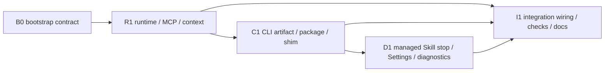

# Provider共通Memory MCP実装計画

## Goal

provider別`withmate-memory` Skill配布を停止し、runtime bindingから解決するactor-relative identityとMCP `tools/list`をMemory通常操作の正本にする。bootstrapではruntime behaviorとtestを変更せず、ADR 020/021の部分置換、ADR 024、本計画を固定する。

## Accepted contract

- `docs/adr/020-memory-affect-mcp-application-boundary.md`: 共通application boundary、SQLite非直結、effect certainty、idempotency、episode mutation owner、lifecycle/event-time appraisalを維持する。agent-facing target、provider executionから使うCLI credential、fallback開始条件はADR 024が置換する。
- `docs/adr/021-agent-runtime-binding-authority-boundary.md`: opaque binding registry、actor Session、provider generation、operation grant、turn capability、runtime owner selectionを維持する。Memory routeの`optional` policy、bindingなし経路、explicit Character selectorはADR 024が置換する。
- `docs/adr/023-multi-instance-runtime-discovery.md`: bound clientはapplication instance/runtime generationを固定し、別instanceへfallbackしない。
- `docs/adr/024-provider-common-memory-mcp-boundary.md`: canonical artifact path、actor-relative schema、CLI credential境界、Character context projection、diagnostics projectionを固定する。本計画と競合する旧Memory Skill配布記述は実装レーンで更新する。
- executable contractの主な現状根拠は`withmate-memory-mcp.test.ts`の`tools/list`/binding/effect tests、`agent-runtime-binding-http.test.ts`のroute policy tests、`character-context-application-service.test.ts`のversion/effective/episode tests、`withmate-memory-cli.test.ts`のidentity challenge/effect tests、`withmate-memory-mcp-integration.test.ts`と`character-context-cli-mcp-integration.test.ts`の共通正本/parity testsである。

## 固定した5事項

1. CLI/MCP artifactは`resources/cli/withmate-memory.mjs`をrepository canonical pathとする。packaged pathは`<process.resourcesPath>/resources/cli/withmate-memory.mjs`。
2. agent-facing general Memory targetは`{ kind: "user-global" } | { kind: "project"; project } | { kind: "character" } | { kind: "character+project"; project }`。user/Character/Session identityは含めない。
3. operator CLIはexplicit identity/targetとoperator credentialを使う。agent-bound CLI fallbackはMCP initializeと`tools/list`取得後のtransport障害に限定し、binding-required marker、owner tuple、opaque reference、`--fallback-from mcp`を必須にして、MCP credentialと`agent_cli_fallback` allowlistを使う。operator credentialへdowngrade/昇格しない。
4. Character contextからtop-level `characterId`/`sessionId`、`scope`、Memory itemのowner/scope/body/file/sourceを除く。schemaVersion、baseline、Affect mode/effective/evaluatedAt/version/updatedAt、Memory id/title/preview/tags/updatedAt、relatedTags、Memory updatedAtは維持する。
5. Memory diagnosticsは`generatedAt`、`runtime`、`cliShim`、`lastErrors`だけを持つ。`providers`、`skillSync`、Managed Skill表示、provider instruction sample/copyを削除する。

## Closure Plan

### PCM-AUTH: actor identityとtarget authority

- Accepted contract / exact anchor: ADR 021の「request bodyのSession IDはactor identityの根拠にしない」をuser/Character/Projectへ展開し、ADR 024のactor-relative targetをpublic schemaとする。
- Scope / semantic owner: `scripts/withmate-memory-mcp*.ts`のagent-facing schema、`src-electron/memory-v6-http-server.ts`のbinding解決/内部request構築、`src/agent-runtime/agent-runtime-binding-contract.ts`のowner tuple。
- Failure mode / consumer impact: spoofed/stale ID、別Character target、未許可Projectがread/writeされる。MCPとfallbackでactor scopeが分裂する。
- State transitions / failure timing: actor Session workspaceのcanonical Project ID解決 → authority snapshot発行 → tools/list validation → runtime identity challenge → adapter credential validation → binding resolve/grant → actor Session/Character/snapshot再照合 → request Project canonicalize/allowed set照合 → application dispatch。発行時にProjectを解決できない場合はProject grantだけを持たず、request前段失敗はdispatchせず`effect: none`。
- Direct verification: authority snapshot tuple/generation test、tools/list exact schema、unknown identity field rejection、binding欠落/期限切れ/stale Character/未許可Projectのpre-dispatch test、path/IDが同じallowed Projectへ収束するserver principal/target resolution test。
- Independent review trigger: authority、credential、route allowlistは高リスク境界なのでruntime schema laneのcommit-bound targeted reviewを行う。
- Gate: ready。

### PCM-CLI: operatorとfallbackのcredential分離

- Accepted contract / exact anchor: ADR 020のadapter credential/route allowlist、ADR 021のbound runtime selection、ADR 024の`agent_cli_fallback`。
- Scope / semantic owner: runtime-side adapter authenticationは`src-electron/memory-v6-http-server.ts`、credential publish/discoveryは`src-electron/memory-v6-runtime.ts`と`scripts/withmate-memory-runtime-client.ts`、CLI mode選択は`scripts/withmate-memory.ts`。
- Failure mode / consumer impact: MCP障害を契機にAgentがoperator routeを実行する、binding欠落をlocal-userへdowngradeする、別runtimeへ接続する、challenge前にsecret/bodyを送る。
- State transitions / failure timing: MCP initialize → `tools/list`取得 → transport障害の分類 → fallback mode admission → exact runtime select → challenge → credential exchange → binding/grant → dispatch → response/retry。initializeまたは`tools/list`取得前の失敗はcapability unavailableでありfallbackしない。binding/flag/credential不備は`effect: none`、dispatch後のwrite response lossだけ`unknown`。
- Direct verification: initialize/`tools/list`前の失敗がfallbackを開始しないtest、取得後のtransport障害だけがbound fallbackへ進むtest、operator command success、MCP-equivalent route success、operator-only route rejection、flag/binding片方欠落 rejection、operator secret非参照、runtime generation mismatch、pre/post dispatch effect test。
- Independent review trigger: PCM-AUTHと同じtargeted reviewでcredential downgrade、secret exposure、generation mixingを反証する。
- Gate: ready。

### PCM-TURN: stale turn mutationの拒否

- Accepted contract / exact anchor: ADR 021のbinding generationとlogical turn capability分離、および「前turnの遅延child requestをmutation前に拒否する」契約をMemory/Character mutationへ適用する。
- Scope / semantic owner: turn capability leaseは`SessionRuntimeService`、provider envは`src-electron/provider-agent-runtime-binding.ts`、exchange伝搬は`scripts/withmate-memory-runtime-client.ts`、Memory route admissionは`src-electron/memory-v6-http-server.ts`。
- Failure mode / consumer impact: 前turnの遅延MCP/CLI requestが次turn中にappend/forget/move/appraise/episode mutationまたはfile exportを実行する。capabilityをidempotency fingerprintへ混ぜて正規reconcileがconflictになる。
- State transitions / failure timing: turn lease発行 → provider env投影 → challenge → exchange envelope → binding/grant resolve → current capability照合 → mutation/file side effect dispatch → turn終了時失効。欠落/stale capabilityはdispatch前に`effect: none`。response loss後の後続turn reconcileは同一request/keyと新しいcurrent capabilityを使う。
- Direct verification: MCPとagent CLI fallbackのcapability伝搬、current/stale/missing capability、同一turn retry、後続turn idempotent reconcile、operator/internal lifecycle非適用、public error/logへのcapability非露出test。
- Independent review trigger: PCM-AUTHと同じtargeted reviewでlease race、capability downgrade、idempotency fingerprint混入を反証する。
- Gate: ready。

### PCM-CONTEXT: identity-free Character context

- Accepted contract / exact anchor: ADR 020のversioned minimal contextと`src-electron/provider-prompt.ts`が実際に消費するeffective/baseline/Memory preview、ADR 024のpublic projection。
- Scope / semantic owner: `src/character-context/character-context-contract.ts`。
- Failure mode / consumer impact: MCP/CLI/promptへuser/Character/Session IDまたはMemory owner/scope/body/file/sourceが露出する。Affect version/effective/previewが欠落してturn/lifecycle評価が壊れる。
- State transitions / failure timing: application read → response assembly → MCP/CLI output schema → provider prompt/lifecycle evaluator。projection時にredactし、内部service inputのidentity解決は維持する。
- Direct verification: exact-key schema test、negative identity/private field test、MCP/CLI/internal parity、provider prompt effective/version/preview test、turn evaluator/settler tests。
- Independent review trigger: targeted checksがprojectionと全consumerを直接観測できるため単独reviewなし。PCM-AUTH reviewではrequest identityだけを対象にする。
- Gate: ready。

### PCM-TOOLS: tools/list operation contract

- Accepted contract / exact anchor: ADR 020のexact input/output/error schema、ADR 018のAffect/episode収束、ADR 024のduplicate/retry/effect contract。
- Scope / semantic owner: `scripts/withmate-memory-mcp.ts`と`scripts/withmate-memory-mcp-general.ts`が生成するMCP initialize instructions、tool description、schema、annotation。
- Failure mode / consumer impact: semantic duplicate append、linked episode二重保存、changed requestへのkey再利用、structured domain errorをtransport failureとしてCLIへ迂回、partial/unknownを成功扱いする。
- State transitions / failure timing: initialize → tools/list discovery → duplicate preflight/read → mutation → response loss/retry → replay/read-back。agent fallback contractはtools/list取得後だけ利用でき、operation contractはprovider promptへ複製しない。
- Direct verification: tools/list snapshotではなくexact field/description assertion、fallback command/mode/schema/開始条件、initializeまたはtools/list取得前のfallback不在、same-target preflight instruction、episode owner、idempotency/effect/error branch、代表invoke/effect test。
- Independent review trigger: PCM-AUTHのtargeted reviewにschema/operation wordingとruntime enforcementの不一致を含める。
- Gate: ready。

### PCM-DIST: managed Skill停止とartifact移設

- Accepted contract / exact anchor: ADR 024のcanonical pathと「upgrade時に既存provider Skill directoryへ触れない」。
- Scope / semantic owner: path定義/buildは`scripts/build-withmate-memory-cli.ts`、packagingは`package.json`と`build/`、shimは`src-electron/memory-cli-shim-service.ts`、managed Skill起動/Settings削除は`src-electron/main.ts`とrenderer Settings。
- Failure mode / consumer impact: 新規installが旧Skillを配布する、upgradeがprovider directoryを削除/更新/検査する、shimが旧pathを指す、artifactがSkill catalogに発見される。
- State transitions / failure timing: build → package → install/upgrade → app bootstrap/Settings action → shim invoke。provider directoryは全phaseでI/O targetにしない。
- Direct verification: build output exact path、package config/installer/shim path test、isolated artifact tools/list smoke、bootstrap/Settingsからmanaged sync call不在のstatic/test assertion、provider Skill root配下へのread/writeを失敗させるI/O spy下でも起動とSettings操作が成功するupgrade simulation。
- Independent review trigger: 既存provider directory非接触はfilesystem副作用境界なのでdistribution lane commitをtargeted reviewへ渡す。
- Gate: ready。

### PCM-DIAG: provider非依存diagnostics

- Accepted contract / exact anchor: ADR 024の4-field projectionと既存redacted runtime diagnostics。
- Scope / semantic owner: `src/memory-v6/memory-diagnostics-state.ts`。
- Failure mode / consumer impact: provider/Skill同期前提がUI/APIに残る、credential/binding/path/Memory本文がdiagnosticsへ漏れる、CLI Shim状態が失われる。
- State transitions / failure timing: runtime/CLI state read → main projection → IPC/preload → Settings render。
- Direct verification: typecheck、IPC projection exact-key test、Settings component test、secret/path/content negative assertion。
- Independent review trigger: direct testsで全projectionを観測できるためなし。
- Gate: ready。

### PCM-LIFECYCLE: mutation ownerとeffect certainty維持

- Accepted contract / exact anchor: ADR 018/020のlifecycle post-turn、event-time appraisal、linked episode、idempotency/effect certainty。
- Scope / semantic owner: 既存Character Affect application/lifecycle owner。今回の3レーンはbehaviorを変更せず、integrationでparityを確認する。
- Failure mode / consumer impact: 即時eventとpost-turn eventの意味dedupe、linked episode二重append、response loss後の新key retry、`partial`/`unknown`の誤成功。
- State transitions / failure timing: event-time appraise、turn terminal settlement、retry/reconcile、read-back。別eventは別key、同一request retryだけ同じkey。
- Direct verification: 既存`character-context-cli-mcp-integration.test.ts`とsettlement tests、MCP/CLI effect tests。
- Independent review trigger: 実装差分がlifecycle ownerへ触れた場合はboundary prerequisiteとして別論理変更へ分ける。触れない限りなし。
- Gate: ready。

## Closure Map / sibling sweep

| Invariant | Canonical owner | Siblings in scope | Excluded siblings |
| --- | --- | --- | --- |
| PCM-AUTH | MCP tools/list + binding Memory authority tuple + HTTP resolver | Character 6 tools、general Memory 11 tools、MCP、agent CLI fallback、Codex/Copilot binding env、Project path/ID canonicalization | operator CLI explicit identityは別authority modeとして維持 |
| PCM-CLI | runtime adapter credential/allowlist | registry credential projection、legacy discovery禁止、challenge、exchange、fallback metric/error | lifecycle internal callはtransportを経由しない |
| PCM-TURN | Session turn lease + Memory route admission | MCP、agent CLI fallback、general/Character mutation、file export、retry/reconcile | read-only、operator CLI、lifecycle internal callはturn capabilityを要求しない |
| PCM-CONTEXT | Character context contract | internal lifecycle、MCP、CLI、provider prompt、turn evaluator/settler | inspect/auditのoperator projectionは通常contextではない |
| PCM-TOOLS | MCP tools/list | initialize instructions、description、input/output、annotation、runtime mapping | system prompt、provider instruction sample、managed Skill docsへ複製しない |
| PCM-DIST | CLI artifact path contract | build、extraResources、Windows alias、POSIX shim、runbook、isolated smoke | providerに残る旧Skill directoryは非接触 |
| PCM-DIAG | diagnostics state type | main、IPC、preload、Settings、component tests | app log/Character metricsは別diagnostics owner |
| PCM-LIFECYCLE | Affect lifecycle/application services | event-time、post-turn、episode owner、retry/effect | semantic Memory duplicate preflightは別kindのduplicate rule |

検索起点は`managed-memory-skill-service`、`provider-agent-runtime-binding`、`memory-v6-http-server/runtime`、`character-context-application-service`、`memory-cli-shim-service`、`withmate-memory-mcp*`、runtime client/CLI/build、Memory/diagnostics/provider sample/binding contracts、packaging filesで固定する。実装中に別のSkill sync、CLI path、context DTO、diagnostics projectionが見つかった場合は同じInvariantへ追加し、caller側aliasで回避しない。

## Migration / compatibility non-goals

- provider directoryに既に存在する`withmate-memory` Skillの削除、更新、marker/digest検査、利用者向け自動cleanup。
- 旧agent-facing MCP inputの`owner/scope/characterId/userId/sessionId` compatibility、alias、deprecated fallback。tools/listはbreaking replacementとして一度に切り替える。
- Memory/Affect SQLite schema、既存entry/event/idempotency recordのmigration。
- operator CLI explicit request shapeのactor-relative化、operator command削減。
- WithMate system prompt、provider instruction file、provider固有adapterへのMemory policy追加。
- lifecycle post-turn appraisal、event-time appraisal、settlement retry/quarantineの再設計。
- MCP transport追加、server分割、CLIとMCPの別application service化。

## Implementation lanes

### Lane 1: runtime binding / MCP schema / context projection

- Suggested branch: `feat/provider-common-memory-mcp-runtime`。
- Suggested worktree: sibling `../feat-provider-common-memory-mcp-runtime`。
- Owns: `src/agent-runtime/`のbinding/Memory authority contract、`src/character-context/`、`src-electron/provider-agent-runtime-binding.ts`、`src-electron/memory-v6-http-server.ts`、`src-electron/memory-v6-runtime.ts`、`src-electron/character-context-application-service.ts`、`src-electron/provider-prompt.ts`、`scripts/withmate-memory-mcp*.ts`、`scripts/withmate-memory-runtime-client.ts`、`scripts/tests/provider-prompt.test.ts`と対応tests。Memory mutationのturn capability admissionと、`src-electron/main.ts`が使うauthority snapshot builderをここで提供する。main wiring自体はLane 2が所有する。
- Canonical schema owner: `scripts/withmate-memory-mcp-general.ts`のtools/list exact schema。Character context projection owner: `src/character-context/character-context-contract.ts`。
- Logical commit R1: actor-relative tools/list、binding-derived identity、agent fallback adapterのserver/client contract、identity-free context projectionとdirect tests。
- Depends on: bootstrap contract commit。Lane 3がCLI entryから使うfallback mode/APIをR1で固定する。

### Lane 2: managed Skill停止 / Settings / diagnostics / provider sample

- Suggested branch: `feat/provider-common-memory-mcp-distribution-stop`。
- Suggested worktree: sibling `../feat-provider-common-memory-mcp-distribution-stop`。
- Owns: `src-electron/main.ts`のMemory Skill bootstrapとLane 1 authority snapshot builderのbinding発行wiring、`src/memory-v6/memory-diagnostics-state.ts`、`src/memory-v6/provider-instruction-sample.ts`、`docs/design/settings-ui.md`、`docs/design/v6-memory-foundation.md`のmanaged Memory Skill記述、Settings/Home/IPC projectionとtests、Memory専用managed Skill service/testsの削除。Glossary/Character Authoringのmanaged distributionは変更しない。
- Canonical diagnostics owner: `src/memory-v6/memory-diagnostics-state.ts`。
- Logical commit D1: Memory Skill I/Oの全入口停止、4-field diagnostics、SettingsのManaged Skill/provider sample削除とdirect tests。
- Depends on: bootstrap contract commit、Lane 1のauthority snapshot builder、Lane 3のcanonical artifact path constant。`src-electron/main.ts`はLane 2だけが編集し、Lane 1/3は変更しない。

### Lane 3: CLI artifact移設 / packaging / shim / runbook

- Suggested branch: `feat/provider-common-memory-mcp-cli-artifact`。
- Suggested worktree: sibling `../feat-provider-common-memory-mcp-cli-artifact`。
- Owns: `scripts/withmate-memory.ts`、`scripts/build-withmate-memory-cli.ts`、`resources/cli/withmate-memory.mjs`、旧`resources/skills/withmate-memory`削除、`package.json`、`build/installer.nsh`、`build/cli/withmate-memory.cmd`、`src-electron/memory-cli-shim-service.ts`、`docs/design/distribution-packaging.md`、`docs/runbooks/memory-affect-mcp.md`と対応tests。`src-electron/main.ts`は編集しない。
- Canonical path owner: `scripts/build-withmate-memory-cli.ts`がexportするrepository/packaged relative path constant。consumerはliteralを再定義しない。
- Logical commit C1: artifact path/build/package/shim/runbook移設と、operator/agent fallback CLI input mode、isolated artifact smoke。
- Depends on: bootstrap contract commit。agent fallback client APIはLane 1 R1を取り込んでからC1を完成させる。path constantはLane 2 D1へ先行提供する。

### Integration lane

- Suggested branch/worktree: current `feat/provider-common-memory-mcp`をintegration ownerとし、3 laneのlogical commitだけを取り込む。merge順はR1 → C1 → D1を既定とし、C1のpath constantをD1が参照する。
- Owns: cross-lane wiring、MCP/CLI integration、cross-provider parity、全体typecheck/build、docsの現行behaviorへの切替。各lane ownerの責務をintegration commitで再実装しない。
- Logical commit I1は、mergeで露出したwiringとintegration contract testだけに限定する。新しいschema/path/projectionを発明しない。

## Direct checks

各laneは変更するtestの設計前に`design-tests`を使い、TypeScript testの新規追加/意味変更はbase commitからのGit modeで`review-test-value`を通す。

### Lane checks

- Lane 1: targeted MCP tools/list、binding HTTP、Character context application、provider prompt、runtime client/CLI effect tests。`npm run typecheck`。
- Lane 2: targeted Settings/Home/IPC/diagnostics/bootstrap tests。Memory managed Skill sync call不在とprovider directory非接触を直接検証。`npm run typecheck`。
- Lane 3: CLI/build/shim/package path tests、分離temp directoryから生成artifactのMCP initialize/tools/list/read/write smoke。`npm run typecheck`、`npm run build:memory-cli`。

### Integration checks

1. MCP initializeと`tools/list`で17 tools、exact actor-relative input/output/error schema、annotation、operation descriptionを確認する。
2. bound CodexとCopilotで同じactor-relative requestが同じcanonical user/Character/Project targetへ解決され、別Character/未許可Project/identity unknown fieldをdispatch前に拒否するcross-provider parityを確認する。
3. operator CLIとagent-bound CLI fallbackで同じread/write/read-backを行い、fallbackがoperator-only route/credentialへ到達できないことを確認する。
4. MCP initialize/`tools/list`取得前の失敗ではagent fallbackを開始せず、取得後のtransport availability failureだけで開始すること、domain/authority/version/migration/idempotency error非fallback、pre/post dispatch effect certainty、unchanged retry/replayを確認する。
5. current/missing/stale turn capabilityをMCPとagent CLI fallbackで確認し、mutation/file exportはstale requestをdispatch前に拒否し、read/operator/internal lifecycleは既存契約を維持することを確認する。
6. Character contextのMCP/CLI/internal parity、identity/private field非投影、Affect version/effective/Memory preview維持を確認する。
7. linked episodeがappraiseだけ、standalone episodeがappend_episodeだけで保存され、即時eventとlifecycle post-turnが別eventとして収束することを確認する。
8. upgrade simulationでprovider Skill root配下へのread/writeをI/O spyで検出し、起動・Settings・shim install/uninstallが同directoryを一切削除/更新/検査しないことを確認する。
9. `npm test`、`npm run typecheck`、`npm run build`をintegration commit OID上で実行する。全体failureは対象とunrelatedを切り分ける。

## Review gates

- Full-review gate: `run`。authority、credential、public schema、filesystem upgrade副作用、複数subsystem interactionを跨ぎ、targeted checkだけでは3 lane統合のdowngrade/owner分裂を直接反証できないため、integration commitへcomplete-diff holistic reviewを一度だけ行う。
- Lane 1 R1: targeted reviewerへauthority/credential/schema/effect lensを渡す。
- Lane 3 C1: targeted reviewerへprovider directory非接触、packaged path、shim owner lensを渡す。
- Lane 2 D1とidentity-free projectionはdirect testsで閉じる。別の高リスクinteractionが見つかった場合だけtargeted reviewを追加する。
- reviewはcommit済みsourceのclean detached worktree、immutable base/review OID、executedOnCommitOid付きcheckで行う。findingは同じInvariant familyだけをcurrent-scope repairし、別ownerはboundary prerequisiteへ分ける。

## Logical commits and dependencies

各commitは対象pathだけをstageし、`AGENTS.md`、provider directoryの外部copy、生成物以外の無関係差分を含めない。

## Open questions

なし。5事項はADR 018/020/021/023、現行consumer、provider非依存/identity非信頼という依頼から実装可能なexact contractへ収束している。実装中に結果を変える新しい外部consumerまたはaccepted contractが見つかった場合は、該当Invariantを`unresolved`へ戻し、互換aliasを追加する前に利用者へ確認する。

## Design refutation disposition

- `resources/cli/withmate-memory.mjs`、4-field diagnostics、Glossary managed distributionの維持、`src-electron/main.ts`の単独owner、distribution design/runbook更新を採用した。
- Memory routeに未伝搬だったturn capabilityは、ADR 021のstale child mutation拒否に対する`current-scope repair`としてPCM-TURNへ追加した。
- agent fallbackがoperator routeへ昇格しない指摘を採用し、さらに正規bound adapterがoperator credentialを選ばない`agent_cli_fallback` credential境界へ固定した。同一OS user上の攻撃的processはADR 021どおりthreat model外であり、このbootstrapでOS isolationへ拡張しない。
- explicit Character IDをagent-facing targetへ残す案とCharacter context identityを維持する案は、現行ADR/設計の説明としては成立するが、今回の明示要求がその契約を置換するため不採用とした。互換shapeは残さない。
- 旧managed Skillをmarker確認後に自動削除する案は、「upgrade時に削除、更新、検査しない」という明示要求に反するため不採用とした。残存copyは非接触の既知legacy artifactとして扱う。

## Bootstrap review finding closure

- ADR 020/021とADR 024のauthority契約競合は`current-scope repair`とした。ADR 024に部分置換表を置き、ADR 020/021からも置換範囲を参照し、本計画のAccepted contractを維持条項だけに限定した。
- MCP初期化前にAgentがfallback契約を取得できない問題は`current-scope repair`とした。provider instruction、system prompt、managed Skillへbootstrap instructionを追加せず、agent-bound CLI fallbackをinitializeと`tools/list`取得後のtransport障害だけに限定した。
- Character context consumerのlane漏れは`current-scope repair`とした。`src-electron/provider-prompt.ts`と`scripts/tests/provider-prompt.test.ts`をLane 1のownershipとdirect checksへ追加した。

## Bootstrap validation

- runtime source、test、resource、package behaviorを変更していないことを`git diff --name-only`で確認する。
- ADR 024と本planのpath、schema、projection、lane ownershipが一致することを検索とdiffで確認する。
- Markdown link/path、重複canonical owner、旧pathを新canonicalとして記述していないことをstaticに確認する。
- 設計artifactだけのためruntime test/buildは実行しない。implementation laneで上記direct checksを実行する。
